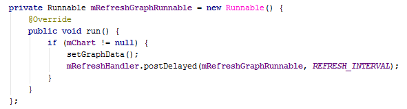
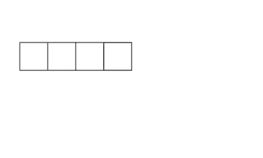

# Toto je Android!

* [Záznam z přednášky (mp3)](./recordings/1-this-is-android.mp3)

Android běží na zařízeních s mnohdy slabým CPU a málo RAM, proto pro něj nemusí platit best practices, které znáte z Javy. I zvyklosti v pojmenovávání jsou jiné.

## Pojmenování
Privátní atributy mají prefix *m*. Statické atributy mají prefix *s*.

```java
public class Something {
   private Object mObject;
   private static String sString;
 
   public void setObject(Object object) {
      mObject = object;
   }
 
   public Object getObject() {
      return mObject;
   }
}
```


## Android Studio
Pro snažší práci s pojmenováváním a generováním getterů/setterů si nastavte:
> File -> Settings -> Editor -> Code Style -> Java -> Code Generation -> Name prefix

> Field: *m*

> Static field: *s*


## Zvýraznění anonymních tříd
Anonymní třídy jsou častým zdrojem memory leaků, protože nemusí být viditelné, že přistupujete k vnějším objektům. Anonymní třída si na ně drží neviditelné reference. To působí problémy především u objektů s životním cyklem (Aktivity, Fragmenty...), které v tom případě nemohou být garbage collectovány.

<div style="text-align: center;">
    
</div>

Pro upomenutí si zvolte výraznou barvu pro anonymní třídy:
> File -> Settings -> Editor -> Colors & Fonts -> Java -> Anonymous class


## Cizí styly pro import
Vyzkoušejte, jak vám vyhovují nastavení jiných:

* [Google](https://github.com/google/styleguide/blob/gh-pages/intellij-java-google-style.xml)
* [Square](https://github.com/square/java-code-styles)
* [Avast](https://github.com/avast/android-styled-dialogs/blob/master/code-formatting-config.xml)


## Naučte se používat zkratky
Pro naučení efektivní práce v IDE se nechte otravovat následujícím [pluginem](https://plugins.jetbrains.com/plugin/4455).


## Používejte StrictMode
Je to mechanismus pro detekci určitých činností, na které umí nastavit penalizace. Např. dělám na UI vlákně dlouhotrvající operaci nad souborem -> zabij aplikaci. Donutí vás psát tyto operace správně. Ideální je se nechat penalizovat za všechny prohřešky:

```java
public class App extends Application {
 
    @Override
    public void onCreate() {
        super.onCreate();
 
        if (BuildConfig.DEBUG) {
            initStrictMode();
        } 
    }
 
    private void initStrictMode() {
        StrictMode.ThreadPolicy.Builder tpb = new StrictMode.ThreadPolicy.Builder()
                .detectAll()
                .penaltyLog();
        if (Build.VERSION.SDK_INT >= Build.VERSION_CODES.HONEYCOMB) {
            tpb.penaltyFlashScreen();
        }
        StrictMode.setThreadPolicy(tpb.build());
 
        StrictMode.VmPolicy.Builder vmpb = new StrictMode.VmPolicy.Builder()
                .detectLeakedSqlLiteObjects()
                .penaltyLog();
        if (Build.VERSION.SDK_INT >= Build.VERSION_CODES.HONEYCOMB) {
            vmpb.detectLeakedClosableObjects();
        }
        StrictMode.setVmPolicy(vmpb.build());
    }
}
```


## Kontejnery
Klasické Javovské kolekce nejsou výkonostně ani paměťově optimalizované pro použití na přenosných zařízeních. Proto je potřeba je používat s rozvahou. Držet se pravidel:

* při konstantním počtu prvků preferovat pole před Listy
* pro nižší řády stovek ukládaných prvků preferovat androidí kontejnery nad javovými
* pro práci s primitivními datovými typy využívat SparseArray


## SimpleArrayMap, ArrayMap
Na místo použití HashMap. ArrayMap implementuje plně rozhraní Map, SimpleArrayMap jen jeho podmnožinu. Jsou to optimalizované kontejnery především po paměťové stránce, ale v případě nižšího počtu vnitřních prvků, i do stránky rychlosti.


## SparseArray
Na místo použití HashMap, když chceme pracovat s primitivními datovými typy - primárně s int. V případě HashMap jsou tyto při vkládání [auto-boxovány](https://docs.oracle.com/javase/tutorial/java/data/autoboxing.html) a při čtení auto-unboxovány, s čímž jsou spojeny především paměťové režie. SparseArray dělá mapování int -> Object. Další implementace: SparseBooleanArray int -> boolean, SparseIntArray int -> int, SparseLongArray int -> long.

```java
Map<Integer, Object> integerObjectMap = new HashMap<>(100);

int integer = 10;
Object object = new Object();
integerObjectMap.put(integer, object);
integerObjectMap.remove(integer);

for (Map.Entry<Integer, Object> entry : integerObjectMap.entrySet()) {
    int key = entry.getKey();
    Object value = entry.getValue();
}
```

```java
SparseArray<Object> sparseArray = new SparseArray<>(100);

int integer = 10;
Object object = new Object();
sparseArray.put(integer, object);
sparseArray.remove(integer);
    
for (int index = 0, size = sparseArray.size(); index < size; index++) {
    int key = sparseArray.keyAt(index);
    Object value = sparseArray.valueAt(index)
}
```

### Proč je auto-(un)boxing nežádoucí?
Primitivní datový typ je paměťově řádově méně náročný. "Prázdný" objekt potřebuje 8 bytů jen na svou správu. Příklad: boolean vs Boolean. Primitivní boolean požaduje na uložení jen 1 bit. Alokovanou paměť ale zarovnáváme na byty, takže ve výsledku sežere 1 byte. Objekt Boolean požaduje tedy rovněž pro své uložení 1 byte + 8 byte pro údržbu. Virtuální stroj navíc pro efektivní přístup k paměti pracuje u objektů s alokací v násobcích 8. Tzn. pro Boolean potřebujeme fakticky 9 bytů, ale po zarovnání na násobek 8 ve výsledku zabere 16 bytů. Více [info](http://www.javamex.com/tutorials/memory/object_memory_usage.shtml).


## Práce s ArrayListy
ArrayList se hodí pro uchování variabilního počtu uspořádaných prvků. Na pozadí ArrayList používá pole, které při inicializaci potřebuje definovat fixní velikost. Pokud potřebujeme vložit prvky nad kapacitu tohoto pole, je potřeba alokovat pole nové a původní prvky do něj přesunout. To s sebou nese režie. Pokud víme, že naše kolekce bude obsahovat alespoň n prvků, je dobré toto n definovat v konstruktoru *ArrayList(int initialCapacity)* a tím eliminovat zbytečné realokace.

<div style="text-align: center;">
    
</div>

### Procházení ArrayListu
Využití foreach cyklu může být výkonnostně a paměťově náročné. Z pohledu kódu je to např. jen:

```java
for (Object o : collection) {}
```

Ve skutečnosti je pro procházení potřeba vytvořit objekt Iterator, který kolekci prochází. Při prázdné kolekci se vytvoří zbytečný objekt. Toto platí všeobecně pro kolekce a neděje se pouze u klasických polí.

```java
for (Iterator<Object> iter = collection.iterator(); iter.hasNext(); ) {
   Object o = iter.next();
}
```

Paměťově i výkonnostně optimálnější způsob procházení je následující:
```java
for (int i = 0, collectionSize = collection.size(); i < collectionSize; i++) {
   Object o = collection.get(i);
}
```

Nesnažte se využívat tento způsob za každou cenu. Pokud by mělo dojít ke zhoršení čitelnosti kódu, je rozhodně lepší se držet zjednodušené formy. Navíc tato optimalizace neplatí pro všechny druhy Listů, jen ArrayList.


## Výčtové typy
Na Androidu je doporučením nepoužívat enum, ale raději konstanty, pokud je potřebujete čistě jako výčet hodnot.

```java
public enum WeekDay {
   MONDAY, TUESDAY, WEDNESDAY, THURSDAY, FRIDAY, SATURDAY, SUNDAY
}
```

```java
public class WeekDay {
   public static final int MONDAY = 0;
   public static final int TUESDAY = 1;
   public static final int WEDNESDAY = 2;
   public static final int THURSDAY = 3;
   public static final int FRIDAY = 4;
   public static final int SATURDAY = 5;
   public static final int SUNDAY = 6;
}
```

Zásadní rozdíl mezi těmito způsoby je především ve velikosti zabrané RAM. Enum ve skutečnosti vytváří třídu, kde každý jeho prvek je novou instancí této třídy. Všechny tyto hodnoty jsou navíc ještě vloženy do pole (kvůli pořadí).

Rozdíl je i v rychlosti přístupu k těmto hodnotám. Ke konstantě umí VM přistupovat přímo, kdežto pro enum, coby objektu je přístup složitější.
Problém s použitím konstant, v tomto stavu nezajistí kontrolu v době kompilace. Je to jen int, takže omylem můžete vložit hodnotu mimo definovaný rozsah.


## Android anotace
Google představil Support Annotations, pro větší kontrolu nad kódem.

```groovy
dependencies {
    compile 'com.android.support:support-annotations:22.2.0'
}
```

Podpora pro výčtové typy pomocí konstant. Anotace zajistí kontrolu použití správných hodnot.
```java
@IntDef({MONDAY, TUESDAY, WEDNESDAY, THURSDAY, FRIDAY, SATURDAY, SUNDAY})
@Retention(RetentionPolicy.SOURCE) //používat jen v IDE
public @interface WeekDay {}
 
public static final int MONDAY = 0;
public static final int TUESDAY = 1;
public static final int WEDNESDAY = 2;
public static final int THURSDAY = 3;
public static final int FRIDAY = 4;
public static final int SATURDAY = 5;
public static final int SUNDAY = 6;
 
@WeekDay
public abstract int getWeekDay();
 
public abstract void setWeekDay(@WeekDay int weekDay);
```

Další velmi často používané anotace jsou *@Nullable* a *@NonNull* pro označení stavu inicializovanosti proměnných nebo návratových hodnot. Kompletní [výčet anotací](http://tools.android.com/tech-docs/support-annotations).


## Když si nevím rady, jak něco funguje
Ne vždy je vše v SDK zdokumentované tak, že pochopíte, jaké máte očekávat chování. Velkou výhodou Androidu je jeho otevřený kód. Proto se můžete přímo podívat na implementaci a nemuset spekulovat.
* [Zdrojové kódy Androidu podle verzí](http://grepcode.com/project/repository.grepcode.com/java/ext/com.google.android/android/)


## Kam dál?
* [Developing for Android: Introduction](https://medium.com/google-developers/developing-for-android-introduction-5345b451567c)