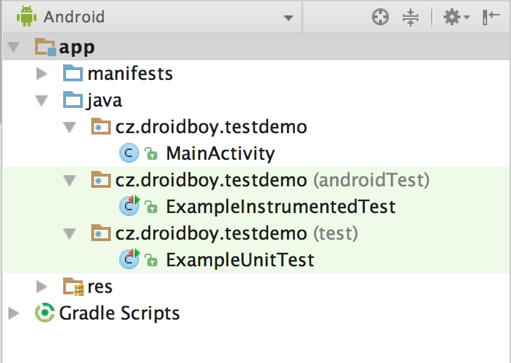

# Testování
<div style="text-align: center;">
    
</div>

* test - jednotkové testy. Využívají jen Java SDK a jsou tedy spustitelné i na PC s JVM. Pozor, cokoli z Android SDK není funkční a je případně třeba namockovat.
* androidTest - zpřístupňují Context a umožňují testování tříd s návazností na Android. Pro spuštění vyžadují emulátor nebo zařízení s Androidem.


## Unit/jednotkové testy
* jUnit – knihovna známá z klasické Javy, využívající asserty.
* Mockito – mokovací nástroj pro vytváření falešných objektů, které potřebujeme pro test, ale nejsou důležité pro vyhodnocení výsledku testu.
* PowerMock – podobné jako Mockito. Hodí se např. pro mokování statických tříd a androidího prostředí.

```groovy
testCompile 'junit:junit:4.12'
testCompile 'org.mockito:mockito-all:1.10.19'
```

## UI testy
* Espresso - Je View viditelný? Má TextView nasetovanou správnou hlášku?
* UIAutomator - testování interakce v aplikaci. Zmáčkni button, odscrolluj...

```groovy
android {

    defaultConfig {
        testInstrumentationRunner "android.support.test.runner.AndroidJUnitRunner" //nutne pro spousteni testu
    }
}

androidTestCompile ('com.android.support.test:runner:0.5') {
    exclude group: 'com.android.support' //knihovna v sobe sama pouziva support library, ktera muze byt v konfliktu s verzi support library vaseho projektu, proto ji odstranime
}
androidTestCompile ('com.android.support.test:rules:0.5') {
    exclude group: 'com.android.support'
}
androidTestCompile ('com.android.support.test.espresso:espresso-core:2.2.2') {
    exclude group: 'com.android.support'
}
```

## Model View Presenter
<div style="text-align: center;">
    
</div>

### Model
Schránka/reprezentace pro data. Neobsahuje žádnou aplikační logiku.

### View
Pasivní komponenta, která umí vykreslovat a reprezentovat data (model). Uživatelské interakce jsou delegovány na prezenter. V aplikaci to budou nejčastěji Fragmenty a Activity.

### Presenter
Prostředník mezi View a Modelem. Stará se o synchronizaci dat a UI.

[Ukázkový projekt](https://github.com/jonasevcik/AndroidTestingDemo)

Kam dál?
* [Android Testing](https://codelabs.developers.google.com/codelabs/android-testing/)

