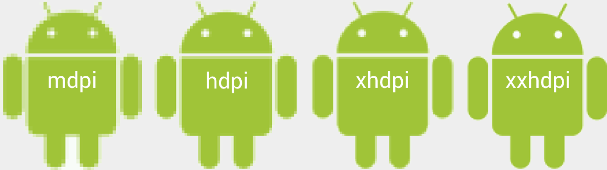
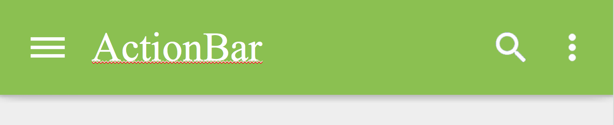
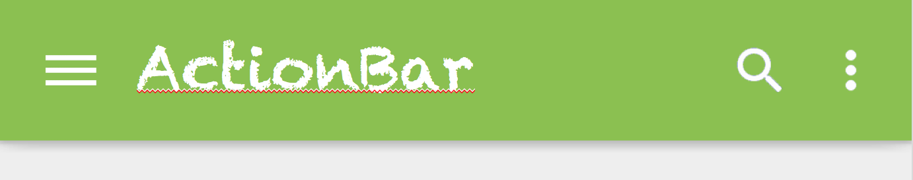
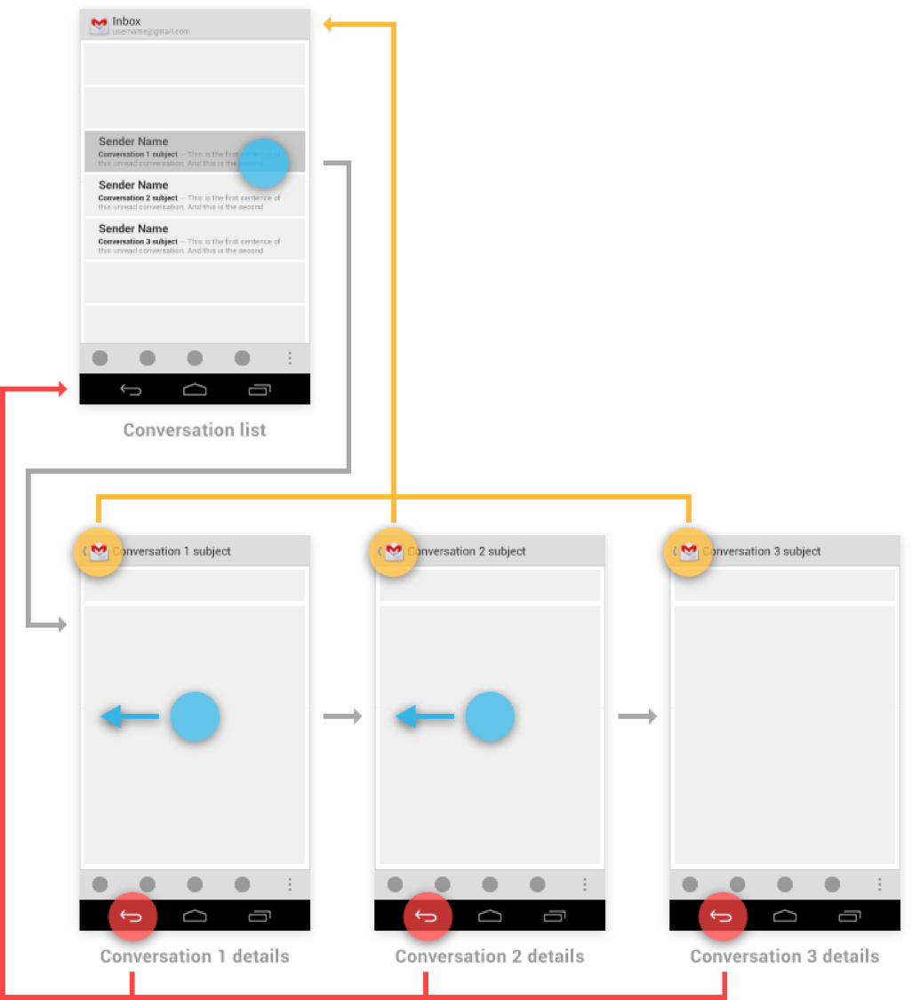
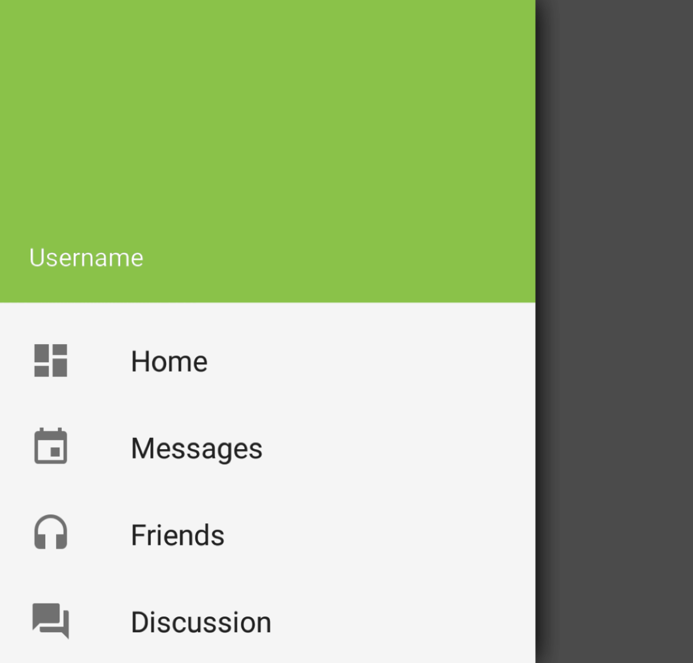
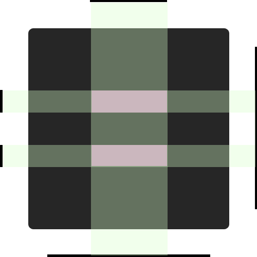

# UI, layout, styly

## Základní stavební prvky

* [Záznam z přednášky \(mp3\)](https://drive.google.com/file/d/0B2ZerSqwiAA-bGtyYml1bjJxZkU/view?usp=sharing)

### Hustota pixelů

   

### ActionBar, Toolbar

* Hlavní branding
* Rychlý přístup k akcím

   

### Contextual ActionBar

* Selekce, hromadné akce


### Floating Action Button \(FAB\)


### Taby

* Dělení na sekce
* Optimálně 3 taby max
* Text / ikona / text + ikona


### Nahoru VS Zpět

#### Nahoru

* nadřazená sekce
* na ActionBaru \(nahoře\)

#### Zpět

* zpátky, kde jsem byl předtím
* na NavigationBaru \(dole\)

  

### Toast

* Rychlé oznámení
* Neblokuje


### SnackBar

* Informace jako toast
* Možno spojit s akcí


### NavigationView / NavigationDrawer

* Kategorizace
* Subkategorie
* Netlačit na sílu



### CoordinatorLayout

FrameLayout na steroidech. Umožňuje vytváření UI s animacemi, kdy jednotliví potomci jsou na základě definovaných chování \(behaviors\) spoečně animováni ze stavu A do stavu B. Jedná se o jeden ze stěžejních prvků Material designu.


### Constraint Layout

Novinka v Android Studiu od verze 2.2. Umožňuje vztváření ploché hierarchie views. Respektive dokáže nahradit složitý vnořený layout použitím jediného view - ConstraintLayoutu. Byl vytvořen pro nahrazení RelativeLayoutu, případně LinearLayoutu s použitím atributu weight, které jsou výpočetně náročné na fázi onMeasure. ConstraintLayout využívá matematických předpisů pro přesnou definici pozice a rozměrů jednotlivých svých potomků. Tím je umožňěno výpočetně rychlejší konstruování layoutu. Zároveň s ConstraintLayoutem přišel i nový editor, který umožňuje vytváření vzhledu pomocí wysiwyg nástroje. ConstraintLayout je navíc samostatná knihovna, takže může být použit v libovolné verzi Androidu.

```java
dependencies {
    compile 'com.android.support.constraint:constraint-layout:1.0.0-alpha8'
}
```


### Design Apple VS Android


## Drawables

Drawable je klasický PNG obrázek, ale klidně i XML definice vektorového obrázku.

### Shape Drawables

Drawable si můžeme nadefinovat v XML. Výhodou je malá velikost a modifikovatelnost přímo v kódu. Výseldný obrázek skládáme z grafických primitiv, barev a přechodů.

Modrý obdélník se spodními kulatými rohy:

```markup
<shape android:shape="rectangle">
    <solid android:color="@android:color/blue_dark" />
    <corners android:bottomLeftRadius="8dp"
        android:bottomRightRadius="8dp" />
</shape>
```

Drawables můžeme tvořit více vrstvé a kombinovat tak základní prvky ve složité útvary:

```markup
<layer-list>
    <item>
        <shape>
            <solid android:color="@color/gray" />
            <corners android:bottomRightRadius="4dp"
                android:bottomLeftRadius="4dp"
                android:topRightRadius="4dp"
                android:topLeftRadius="4dp" />
        </shape>
    </item>
    <item android:bottom="4dp">
        <shape>
            <solid android:color="@color/black" />
            <corners android:bottomRightRadius="4dp"
                android:bottomLeftRadius="4dp"
                android:topRightRadius="4dp"
                android:topLeftRadius="4dp" />
        </shape>
    </item>
</layer-list>
```

### 9-patch

Speciální formát PNG obrázku \([.9.png](http://developer.android.com/guide/topics/graphics/2d-graphics.html#nine-patch)\), kde jsou čárami specifikovány oblasti obrázku, které je možno natahovat.


Jméno má podle rozdělení obrázku na 9 sektorů - "záplat":

* **1, 3, 7, 9** - rohy jsou statické a nenatahují se
* **2, 8** - horní a spodní hrany mohou být nataženy horizontálně
* **4, 6** - boční hrany mohou být nataženy vertikálně
* **5** - střed může být natažen horizontálně i vertikálně

  

Zelené oblasti se natahují v jednom směru. Růžové oblasti se natahují do obou stran. Oblastí pro natahování může být několik. To v případě, že nechcete deformovat vnitřní část obrázku.

#### Optical bounds

Optical bounds byly zavedeny v Androidu 4.3. Určují oblast obrázku, která se "nepočítá" do jeho rozměrů. Toho se dá využít např. když je kolem útvaru 9patche nakreslen stín. Ten nechceme počítat do rozměrů útvaru.


#### Draw 9-patch editor

[Editor](https://developer.android.com/tools/help/draw9patch.html) je součástí Android SDK. Umožňuje konvertovat PNG soubory na .9.png.

### Selectory

Selector je speciální drawable, která mění svůj vzhled na základě specifikovaných podmínek. Jedná se o seznam složený z drawables/barev a podmínek, kdy je zobrazit. Podmínek může být pro 1 stav specifikováno několik. Vyhodnocení podmínek probíhá odshora. Položka bez podmínek je tzv. fallback varianta.

```markup
<selector xmlns:android="http://schemas.android.com/apk/res/android">
   <item android:state_pressed="true" android:color="@color/light_blue"/>
   <item android:state_focused="true" android:color="@color/dark_blue"/>
   <item android:state_selected="true" android:state_activated="true" android:color="@color/light_blue_A400"/>
   <item android:state_selected="true" android:state_activated="false" android:color="@color/gray"/>
   <item android:color="@color/black"/>
</selector>
```

## Styly vs Témata

Účel stylů je především oddělit definice designu od samotného kódu obsahu - podobně jako CSS na webu. Samotné prvky GUI se dají vizuálně modifikovat přímo v layoutu, ale takový kód je nepřehledný a vznikají duplicitní definice. Např. v layoutu je 10 tlačítek a pro každé by byl definován stejný styl 10x.

Best practice je udržovat si definice ve 2 souborech. theme.xml pro souhrn definic jednotlivých views tvořící dohromady téma celé aplikace. Dále styles.xml, ve kterém jsou již konkrétní definice pro jednotlivé prvky. Toto se dělá proto, že je třeba udržet hierarchii a přehlednost jednotlivých definic.

theme.xml

```markup
<style name="Theme" parent="android:Theme.Holo.Light">
   <item name="android:buttonStyle">@style/ButtonStyle</item>
   <item name="android:seekBarStyle">@style/SeekBarStyle</item>
</style>
```

styles.xml

```markup
<style name="ButtonStyle" parent="android:Widget.Holo.Light.Button">
   <item name="android:background">@drawable/theme_btn_default_holo_light</item>
   <item name="android:textColor">@color/white</item>
   <item name="android:textSize">@dimen/button_text</item>
 </style>

 <style name="ButtonStyle.Big">
   <item name="android:textSize">@dimen/button_text_big</item>
 </style>

 <style name="SeekBarStyle" parent="android:Widget.Holo.Light.SeekBar">
   <item name="android:progressDrawable">@drawable/theme_scrubber_progress_horizontal_holo_light</item>
   <item name="android:indeterminateDrawable">@drawable/theme_scrubber_progress_horizontal_holo_light</item>
   <item name="android:thumb">@drawable/theme_scrubber_control_selector_holo_light</item>
 </style>
```

### Dědičnost

Práci se styly si můžeme zjednodušit dědičností. Např. máme definovaný kompletní styl pro tlačítko \(např. 10 atributů\) a chceme vyrobit nový styl, který se liší pouze v 1 atributu. Nemusíme definovat celý nový styl ale určíme si ten původní jako rodič a definujeme jen lišící se atribut.

Dědit lze 2 způsoby. Klíčovým slovem parent nebo tečkovou notací.

* Parent

  ```markup
  <style name="Parent"/>
  ```

* Explicitní dědičnost

  ```markup
  <style name="Child" parent="Parent"/>
  ```

* Implicitní dědičnost

  ```markup
  <style name="Parent.Child"/>
  ```

Systémové styly jde dědit jen přes atribut parent. Pokud dědíme z vlastních stylů, můžeme použít jen tečkovou notaci. V příkladu _ButtonStyle.Big_ má stejné atributy jako ButtonStyle, jen navíc mění velikost písma. Seznam všech [atributů](http://developer.android.com/reference/android/R.attr.html).

#### Použití explicitní a implicitní dědičnosti zaráz

```markup
<style name="Implicit"/>
<style name="Explicit"/>
<style name="Implicit.Child" parent="Explicit"/>
```

Podědí Child jak ze stylu Implicit, tak ze stylu Explicit? **Ne**, při použití obou způsobů dědičnosti, dědí potomek pouze z explicitního rodiče. Proto raději používejte jen 1 způsob dědičnosti.

### Použití

Styly lze aplikovat na jednotlivé GUI elementy, na samostatné aktivity nebo na celou aplikaci.

MyLayout.xml

```markup
<Button style="@style/ButtonStyle.Big" />
```

Manifest.xml

```markup
<activity android:theme="@style/Theme">
```

Manifest.xml

```markup
<application android:theme="@style/Theme">
```

#### Více stylů pro jeden View zaráz?

Na jeden View jde aplikovat pouze jeden styl. Výjimkou je pouze TextView, který jde ještě stylovat pomocí textAppearance.

```markup
<TextView
        android:textAppearance="@style/TextViewAppearance"
        style="@style/TextView"/>
```

Vždy u stylu textAppearance děďte z TextAppearance:

```markup
<style name="MyText" parent="TextAppearance.AppCompat">
    <item name="android:textColor">#fff</item>
</style>
```

TextAppearance atributy:

* textColor
* textColorHighlight
* textColorHint
* textColorLink
* textSize
* textStyle
* fontFamily
* typeface
* textAllCaps
* shadowColor
* shadowDx
* shadowDy
* shadowRadius
* elegantTextHeight
* letterSpacing
* fontFeatureSettings

### Theme


### Holo

Dříve bylo styly nejjednodušší dělat přes generátor. Pro všechny styly bez ActionBaru se dá použít Android Holo Colors Generator, jen pro ActionBar - Android Action Bar Style Generator.

* [Holo Colors](http://android-holo-colors.com/)
* [ActionBar style generator](http://jgilfelt.github.io/android-actionbarstylegenerator/)

Dnes už se nepoužívá. Vše směřuje k material designu. Původní přístup znamenal velké množství definic stylů a grafických resourců =&gt; nepřehledné, zabíralo místo.

### Material

Pokud použijeme _Theme.AppCompat_, můžeme jednoduše definicí několika barev upravit základní UI prvky.

```markup
<style name="Theme.MyTheme" parent="Theme.AppCompat.Light">
    <item name="colorPrimary">@color/material_blue_500</item>
    <item name="colorPrimaryDark">@color/material_blue_700</item>
    <item name="colorAccent">@color/material_green_A200</item>
</style>
```


Abyste nastylovali všechny prvky, použijte jejich AppCompat verzi:

* AppCompatAutoCompleteTextView
* AppCompatButton
* AppCompatCheckBox
* AppCompatCheckedTextView
* AppCompatEditText
* AppCompatMultiAutoCompleteTextView
* AppCompatRadioButton
* AppCompatRatingBar
* AppCompatSpinner
* AppCompatTextView

#### Idea hloubky

UI není jen ploché \(flat\). Jednotlivé prvky jsou skládány a seskupovány po vrstvách. Ty pak vytvářejí dojem prostoru.


* [LayerVisualizer](https://github.com/romannurik/LayerVisualizer)

#### Jak na to

* [Using the Material Theme](http://developer.android.com/training/material/theme.html)
* [Material Palette](http://www.materialpalette.com/) - Generování barev aplikace na základě výběru primární a doplňkové barvy
* [Material mixer](http://www.sankk.in/material-mixer/) - Vyběr palety barev
* [Color Tool](https://material.io/color)


  
      @import url\(https://fonts.googleapis.com/css?family=Roboto:400,500\);  
  
      \#toolbar {  
        width: 300px;  
        height: 108px;  
        position: relative;  
        box-shadow: 0 0 10px rgba\(0,0,0,0.87\);  
        margin: auto;  
        margin-bottom: 20px;  
        background-color: black;  
      }  
      \#toolbar \#hint {  
        font-weight: 400;  
        font-size: 12px;  
        position: absolute;  
        top: 16px;  
        color: white;  
      }  
      \#toolbar .heading {  
        font-weight: 500;  
        font-size: 24px;  
        position: absolute;  
        top: 32px;  
      }  
      \#toolbar \#underline {  
        width: 228px;  
        height: 2px;  
        position: absolute;  
        top: 70px;  
        background-color: white;  
      }  
      \#toolbar \#hint, \#toolbar .heading, \#toolbar \#underline {  
        left: 60px;  
      }  
      \#toolbar \#fab {  
        width: 56px;  
        height: 56px;  
        position: absolute;  
        right: 16px;  
        bottom: -28px;  
        background-color: white;  
        box-shadow: 0 3px 10px rgba\(0,0,0,0.23\),0 3px 10px rgba\(0,0,0,0.16\);  
        border-radius: 100%;  
        text-align: center;  
      }  
      \#toolbar \#fab \#icon {  
        position: relative;  
        top: 8px;  
        font-weight: bold;  
        font-size: 28px;  
      }  
      .container {  
        width: 100%;  
        height: 400px;  
        overflow: hidden;  
        padding: 20px;  
        box-sizing: border-box;  
      }  
      .color {  
        width: 20%;  
        height: 25%;  
        text-align: center;  
        float: left;  
        color: rgba\(255,255,255,0.87\);  
        z-index: 1;  
        transition: none;  
      }  
      .color:hover {  
        box-shadow: 0 0 10px rgba\(0,0,0,0.87\);  
        transform: scale\(1.05\);  
        z-index: 2;  
        transition: all 400ms ease-out;  
        cursor: pointer;  
      }  
      .color:hover .title {  
        color: rgba\(0,0,0,0.87\);    
        text-decoration: line-through;      
      }  
      .title {  
        position: relative;  
        top: 10px;  
        font-style: normal;  
        font-weight: 500;  
        font-size: 20px;  
      }  
      .light-strong {  
        color: \#fff;  
      }  
      .dark {  
        color: rgba\(0,0,0,0.87\);  
      }  


  
      function invertColor\(div\) {  
        console.log\(invert\(div.style.backgroundColor\)\);  
        div.style.backgroundColor = invert\(div.style.backgroundColor\);  
      }  
  
      function invert\(rgb\){  
        console.log\(rgb\);  
        rgb = \[\].slice.call\(arguments\).join\(","\).replace\(/rgb\\(\|\\)\|rgba\\(\|\\)\|\s/gi, ''\).split\(','\);  
        for \(var i = 0; i &lt; rgb.length; i++\) rgb\[i\] = \(i === 3 ? 1 : 255\) - rgb\[i\];  
        return "rgb\(" + rgb.join\(", "\) + "\)";  
      }  
  
      function setColors\(element\) {  
        var toolbar = document.getElementById\("toolbar"\);  
        var hint = document.getElementById\("hint"\);  
        var underline = document.getElementById\("underline"\);  
        var normalColor = invert\(element.style.backgroundColor\);  
        var invertedColor = element.style.backgroundColor;  
        var fab = document.getElementById\("fab"\);  
        var icon = document.getElementById\("icon"\);  
  
        toolbar.style.backgroundColor = normalColor;  
  
        hint.style.color = invertedColor;  
        underline.style.backgroundColor = invertedColor;  
  
        fab.style.backgroundColor = invertedColor;  
        icon.style.color = "rgb\(255,255,255\)";  
      }  


 Title Change My Colors+

 Red Pink Purple Deep Purple Indigo Blue Light Blue Cyan Teal Green Light Green Lime Yellow Amber Orange Deep Orange Brown Grey Blue Grey Black

* Extrakce stylu z View


#### AppCompat

Používejte AppCompat téma. Získáte tak Material na všech verzích systému. Je to dobrý základ pro rozšíření. Umožňuje i použití témat na úrovni Views.

```markup
<android.support.v7.widget.Toolbar
        app:theme="@style/ThemeOverlay.AppCompat.Dark.ActionBar"/>
```

### Layout

#### Nepoužívejte RelativeLayout jako rodiče větvené hierarchie Views

RelativeLayout je dobrý pro jednoduchou hierarchii Views. U složitější může nastat problém u měření jeho rozměrů. RelativeLayout totiž používá 2 průchody měření. Při prvním proběhne přeměření jednotlivých jeho ChildViews a při druhém může na základě nich nastavit své rozměry.

* Google I/O 2013 - [Writing Custom Views for Android](https://www.youtube.com/watch?v=NYtB6mlu7vA&t=1m41s)
* Facebook's [Custom ViewGroups](https://sriramramani.wordpress.com/2015/05/06/custom-viewgroups/#more-406)

#### Efektivní inflatování

Uvažujme layout:

```markup
<ViewGroup android:id="@+id/root">
    <View android:id="@+id/leaf" />
    <ViewGroup android:id="@+id/inner_group">
        <View android:id="@+id/inner_leaf" />
    </ViewGroup>
</ViewGroup>
```

**Rozdíl?**

A\)

```java
ViewGroup vg = (ViewGroup)findViewById(R.id.inner_group);
View v = findViewById(R.id.inner_leaf);
```

B\)

```java
ViewGroup vg = (ViewGroup)findViewById(R.id.inner_group);
View v = vg.findViewById(R.id.inner_leaf);
```

Pokud v Aktivitě voláme _findViewById\(\)_, voláme tuto metodu od kořenového View postupně na všechny jeho ChildViews, dokud dané ID nenajdeme, nebo neprojdeme celou hierarchii. V případu A je postup prohledávání pro View v následovný:

1. root-&gt;leaf  
2. root-&gt;inner\_group  
3. inner\_group-&gt;inner\_leaf

V případu B je to jen:

1. inner\_group-&gt;inner\_leaf

#### Minimalizace překreslování

U layoutů, kde dochází k překrývání jednotlivých vrstev \(často např. FrameLayout\) jsou části obrazovky několikrát překresleny, než dojde k vykreslení její finální podoby.

Všimněte si zejména přechodu posteru. Nejdříve je vykresleno pozadí aktivity, pak pozadí toolbaru, následně obrázek pozadí a přes něj až samotný poster. Pixely v dané oblasti jsou tedy překresleny až 4x!


Překreslování stejných pixelů samozřejmě zpomaluje celkové vykreslení - zpracovává se informace, která je stejně následně zahozena.

_Aktivujte si detekci překreslování v Developer options:_


Pokud si nedáváme pozor, můžeme jej do aplikace dostat např. jen pouhým používáním pozadí.

_Scéna se zbytečně aktivovaným pozadím VS Scéna s odstraněným pozadím_

  

> “Dobří umělci kopírují, skvělí kradou.”
>
> — Pablo Picasso

## Kam dál?

* [Android Design Principles](https://developer.android.com/design/get-started/principles.html)
* [oficiální Google materiály](http://developer.android.com/training/index.html)
* [Materialdoc](https://materialdoc.com/)
* [Mastering CoordinatorLayout](http://saulmm.github.io/mastering-coordinator)
* mDevCamp 2013 [Optimalizace UI](https://www.youtube.com/watch?v=X_TJOSNzNug)
* [Nanodegree na Udacity](https://www.udacity.com/course/android-developer-nanodegree--nd801) - oficiální online kurz Androidu
* [Using styles and themes without going crazy](https://speakerdeck.com/dlew/using-styles-and-themes-without-going-crazy-1)
* [ConstraintLayout codelab](https://codelabs.developers.google.com/codelabs/constraint-layout/index.html)
* [Reducing Overdraw](https://developer.android.com/topic/performance/rendering/overdraw.html)

