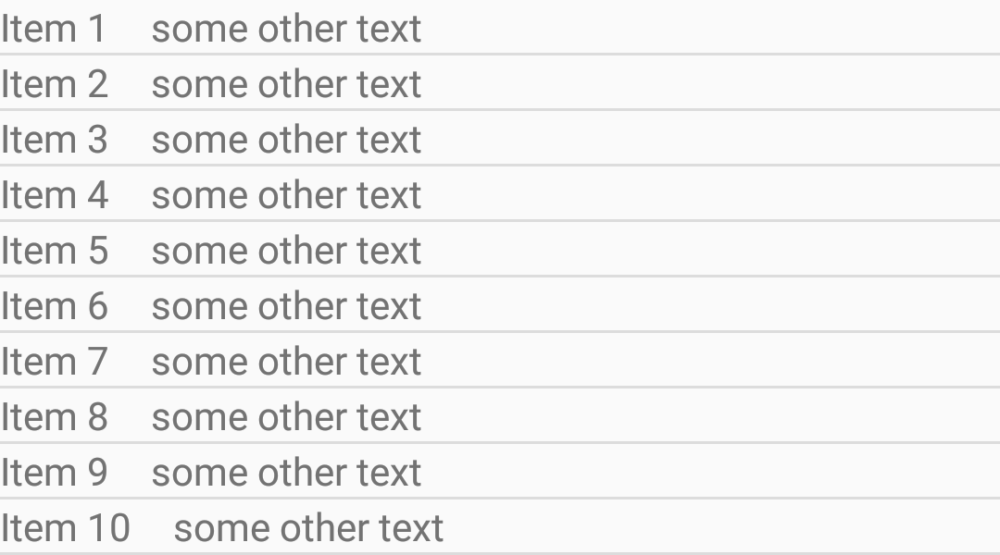

## ListView, GridView
(Co je zde psáno o [ListView](http://developer.android.com/reference/android/widget/ListView.html), platí stejně pro [GridView](http://developer.android.com/reference/android/widget/GridView.html), který se chová identicky, jen zobrazuje data ve více sloupcích.) Pro zobrazení dat na telefonu jsou velmi vhodné seznamy nebo mřížka – přirozený způsob reprezentace dat. Je to speciální druh ViewGroup, který neprovádí své kompletní vykreslování po inflatování. O to se stará tzv. Adaptér. Důvodem je, že ListView může obsahovat rozsáhlé kolekce dat a generování layoutu by způsobovalo lag v UI, jelikož veškeré operace nad Views se provádí v hlavním vlákně. Adaptér se stará o uchování dat a zprostředkování vykreslení layoutu jen těch položek, které jsou aktuálně na displeji viditelné (+ nějaké Views do rezervy pro snížení odezvy). Obstarává též operace nad kolekcí zdrojových dat, aktualizaci vzhledu asociovaného listview, filtrování dat…


## Adapter
Implementace rozhraní Adapter. Pro použití do ListView můžete vytvořit vlastní implementaci, ale je vhodnější si vybrat buď nějakou hotovou, nebo si takovou implementaci vhodně rozšířit. Např. pro základní použití je vhodný ArrayAdapter, který jako zdroj dat využívá pole. Pro získání vlastního vzhledu stačí překrýt metodu getView(int position, View convertView, ViewGroup parent). Při použití BaseAdapteru je potřeba implementovat:
* *getItem()*
* *getCount()* – zde vracet počet prvků zdrojové kolekce dat
* *hasStableIds()* – true pokud měníme za chodu prvky (mažeme, přidáváme)
* *getItemId()* – nevracet jako id pozici. Na základě id ListView pozná o jaký prvek se jedná a pokud bychom např. z prostředku listu odmazali jednu položku, tak by neaktualizoval správně vzhled. Je lepší vracet např. hash dané položky.
* *getViewTypeCount()* – zde vracet konstantu, podle toho kolik máme druhů položek. (Ve většině případů to bude 1)


## Best Practices
Pro zrychlení responzivity dochází k recyklování jednotlivých Views položek. Protože tvorba layoutu je výpočetně náročná – layout se rekurzivně vyměřuje a následně vykresluje na Canvas. Musíme ale recyklaci správně naimplementovat. Ve verzích do 5.0 Android jen podává prostředky k recyklaci, dělat ji ale musíme sami. Layout tedy inflatujeme jen 1x a dále používáme layout z convertView a jen setujeme jiné hodnoty.

###ViewHolder
Pomocná třída, která si pamatuje referenci na Views se kterými u getView pracujeme. Hledání view pomocí ID chvíli trvá, proto je vhodné jej dělat jen 1x a dále cachovat pomocí ViewHolderu.

```java
public class FooAdapter extends BaseAdapter {
 
    private Context mContext;
    private List<Bar> mData;
 
    public FooAdapter(Context context, List<Bar> data) {
        mContext = context;
        mData = data;
    }
 
    @Override
    public int getCount() {
        return mData.size();
    }
 
    @Override
    public Object getItem(int i) {
        return mData.get(i);
    }
 
    @Override
    public long getItemId(int i) {
        return mData.get(i).getNumber();
    }
 
    @Override
    public int getViewTypeCount() {
        return 1;
    }
 
    private static class ViewHolder {
        TextView view;
    }
 
    @Override
    public View getView(int position, View convertView, ViewGroup parent) {
        if (convertView == null) {
            LayoutInflater inflater = (LayoutInflater) mContext.getSystemService(Context.LAYOUT_INFLATER_SERVICE);
            convertView = inflater.inflate(R.layout.foo_row, parent, false);
            ViewHolder holder = new ViewHolder();
            holder.view = (TextView) convertView.findViewById(R.id.foo_text);
            convertView.setTag(holder);
        }
        ViewHolder holder = (ViewHolder) convertView.getTag();
        holder.view.setText(mData.get(position).toString());
        return convertView;
    }
 }
```

###Fixní rozměry položky
Abychom nebrzdili Listview přepočítáváním layoutu, je vhodné využít fixní rozměry položek. U listview stačí fixní výška, u gridview i šířka. Pokud se nám to hodí, můžeme použít přímo atribut **?android:attr/listPreferredItemHeight**

```xml
<LinearLayout xmlns:android="http://schemas.android.com/apk/res/android"
    android:layout_width="match_parent"
    android:layout_height="?android:attr/listPreferredItemHeight" 
    android:gravity="center_vertical"
    android:orientation="horizontal">
    <TextView
        android:id="@+id/text1"
        android:layout_width="wrap_content"
        android:layout_height="wrap_content"
        android:paddingRight="15dp"
        android:text="Text1" />
    <TextView
        android:id="@+id/text2"
        android:layout_width="0dp"
        android:layout_height="wrap_content"
        android:layout_weight="1"
        android:text="Text2" />
</LinearLayout>
```

###Správné inflatování
Pro inflatování nepoužívejte

```java
convertView = inflate(R.layout.item_row, null);
```

Veškeré parametry *android:layout_*+ kořenového view inflatovaného layoutu jsou posuzovány ve vztahu k nadřazenému parent view. Pokud tedy nadřazený layout neuvedete, budou zahozeny a nahrazeny defaultními hodnotami. Což můžou být zrovna ty, co jste definovali, takže na první pohled nic nepoznáte.



Pokud naopak provedete inflate správně, tzn. použijete druhou metodu

```java
convertView = inflater.inflate(R.layout.item_row, parent, false);
```

pak uvádíte parent view, jen se nepoužije pro vložení nainflatovaného layoutu - a to je kýžený výsledek.

### Žádná data

Pokud list neobsahuje žádná data, není dobré jej nechat jen tak prázdný. Uživatel neví, jestli je to chyba, nebo úmysl. Je tedy dobré zobrazit minimálně text vysvětlující důvod prázdného seznamu, případně ideogram se stejným sdělením, nebo obojí.


##Více druhů dat/položek

Pokud pracujeme s adaptérem, který vykresluje více než 1 druh položky, tak také recyklování probíhá odlišně. Je nutné rozlišovat aktuální typ dat a podle toho použít vhodný tag pro viewholder. Tagy se od sebe odliší pomocí id použitého layoutu pro daný item.

```java
public class DoubleFooAdapter extends BaseAdapter {
 
    private static final int TYPE_BAR = 0;
    private static final int TYPE_BARBAR = 1;
 
    private Context mContext;
    private List<Object> mData;
 
    public DoubleFooAdapter(Context context, List<Object> data) {
        mContext = context;
        mData = data;
    }
 
    @Override
    public int getCount() {
        return mData.size();
    }
 
    @Override
    public Object getItem(int i) {
        return mData.get(i);
    }
 
    @Override
    public long getItemId(int i) {
        return i;
    }
 
    @Override
    public int getViewTypeCount() {
        return 2;
    }
 
    @Override
    public int getItemViewType(int position) {
        return mData.get(position) instanceof Bar ? TYPE_BAR : TYPE_BARBAR;
    }
 
    private static class BarHolder {
        TextView view;
    }
 
    private static class BarBarHolder {
        TextView view;
    }
 
    @Override
    public View getView(int position, View convertView, ViewGroup parent) {
        int rowType = getItemViewType(position);
        if (convertView == null) {
            LayoutInflater inflater = (LayoutInflater) mContext.getSystemService(Context.LAYOUT_INFLATER_SERVICE);
            switch (rowType) {
                case TYPE_BAR:
                    convertView = inflater.inflate(R.layout.foo_row, parent, false);
                    BarHolder holder = new BarHolder();
                    holder.view = (TextView) convertView.findViewById(R.id.foo_text);
                    convertView.setTag(R.layout.foo_row, holder); //spravne otagujeme viewholder
                    break;
                case TYPE_BARBAR:
                    convertView = inflater.inflate(R.layout.barbar_row, parent, false);
                    BarBarHolder barBarHolder = new BarBarHolder();
                    barBarHolder.view = (TextView) convertView.findViewById(R.id.foo_text);
                    convertView.setTag(R.layout.barbar_row, barBarHolder);
                    break;
            }
        }
        switch (rowType) {
            case TYPE_BAR:
                BarHolder holder = (BarHolder) convertView.getTag(R.layout.foo_row);
                holder.view.setText(mData.get(position).toString());
                break;
            case TYPE_BARBAR:
                BarBarHolder barBarHolder = (BarBarHolder) convertView.getTag(R.layout.barbar_row);
                barBarHolder.view.setText(mData.get(position).toString());
                break;
        }
        return convertView;
    }
 
 }
```
```java
public class MainActivity extends ListActivity {
 
    @Override
    protected void onCreate(Bundle savedInstanceState) {
        super.onCreate(savedInstanceState);
        List<Bar> data = new ArrayList<Bar>(20);
        for (int i = 0; i < 20; i++) {
            data.add(new Bar());
        }
        setListAdapter(new FooAdapter(this, data));
    }
 
 }
```


## RecyclerView
Android 5.0 a Support library v7 představuje [RecyclerView](https://developer.android.com/reference/android/support/v7/widget/RecyclerView.html) zřejmě jako reakci na to, že programátoři špatně, případně vůbec neimplementovali recyklaci Views v adaptéru. RecyclerView programátora přímo nutí k tomu využívat ViewHolder a recyklovat Views.

```java
public class FooRecyclerAdapter extends RecyclerView.Adapter<FooRecyclerAdapter.ViewHolder> {
 
    private Context mContext;
    private List<Bar> mData;
 
    public FooRecyclerAdapter(Context context, List<Bar> data) {
        mContext = context;
        mData = data;
    }
 
    @Override
    public ViewHolder onCreateViewHolder(ViewGroup parent, int viewType) {
        LayoutInflater inflater = (LayoutInflater) mContext.getSystemService(Context.LAYOUT_INFLATER_SERVICE);
        View view = inflater.inflate(R.layout.foo_row, parent, false);
        return new ViewHolder(view);
    }
 
    @Override
    public void onBindViewHolder(ViewHolder holder, int position) {
        Bar item = mData.get(position);
        holder.text.setText(item.toString());
        holder.itemView.setTag(item);
    }
 
    @Override
    public int getItemCount() {
        return mData.size();
    }
 
    static class ViewHolder extends RecyclerView.ViewHolder {
        public TextView text;
 
        public ViewHolder(View itemView) {
            super(itemView);
            text = (TextView) itemView.findViewById(R.id.foo_text);
        }
    }
 }
```
```java
public class RecycleActivity extends Activity {
 
    @Override
    protected void onCreate(Bundle savedInstanceState) {
        super.onCreate(savedInstanceState);
        setContentView(R.layout.activity_recycle);
 
        RecyclerView recyclerView = (RecyclerView) findViewById(R.id.list);
        recyclerView.setHasFixedSize(true);
        List<Bar> data = new ArrayList<Bar>(20);
        for (int i = 0; i < 20; i++) {
            data.add(new Bar());
        }
        FooRecyclerAdapter adapter = new FooRecyclerAdapter(this, data);
        recyclerView.setAdapter(adapter);
        recyclerView.setLayoutManager(new LinearLayoutManager(this));
        recyclerView.setItemAnimator(new DefaultItemAnimator());
    }
 
 }
```