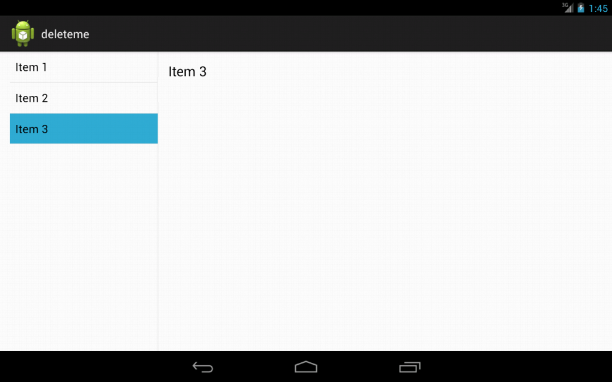

# Activity, Fragment, and Lifecycle

## Activity

`Activity` can be perceived as an application screen \(in a single window mode\). Application can start Activities belonging to it and even external ones. In terms of 1 application, invoking a new activity suspends the old one and places it in the _back stack_. Pressing the back button restores the last activity on the stack.

Activities are invoked using `Intents`, because only the system can create new instances of Activity objects. To expose the activity to the system, one must declare it in `AndroidManifest.xml`. Common beginner's mistake is to define an Activity only as a class, but not declaring it in the `AndroidManifest.xml`.

```markup
<activity android:name=".Name"
        android:label="@string/application_name">
      <intent-filter>
        <action android:name="android.intent.action.MAIN"/>
        <category android:name="android.intent.category.LAUNCHER"/>
      </intent-filter>
</activity>
```

Note that activity declaration can contain intent-filter to restrict its invocation usage.

### Intent

As stated above, Activities are created by the system as a reaction to `Intent`. For instance, launcher application can launch other applications using an `Intent`, which is targeting their main `Activity`. `Intent` can invoke launching other components than `Activities`, and can transfer data too. Data and flags can serve as messages for the targeting component.

#### Explicit Intent

Explicit Intent invokes specific Activity class.



```kotlin
val intent = Intent(this, OtherActivity::class.java)
startActivity(intent)
```



```java
Intent intent = new Intent(this, OtherActivity.class);
startActivity(intent);
```



#### Implicit Intent

Implicit Intent doesn't require specific Activity to run. Instead, it asks system to find suitable candidate to perform desired type of action.



```kotlin
val intent = Intent(Intent.ACTION_SENDTO)
intent.type = "text/plain"
intent.putExtra(Intent.EXTRA_EMAIL, "address@example.com")
intent.putExtra(Intent.EXTRA_SUBJECT, "Subject")
intent.putExtra(Intent.EXTRA_TEXT, "I'm e-mail body.")

startActivity(Intent.createChooser(intent, "Send E-mail"))
```



```java
Intent intent = new Intent(Intent.ACTION_SENDTO);
intent.setType("text/plain");
intent.putExtra(Intent.EXTRA_EMAIL, "address@example.com");
intent.putExtra(Intent.EXTRA_SUBJECT, "Subject");
intent.putExtra(Intent.EXTRA_TEXT, "I'm e-mail body.");

startActivity(Intent.createChooser(intent, "Send E-mail"));
```



## Fragment

`Fragment` represents a logical part of the screen. Introduced in Android 3.0, Fragments became the main building block for modular UI. Android 3.0 introduced support for tablets for the first time. With large screens it wasn't possible \(or at least visually appealing\) to use the same layout both for mobile and tablet. Especially UI elements using `match_parent` for their dimensions were stretched to fill the entire screen, making terribly looking layout.

Fragments allowed for taking portion of the UI elements and wrapping them as one logical piece. This pieces can be reused in multiple layouts across the application. Typical use case is so called master/detail flow, where for a list of items and their detail, you would have 2 Activities on a mobile, whereas on tablet, you can fit both into one screen.

[Ukázka kódu implementace pro Master/Detail](https://github.com/jonasevcik/MasterDetailDemo)



#### Fragment Manager

`FragmentManager` is a system component handling Fragment's lifecycle. It's responsible for maintaining all fragments inside application and associated back stack behavior.

### Static fragment

Static fragment is defined in layout xml file. It is created when calling the _setContentView_ function in Activity.

```markup
<LinearLayout xmlns:android="http://schemas.android.com/apk/res/android"
    android:orientation="horizontal"
    android:layout_width="match_parent"
    android:layout_height="match_parent">

    <fragment android:name="com.example.android.SomeFragment"
              android:id="@+id/headlines_fragment"
              android:layout_weight="1"
              android:layout_width="0dp"
              android:layout_height="match_parent" />

    <fragment android:name="com.example.android.OtherFragment"
              android:id="@+id/article_fragment"
              android:layout_weight="2"
              android:layout_width="0dp"
              android:layout_height="match_parent" />

</LinearLayout>
```

`Fragment` should be marked with ID or a tag, based in which it can be identified by `FragmentManager`. 


Fragments without ID cannot be identified by the system, thus cannot be recycled.


### Dynamic fragment

Dynamic fragment is created programatically during the runtime. This can be used for changing the UI to reflect no Internet connectivity for instance. In system components it's used in lazy initialisation in `ViewPager` etc.

```kotlin
class SomeActivity : AppCompatActivity() {

    override fun onCreate(savedInstanceState: Bundle?) {
        super.onCreate(savedInstanceState)
        setContentView(R.layout.main_activity)
        
        // When the Activity is being created for the 1st time
        if (savedInstanceState == null) {
            supportFragmentManager.beginTransaction()
                    .replace(R.id.container, MainFragment.newInstance())
                    .commitNow()
        }
    }
}
```


**Use Fragment implementation from the support library** \(Appcompat\) and its SupportFragmentManager. This ensures you have the latest implementation, no matter the SDK version. Also, never mix implementation from the platform with support version.


### newInstance

`FragmentManager` must be always able to recreate a `Fragment`, therefore the only permissible constructor is without any arguments. If you need to create a `Fragment` and pass it some arguments, use the following _newInstance_ pattern:

```kotlin
class FragmentWithArguments : Fragment() {
    companion object {
        private const val MY_BOOLEAN = "my_boolean"
        private const val MY_INT = "my_int"

        fun newInstance(booleanArg: Boolean, intArg: Int) = FragmentWithArguments().apply {
            arguments = bundleOf(
                    MY_BOOLEAN to booleanArg,
                    MY_INT to intArg)
        }
    }

    override fun onCreateView(inflater: LayoutInflater, container: ViewGroup?, savedInstanceState: Bundle?): View? {
        val myBoolean = arguments.getBoolean(MY_BOOLEAN)
        val myInt = arguments.getInt(MY_INT)
        // ...
    }
}
```

### Communication with parent Activity

Reference to parent `Activity` is passed to fragment in [`onAttach()`](https://developer.android.com/reference/androidx/fragment/app/Fragment.html#onAttach%28android.content.Context%29) function. It's a good practice to extract the communication behavior into interface, which then the parent `Activity` implements.



```kotlin
class HostActivity : AppCompatActivity(), MyFragment.OnFragmentInteractionListener {
    //...
    fun onFragmentInteraction() {
        //...
    }
}
```



```java
public class HostActivity extends AppCompatActivity implements MyFragment.OnFragmentInteractionListener{

    //...

    @Override
    public void onFragmentInteraction() {
        //...
    }
}
```





```kotlin
class MyFragment : Fragment() {
    private var fragmentInteractionListener: OnFragmentInteractionListener? = null

    override fun onAttach(context: Context) {
        super.onAttach(context)
        fragmentInteractionListener = if (context is OnFragmentInteractionListener) {
            context
        } else {
            throw ClassCastException("$context must implement OnFragmentInteractionListener")
        }
    }

    private fun someInteractingMethod() {
        // ...
        fragmentInteractionListener?.onFragmentInteraction()
    }

    override fun onDetach() {
        super.onDetach()
        fragmentInteractionListener = null // don't hold on to the host Activity -> prevent leaks
    }

    internal interface OnFragmentInteractionListener {
        fun onFragmentInteraction()
    }
}
```



```java
public class MyFragment extends Fragment {
    private OnFragmentInteractionListener fragmentInteractionListener;

    @Override
    public void onAttach(Context context) {
        super.onAttach(context);
        if (context instanceof OnFragmentInteractionListener) {
            fragmentInteractionListener = (OnFragmentInteractionListener) context;
        } else {
            throw new ClassCastException(context.toString()
                + " must implement OnFragmentInteractionListener");
        }
    }

    private void someInteractingMethod() {
        // ...
        if (fragmentInteractionListener != null) {
            fragmentInteractionListener.onFragmentInteraction();
        }
    }

    @Override
    public void onDetach() {
        super.onDetach();
        fragmentInteractionListener = null; // don't hold on to the host Activity -> prevent leaks
    }

    interface OnFragmentInteractionListener {
        void onFragmentInteraction();
    }
}
```



## Lifecycle

Android application is not a linearly running program, nor it's behaving the same as a PC application. In order to save resources \(CPU, power, memory\), android applications are a subject to lifecycle. This lifecycle is run by application's state.

* [Complete Android Fragment & Activity Lifecycle](https://github.com/xxv/android-lifecycle)

`Activities` aren't the only components with lifecycle, `Fragments`, `Views`, and `Services` have it too.


One `Activity` class can have multiple instances created at the same time.


Creating multiple instances of one Activity is easy as doing this:

1. Activity A --Intent--&gt; Activity B
2. Activity B --Intent--&gt; Activity A

This way you get 2 different instances of Activity A. If you need for some reason to keep just one instance at all times, this behavior must be specified in `AndroidManifest.xml` by `android:launchMode="singleInstance"`. Launching `Activities` is influenced by the settings in `AndroidManifest.xml`, but also by the `Intent`, launching the `Activity`. For more info, see [here](https://developer.android.com/guide/components/activities/tasks-and-back-stack).

### Visible lifecycle

Od _onStart_ po _onStop_ probíhá tzv. viditelný životní cyklus, během kterého uživatel vidí obsah Aktivity. Ostatní část životního cyklu se odehrává na pozadí. Toho se dá využít např. pro refresh zobrazených dat, po opětovném příchodu do aplikace.

Všimněte si, že třídy, jako jsou Aktivity ani nevytváříme pomocí konstruktoru. O vše se stará systém. My od něj jen dostáváme callbacky do příslušných metod \(_onCreate_, _onStart_...\). Je na nás, abychom je správně implementovali. Po volání _onDestroy_ by mělo v následující GC dojít k uvolnění zdrojů držených Aktivitou a zrušení jí samotné. Co když ale na ni někdo drží referenci? Pak máme objekt, který prošel lifecyclem a je "mrtvý", ale nemůže být odstraněn a zabírá místo v paměti =&gt; memory leak. Toto je častý problém, pokud např. do jiných vláken předáváte aktivitu např. v podobě Contextu. Př.: Vlákno řeší paralelně networking, user odejde z aplikace, aktivita je zrušena. Vlákno dořeší stahování a chce updatovat UI, to ale už neexistuje.

### TIP

Při překrývání metod tříd s životním cyklem, je dobré metody překrývat právě v pořadí v jakém probíhají. Z kódu je pak čitelnější, co se děje a navíc se sami nespletete u špatného pořadí metod stylem: tento objekt přece musí být dávno nainicializovaný, vždyť je jeho definice nahoře v kódě:\)

## Jak se vyhnout memory leakům Aktivit?

* Hlídejte si, kam dovolíte předat referenci na Context/Aktivitu.
* Obzvlášť hlídejte nová vlákna - Thread, AsyncTask, Handler
* U Handleru pozor u postDelayed, může se vykonat až, když Aktivita není ve viditelném lifecyclu. [How to Leak a Context](https://www.androiddesignpatterns.com/2013/01/inner-class-handler-memory-leak.html)
* Do callbacků přidávejte logy - může na vás vyskočit v situaci, kdy nečekáte, že by mohl nastat a odhalíte leak
* Pozor na listenery, zvlášť pokud je jím Aktivita
* U Fragmentů se zaměřte na _onAttach_ a _onDetach_, kde probíhá jeho napojení/odpojení na/od Aktivitu/y
* Pro debug build používat [LeakCanary](https://github.com/square/leakcanary) - Automaticky hlídá memory leaky Aktivit a dá se nakonfigurovat i pro hlídání dalších tříd

## Jak přežít v životním cyklu?

Aktivitu zabije kde co, nejčastěji rotace displeje.

  

### Špatné přístupy k rotaci displeje

* ignorace
* vynucení pevné orientace displeje
* deklarace configChanges v manifestu a následná ignorace změny


Nastavením _android:configChanges="orientation"_ k patřičné aktivitě v manifestu říkáme, že se o změny layoutu staráme sami. Takže bychom na ně měli patřičně v _public void onConfigurationChanged\(Configuration newConfig\)_ reagovat.

### Ukládání stavu Views

U nativních grafických prvků řeší systém. Stačí u daného View vyplnit id. Pozor, **id musí být unikátní**, jinak se stav nemusí správně obnovit.


#### Co ukládat?

* To, co **nejde lehce** získat/**obnovit** - složitý výpočet, data ze serveru...
* Pokud stahuju **větší množství dat** nebo data, která se mění např. 1x denně, ale user by je mohl příchody do aplikace pokaždé stahovat, **nedržím** je **v paměti, ale použiju databázi**.

### Serializace objektů

V Androidu se spíše nepoužívá Serializable, ale Parcelable.

#### Parcelable

[Parcelable](http://developer.android.com/reference/android/os/Parcelable.html) - androidí způsob serializace objektů. Je velmi rychlý. Používá nativní kód. Záleží na pořadí zápisu/čtení atributů. Zvládá práci pouze s primitivními datovými typy \(+ String\), poli primitivných dat. typů a dalších Parcalable.

**Bundle**

Speciální Parcelable, kde nezávisí na pořadí zápisu/čtení parametrů. Je to mapa KlíčPodKterýmUkládám -&gt; Hodnota. Využívá se pro serializaci stavu Aktivit aj.

**Parcelable automaticky**

Parcelable nepište ručně, nikam vás to neposune. Je to jen boilerplate code, ztráta času a můžete při tom omylem nasekat chyby.

* [IntelliJ plugin](https://github.com/mcharmas/android-parcelable-intellij-plugin) - generuje statický kód
* [Parceler](https://github.com/johncarl81/parceler) - parcelable pomocí anotací, nefunguje dobře s některými knihovnami \(Icepick\)

### Ukládání stavu Aktivity


```java
public class SaveStateActivity extends Activity {

    private static final String STATE_OUT = "state:out";

    private DataComponents mOut;

    @Override
    protected void onCreate(Bundle inState) {
        super.onCreate(inState);

        if (inState != null) {  //aktivita znovu vytvorena
            DataComponents components = inState.gerParcelable(STATE_OUT);
            if (components != null) {
                //tady nastavit vsechna data z components
            }
        }
    }

    @Override
    protected void onSaveInstanceState(Bundle outState) { //zavola se pred zabitim aktivity
        super.onSaveInstanceState(outState);
        outState.putParcelable(STATE_OUT, mOut);
    }
}
```

### Ukládání stavu Fragmentu

Obdobně jako u aktivity - do Bundlu. U fragmentů existuje možnost nastavit _setRetainInstance\(true\)_. To říká, že se Fragment při změně stavů nezabíjí a nevytváří znovu. Toho lze využít u fragmentů bez View, ty pak můžou sloužit jako [schránka na data](http://developer.android.com/guide/topics/resources/runtime-changes.html#RetainingAnObject). U Fragmentů s View _setRetainInstance\(true\)_ nepoužívejte. Fragment pak drží reference na UI a nedochází k uvolnění paměti. Taktéž dávejte pozor, co ukládáte do Fragmentu bez View. Ukládejte do něj jen data, ne objekty přímo asociované s Views \(např. Adapter -&gt; je napojen na ListView\). Může tak dojít k memory leaku.

```java
public class RetainedFragment extends Fragment {

    public static final String TAG = RetainedFragment.class.getSimpleName();

    // data object we want to retain
    private List<Bar> data;

    // this method is only called once for this fragment
    @Override
    public void onCreate(Bundle savedInstanceState) {
        super.onCreate(savedInstanceState);
        // retain this fragment
        setRetainInstance(true);
    }

    public void setData(List<Bar> data) {
        this.data = data;
    }

    public List<Bar> getData() {
        return data;
    }
}
```

```java
public class MainActivity extends ListActivity {

    @Override
    protected void onCreate(Bundle savedInstanceState) {
        super.onCreate(savedInstanceState);

        List<Bar> data;

        FragmentManager fm = getFragmentManager();
        RetainedFragment dataFragment = (RetainedFragment) fm.findFragmentByTag(RetainedFragment.TAG);
        if (dataFragment == null) { //load data
            data = new ArrayList<Bar>(20);
            for (int i = 0; i < 40; i++) {
                data.add(new Bar());
            }

            dataFragment = new RetainedFragment();
            fm.beginTransaction().add(dataFragment, RetainedFragment.TAG).commit();
            dataFragment.setData(data);
        } else { //have data, just set them
            data = dataFragment.getData();
        }

        mAdapter = new FooAdapter(this, data);
        setListAdapter(mAdapter);
    }
}
```

#### Jak ověřit správnost implementace?

> Developer options -&gt; Don't keep activities

Nemilosrdně vraždí aktivity při odchodu z nich. U high-end zařízení takovéto vraždění běžně nepotkáte. Často je jen u lowendů nebo Android Wear. Porovnejte u cizích aplikací, kolik jich ukládá správně stav.;\)

### Knihovny

* [Icepick](https://github.com/frankiesardo/icepick) - zjednodušení ukládání do Bundlu
* [Mortar](https://github.com/square/mortar)
* [AndroidViewModel](https://github.com/inloop/AndroidViewModel)

### ViewModel

Reakce Googlu \(2017!\) na absenci oficiálního frameworku, případně tutoriálu, jak řešit přežití v životním cyklu, především v závislosti na změnách konfigurace a rotace displaye. [ViewModel](https://developer.android.com/reference/android/arch/lifecycle/ViewModel.html) řeší jak životní cyklus jak Aktivity, tak Fragmentu.


ViewModel existuje od doby, kdy jej vytvoříte, až do doby, kdy Activita přestane existovat, tzn. přežije i rotace displeje. Cílem je tedy všechna důležitá data držet v třídě rozšiřující ViewModel.

**Pozor**, instance Activity se po čas jejího života mění, proto není dobré držet referenci na ni ve ViewModelu. Držel by referenci na instanci, která už může být mrtvá. Pokud potřebujete Context, použijte ten aplikační. Na to je i speciální druh ViewModelu, [AndroidViewModel](https://developer.android.com/reference/android/arch/lifecycle/AndroidViewModel.html).

Jak zajistit přístup ke stejné instanci ViewModelu:

```java
protected void onCreate(Bundle savedInstanceState) {
   super.onCreate(savedInstanceState);
   setContentView(R.layout.activity_main);
   mViewModel = ViewModelProviders.of(this).get(MyViewModel.class);
   // ...
}
```

## Kam dál?

* [Context, What Context?](https://possiblemobile.com/2013/06/context/)
* [Deep dive into Android state restoration](http://cyrilmottier.com/2014/09/25/deep-dive-into-android-state-restoration/)
* [Fragment state saving: Best practices](http://inthecheesefactory.com/blog/fragment-state-saving-best-practices/en)
* [ViewModels: A simple example](https://medium.com/google-developers/viewmodels-a-simple-example-ed5ac416317e)

