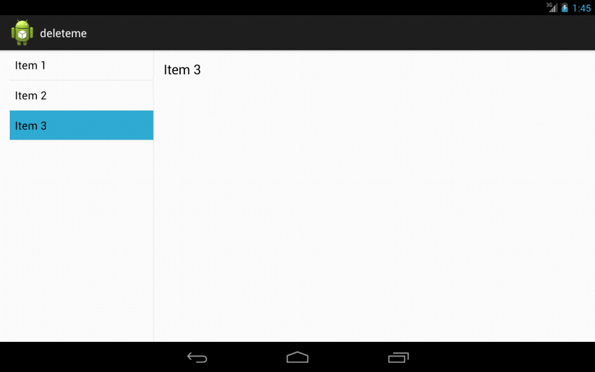

# Activity, Fragment, and Lifecycle

## Activity

`Activity` can be perceived as an application screen \(in a single window mode\). Application can start Activities belonging to it and even external ones. In terms of 1 application, invoking a new activity suspends the old one and places it in the _back stack_. Pressing the back button restores the last activity on the stack.

Activities are invoked using `Intents`, because only the system can create new instances of Activity objects. To expose the activity to the system, one must declare it in `AndroidManifest.xml`. Common beginner's mistake is to define an Activity only as a class, but not declaring it in the `AndroidManifest.xml`.

```markup
<activity android:name=".Name"
        android:label="@string/application_name">
      <intent-filter>
        <action android:name="android.intent.action.MAIN"/>
        <category android:name="android.intent.category.LAUNCHER"/>
      </intent-filter>
</activity>
```

Note that activity declaration can contain intent-filter to restrict its invocation usage.

### Intent

As stated above, Activities are created by the system as a reaction to an `Intent`. For instance, launcher application can launch other applications using an `Intent`, which is targeting their main `Activity`. `Intent` can invoke launching other components than `Activities`, and can transfer data too. Data and flags can serve as messages for the targeting component.

#### Explicit Intent

Explicit Intent invokes specific Activity class.



```kotlin
val intent = Intent(this, OtherActivity::class.java)
startActivity(intent)
```



```java
Intent intent = new Intent(this, OtherActivity.class);
startActivity(intent);
```



#### Implicit Intent

Implicit Intent doesn't require specific Activity to run. Instead, it asks system to find suitable candidate to perform desired type of action.



```kotlin
val intent = Intent(Intent.ACTION_SEND)
intent.type = "message/rfc822"
intent.putExtra(Intent.EXTRA_EMAIL, arrayOf("address@example.com"))
intent.putExtra(Intent.EXTRA_SUBJECT, "Subject")
intent.putExtra(Intent.EXTRA_TEXT, "I'm e-mail body.")

startActivity(Intent.createChooser(intent, "Send E-mail"))
```



```java
Intent intent = new Intent(Intent.ACTION_SEND);
intent.setType("message/rfc822");
intent.putExtra(Intent.EXTRA_EMAIL, "address@example.com");
intent.putExtra(Intent.EXTRA_SUBJECT, "Subject");
intent.putExtra(Intent.EXTRA_TEXT, "I'm e-mail body.");

startActivity(Intent.createChooser(intent, "Send E-mail"));
```



### Parent Activity

`Activity` can be labeled as a child activity, so it can embrace navigation to the top level. Navigation is discussed in more detail [here](../layout-and-views/ui-layout-styles.md#up).

```markup
<activity
    android:name=".ChildActivity"
    android:label="Child Activity"
    android:parentActivityName=".ParentActivity"/>
```


## Fragment

`Fragment` represents a logical part of the screen. Introduced in Android 3.0, Fragments became the main building block for modular UI. Android 3.0 introduced support for tablets for the first time. With large screens it wasn't possible \(or at least visually appealing\) to use the same layout both for mobile and tablet. Especially UI elements using `match_parent` for their dimensions were stretched to fill the entire screen, making terribly looking layout.

Fragments allowed for taking portion of the UI elements and wrapping them as one logical piece. This pieces can be reused in multiple layouts across the application. Typical use case is so called master/detail flow, where for a list of items and their detail, you would have 2 Activities on a mobile, whereas on tablet, you can fit both into one screen.

[Ukázka kódu implementace pro Master/Detail](https://github.com/jonasevcik/MasterDetailDemo)



#### Fragment Manager

`FragmentManager` is a system component handling Fragment's lifecycle. It's responsible for maintaining all fragments inside application and associated back stack behavior.

### Static fragment

Static fragment is defined in layout xml file. It is created when calling the _setContentView_ function in Activity.

```markup
<LinearLayout xmlns:android="http://schemas.android.com/apk/res/android"
    android:orientation="horizontal"
    android:layout_width="match_parent"
    android:layout_height="match_parent">

    <fragment android:name="com.example.android.SomeFragment"
              android:id="@+id/headlines_fragment"
              android:layout_weight="1"
              android:layout_width="0dp"
              android:layout_height="match_parent" />

    <fragment android:name="com.example.android.OtherFragment"
              android:id="@+id/article_fragment"
              android:layout_weight="2"
              android:layout_width="0dp"
              android:layout_height="match_parent" />

</LinearLayout>
```

`Fragment` should be marked with ID or a tag, based in which it can be identified by `FragmentManager`. 


Fragments without ID cannot be identified by the system, thus cannot be recycled.


### Dynamic fragment

Dynamic fragment is created programatically during the runtime. This can be used for changing the UI to reflect no Internet connectivity for instance. In system components it's used in lazy initialisation in `ViewPager` etc.

```kotlin
class SomeActivity : AppCompatActivity() {

    override fun onCreate(savedInstanceState: Bundle?) {
        super.onCreate(savedInstanceState)
        setContentView(R.layout.main_activity)
        
        // When the Activity is being created for the 1st time
        if (savedInstanceState == null) {
            supportFragmentManager.beginTransaction()
                    .replace(R.id.container, MainFragment.newInstance())
                    .commitNow()
        }
    }
}
```


**Use Fragment implementation from the support library** \(Appcompat\) and its SupportFragmentManager. This ensures you have the latest implementation, no matter the SDK version. Also, never mix implementation from the platform with support version.


### newInstance

`FragmentManager` must be always able to recreate a `Fragment`,  also when creating `Fragment` from XML layout, you cannot pass any arguments into it. Therefore the only permissible constructor is without any arguments. If you need to create a `Fragment` and pass it some arguments, use the following _newInstance_ pattern:

```kotlin
private const val MY_BOOLEAN = "my_boolean"
private const val MY_INT = "my_int"

class FragmentWithArguments : Fragment() {
    companion object {
        @JvmStatic
        fun newInstance(booleanArg: Boolean, intArg: Int) = FragmentWithArguments().apply {
            arguments = bundleOf(
                    MY_BOOLEAN to booleanArg,
                    MY_INT to intArg)
        }
    }
    
    private var myBoolean: Boolean? = null
    private var myInt: Int? = null

    override fun onCreate(savedInstanceState: Bundle?) {
        super.onCreate(savedInstanceState)
        arguments?.let {
            myBoolean = it.getBoolean(MY_BOOLEAN)
            myInt = it.getInt(MY_INT)
        }
    }
}
```

### Communication with parent Activity

Reference to parent `Activity` is passed to fragment in [`onAttach()`](https://developer.android.com/reference/androidx/fragment/app/Fragment.html#onAttach%28android.content.Context%29) function. It's a good practice to extract the communication behavior into interface, which then the parent `Activity` implements.



```kotlin
class HostActivity : AppCompatActivity(), MyFragment.OnFragmentInteractionListener {
    //...
    fun onFragmentInteraction() {
        //...
    }
}
```



```java
public class HostActivity extends AppCompatActivity implements MyFragment.OnFragmentInteractionListener{

    //...

    @Override
    public void onFragmentInteraction() {
        //...
    }
}
```





```kotlin
class MyFragment : Fragment() {
    private var fragmentInteractionListener: OnFragmentInteractionListener? = null

    override fun onAttach(context: Context) {
        super.onAttach(context)
        fragmentInteractionListener = if (context is OnFragmentInteractionListener) {
            context
        } else {
            throw ClassCastException("$context must implement OnFragmentInteractionListener")
        }
    }

    private fun someInteractingMethod() {
        // ...
        fragmentInteractionListener?.onFragmentInteraction()
    }

    override fun onDetach() {
        super.onDetach()
        fragmentInteractionListener = null // don't hold on to the host Activity -> prevent leaks
    }

    internal interface OnFragmentInteractionListener {
        fun onFragmentInteraction()
    }
}
```



```java
public class MyFragment extends Fragment {
    private OnFragmentInteractionListener fragmentInteractionListener;

    @Override
    public void onAttach(Context context) {
        super.onAttach(context);
        if (context instanceof OnFragmentInteractionListener) {
            fragmentInteractionListener = (OnFragmentInteractionListener) context;
        } else {
            throw new ClassCastException(context.toString()
                + " must implement OnFragmentInteractionListener");
        }
    }

    private void someInteractingMethod() {
        // ...
        if (fragmentInteractionListener != null) {
            fragmentInteractionListener.onFragmentInteraction();
        }
    }

    @Override
    public void onDetach() {
        super.onDetach();
        fragmentInteractionListener = null; // don't hold on to the host Activity -> prevent leaks
    }

    interface OnFragmentInteractionListener {
        void onFragmentInteraction();
    }
}
```



## Lifecycle

Android application is not a linearly running program, nor it's behaving the same as a PC application. In order to save resources \(CPU, power, memory\), Android applications are a subject to lifecycle. This lifecycle is run by application's state.


* [Complete Android Fragment & Activity Lifecycle](https://github.com/xxv/android-lifecycle)

`Activities` aren't the only components with lifecycle, `Fragments`, `Views`, and `Services` have it too.


One `Activity` class can have multiple instances created at the same time.


Creating multiple instances of one Activity is easy as doing this:

1. Activity A --Intent--&gt; Activity B
2. Activity B --Intent--&gt; Activity A

This way you get 2 different instances of Activity A. If you need for some reason to keep just one instance at all times, this behavior must be specified in `AndroidManifest.xml` by `android:launchMode="singleInstance"`. Launching `Activities` is influenced by the settings in `AndroidManifest.xml`, but also by the `Intent`, launching the `Activity`. For more info, see [here](https://developer.android.com/guide/components/activities/tasks-and-back-stack).

### Visible lifecycle

Visible lifecycle starts with [`onStart()`](https://developer.android.com/reference/android/app/Activity.html#onStart%28%29) callback and ends with [`onStop()`](https://developer.android.com/reference/android/app/Activity.html#onStop%28%29) callback. User can see `Activity's` content during this cycle. The rest of the lifecycle is invisible to the user.

As it was mentioned [before](./#activity), activities are instantiated by the system, programmers are just given the opportunity to implement lifecycle callbacks to react on it. System can decide when to destroy your Activity, or bring it back to life, so it's up to you as a programmer to implement the callbacks correctly, so the user experience isn't influenced in a bad way.


Derived classes must call through to the super class's implementation of lifecycle methods. If they do not, an exception will be thrown.


After calling on `onDestroy()`, the `Activity` is dereferenced and not going to be used any more. It is a programmer's task to clean up any resources associated with the `Activity`. Also, make sure, you are not referencing the Activity from anywhere else. That would cause a **memory leak**. Referencing the activity which passed the `onDestroy` point, means the garbage collector cannot clean it from the memory. Leaking Activities is a huge problem, because their memory footprint is also huge, since they hold references to their complete UI elements. Leaking Activities is also a common mistake, because many utility classes accept `Activity` in a form of [`Context`](https://developer.android.com/reference/android/content/Context).


It might be better readable for a programmer to implement lifecycle callbacks in the order, they are executed.


#### How to avoid leaking Activities?

* Pay attention to the places where you pass reference to `Activity` or `Context`
  * Use `ApplicationContext` if possible
* Pay extra attention to thread operations - `Thread`, `Handler`, etc.
  * `Handler's` `postDelayed()` method is problematic, since it can fire in the state, where `Activity` is not visible to the user. See [How to Leak a Context](https://www.androiddesignpatterns.com/2013/01/inner-class-handler-memory-leak.html).
* Pay attention to Listeners, especially when the `Activity` is implementing one.
* `Fragment's` `onAttach()` and `onDetach()` are typical places for binding an `Activity`, make sure you are dereferencing it in `onDetach()`.
* Use [**LeakCanary**](https://github.com/square/leakcanary) for debug builds. It watches `Activity` memory leaks, and can be configured to watch other classes too.

> _"A small leak will sink a great ship."_
>
> Benjamin Franklin

