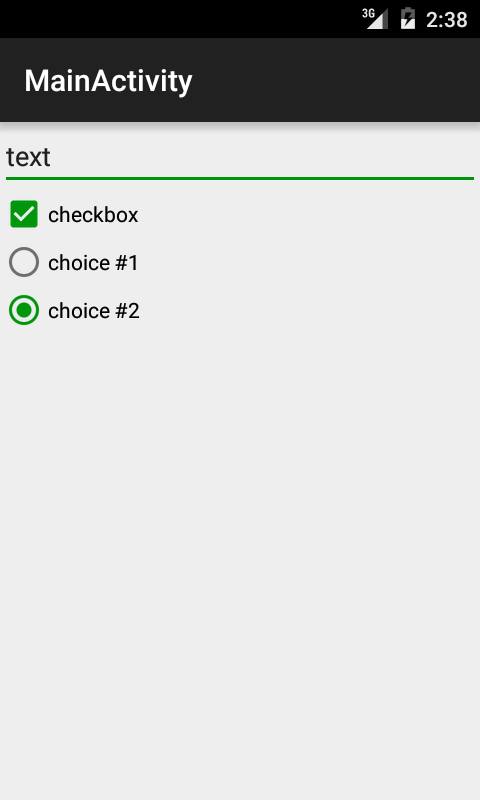
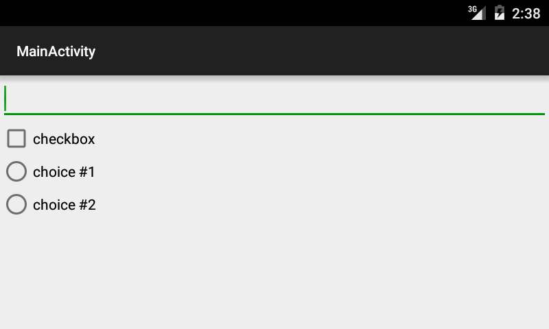
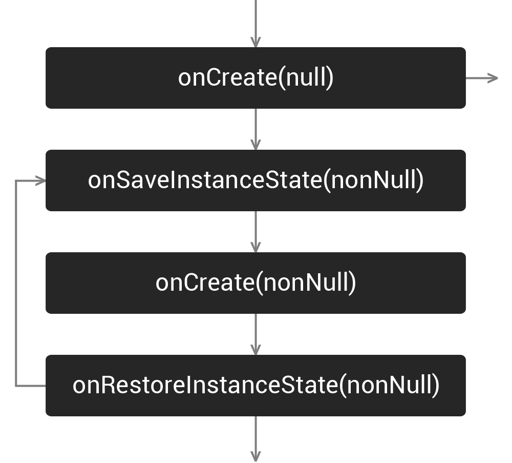

# Životní cyklus
Aplikace v Androidu není lineárně běžící program, ani nemá stavy, jak je můžeme znát z aplikací u PC. Aby bylo možné šetřit prostředky (CPU, baterie, paměť...), podléhá androidí aplikace životnímu cyklu. Ten je řízen systémem na základě jeho stavu.

Lifecycle nemají jen Aktivity a Fragmenty, ale také Views, Services...

**Pozor**, 1 Aktivita nemusí mít při běhu aplikace vytvořenu jen 1 instanci. Uvažujme průchod aplikací:

> Aktivita A --Intent--> Aktivita B  
> Aktivita B --Intent--> Aktivita A

Pak máme na stacku 2 různé Aktivity A. Pokud chcete mít jen 1 instanci Aktivity A, musíte toto chování specifikovat v manifestu *android:launchMode="singleInstance"*. Spouštění Aktivit je ovlivněno nejen nastavením v manifestu, ale i intentem, který je vyvolává. Více [zde](http://developer.android.com/guide/components/tasks-and-back-stack.html).


## Viditelný životní cyklus
Od *onStart* po *onStop* probíhá tzv. viditelný životní cyklus, během kterého uživatel vidí obsah Aktivity. Ostatní část životního cyklu se odehrává na pozadí. Toho se dá využít např. pro refresh zobrazených dat, po opětovném příchodu do aplikace.

Všimněte si, že třídy, jako jsou Aktivity ani nevytváříme pomocí konstruktoru. O vše se stará systém. My od něj jen dostáváme callbacky do příslušných metod (*onCreate*, *onStart*...). Je na nás, abychom je správně implementovali. Po volání *onDestroy* by mělo v následující GC dojít k uvolnění zdrojů držených Aktivitou a zrušení jí samotné. Co když ale na ni někdo drží referenci? Pak máme objekt, který prošel lifecyclem a je "mrtvý", ale nemůže být odstraněn a zabírá místo v paměti => memory leak. Toto je častý problém, pokud např. do jiných vláken předáváte aktivitu např. v podobě Contextu. Př.: Vlákno řeší paralelně networking, user odejde z aplikace, aktivita je zrušena. Vlákno dořeší stahování a chce updatovat UI, to ale už neexistuje.


### TIP
Při překrývání metod tříd s životním cyklem, je dobré metody překrývat právě v pořadí v jakém probíhají. Z kódu je pak čitelnější, co se děje a navíc se sami nespletete u špatného pořadí metod stylem: tento objekt přece musí být dávno nainicializovaný, vždyť je jeho definice nahoře v kódě:)

## Jak se vyhnout memory leakům Aktivit?
* Hlídejte si, kam dovolíte předat referenci na Context/Aktivitu.
* Obzvlášť hlídejte nová vlákna - Thread, AsyncTask, Handler
* U Handleru pozor u postDelayed, může se vykonat až, když Aktivita není ve viditelném lifecyclu
* Do callbacků přidávejte logy - může na vás vyskočit v situaci, kdy nečekáte, že by mohl nastat a odhalíte leak
* Pozor na listenery, zvlášť pokud je jím Aktivita
* Pro debug build používat [LeakCanary](https://github.com/square/leakcanary) - Automaticky hlídá memory leaky Aktivit a dá se nakonfigurovat i pro hlídání dalších tříd

## Jak přežít v životním cyklu?
Aktivitu zabije kde co, nejčastěji rotace displeje.

<div style="text-align: center;">
    
    
</div>

### Špatné přístupy k rotaci displeje
* ignorace
* vynucení pevné orientace displeje
* deklarace configChanges v manifestu a následná ignorace změny

<div style="text-align: center;">
    
</div>

Nastavením *android:configChanges="orientation"* k patřičné aktivitě v manifestu říkáme, že se o změny layoutu staráme sami. Takže bychom na ně měli patřičně v *public void onConfigurationChanged(Configuration newConfig)* reagovat.

### Ukládání stavu Views

U nativních grafických prvků řeší systém. Stačí u daného View vyplnit id. Pozor, **id musí být unikátní**, jinak se stav nemusí správně obnovit.

#### Co ukládat?
* To, co **nejde lehce** získat/**obnovit** - složitý výpočet, data ze serveru...
* Pokud stahuju **větší množství dat** nebo data, která se mění např. 1x denně, ale user by je mohl příchody do aplikace pokaždé stahovat, **nedržím** je **v paměti, ale použiju databázi**.

### Serializace objektů
V Androidu se spíše nepoužívá Serializable, ale Parcelable.

#### Parcelable
[Parcelable](http://developer.android.com/reference/android/os/Parcelable.html) - androidí způsob serializace objektů. Je velmi rychlý. Používá nativní kód. Záleží na pořadí zápisu/čtení atributů. Zvládá práci pouze s primitivními datovými typy (+ String), poli primitivných dat. typů a dalších Parcalable.

##### Bundle
Speciální Parcelable, kde nezávisí na pořadí zápisu/čtení parametrů. Je to mapa KlíčPodKterýmUkládám -> Hodnota. Využívá se pro serializaci stavu Aktivit aj.

##### Parcelable automaticky
Parcelable nepište ručně, nikam vás to neposune. Je to jen boilerplate code, ztráta času a můžete při tom omylem nasekat chyby.
* [IntelliJ plugin](https://github.com/mcharmas/android-parcelable-intellij-plugin) - generuje statický kód
* [Parceler](https://github.com/johncarl81/parceler) - parcelable pomocí anotací, nefunguje dobře s některými knihovnami (Icepick)

### Ukládání stavu Aktivity

<div style="text-align: center;">
    
</div>

```java
public class SaveStateActivity extends Activity {
 
    private static final String STATE_OUT = "state:out";
 
    private DataComponents mOut;
 
    @Override
    protected void onCreate(Bundle inState) {
        super.onCreate(inState);
 
        if (inState != null) {  //aktivita znovu vytvorena
            DataComponents components = inState.gerParcelable(STATE_OUT);
            if (components != null) {
                //tady nastavit vsechna data z components
            }
        }
    }
 
    @Override
    protected void onSaveInstanceState(Bundle outState) { //zavola se pred zabitim aktivity
        super.onSaveInstanceState(outState);
        outState.putParcelable(STATE_OUT, mOut);
    }
}
```

### Ukládání stavu Fragmentu
Obdobně jako u aktivity - do Bundlu. U fragmentů existuje možnost nastavit *setRetainInstance(true)*. To říká, že se Fragment při změně stavů nezabíjí a nevytváří znovu. Toho lze využít u fragmentů bez View, ty pak můžou sloužit jako [schránka na data](http://developer.android.com/guide/topics/resources/runtime-changes.html#RetainingAnObject). U Fragmentů s View *setRetainInstance(true)* nepoužívejte. Fragment pak drží reference na UI a nedochází k uvolnění paměti. Taktéž dávejte pozor, co ukládáte do Fragmentu bez View. Ukládejte do něj jen data, ne objekty přímo asociované s Views (např. Adapter -> je napojen na ListView). Může tak dojít k memory leaku.

```java
public class RetainedFragment extends Fragment {
 
    public static final String TAG = RetainedFragment.class.getSimpleName();
 
    // data object we want to retain
    private List<Bar> data;
 
    // this method is only called once for this fragment
    @Override
    public void onCreate(Bundle savedInstanceState) {
        super.onCreate(savedInstanceState);
        // retain this fragment
        setRetainInstance(true);
    }
 
    public void setData(List<Bar> data) {
        this.data = data;
    }
 
    public List<Bar> getData() {
        return data;
    }
}
```

```java
public class MainActivity extends ListActivity {
 
    @Override
    protected void onCreate(Bundle savedInstanceState) {
        super.onCreate(savedInstanceState);
 
        List<Bar> data;
 
        FragmentManager fm = getFragmentManager();
        RetainedFragment dataFragment = (RetainedFragment) fm.findFragmentByTag(RetainedFragment.TAG);
        if (dataFragment == null) { //load data
            data = new ArrayList<Bar>(20);
            for (int i = 0; i < 40; i++) {
                data.add(new Bar());
            }
 
            dataFragment = new RetainedFragment();
            fm.beginTransaction().add(dataFragment, RetainedFragment.TAG).commit();
            dataFragment.setData(data);
        } else { //have data, just set them
            data = dataFragment.getData();
        }
 
        mAdapter = new FooAdapter(this, data);
        setListAdapter(mAdapter);
    }
}
```

#### Jak ověřit správnost implementace?
> Developer options -> Don't keep activities

Nemilosrdně vraždí aktivity při odchodu z nich. U high-end zařízení takovéto vraždění běžně nepotkáte. Často je jen u lowendů nebo Android Wear. Porovnejte u cizích aplikací, kolik jich ukládá správně stav.;)

###Knihovny
* [Icepick](https://github.com/frankiesardo/icepick) - zjednodušení ukládání do Bundlu
* [Mortar](https://github.com/square/mortar)
* [AndroidViewModel](https://github.com/inloop/AndroidViewModel)

## Kam dál?
* [Context, What Context?](https://possiblemobile.com/2013/06/context/)
* [Deep dive into Android state restoration](http://cyrilmottier.com/2014/09/25/deep-dive-into-android-state-restoration/)
* [Fragment state saving: Best practices](http://inthecheesefactory.com/blog/fragment-state-saving-best-practices/en)