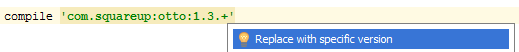
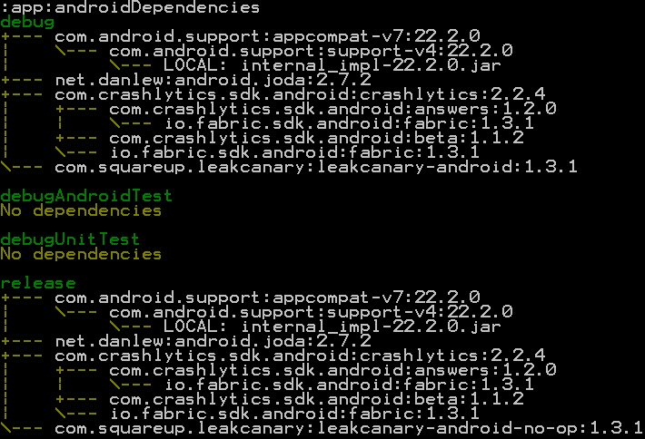

# Buildovací systém

* [Záznam z přednášky (mp3)](https://drive.google.com/file/d/0B2ZerSqwiAA-eThUOTFYY3RWb00/view?usp=sharing)

Současné Android Studio využívá pro buildování systém [Gradle](https://docs.gradle.org/current/release-notes). Ten využívá jazyka [Groovy](http://www.groovy-lang.org/), běžícího na JVM. Gradle předepisuje strukturu buildovacího skriptu pomocí DSL. Skript pak vypadá jako JSON dokument. Pro lepší porozumění je si projdětě [dokumentaci](https://docs.gradle.org/current/dsl/). Pro buildování androidích projektů se pak používá [Android plugin for Gradle](https://developer.android.com/tools/building/plugin-for-gradle.html).

## Gradle vs Gradle Wrapper
Standalone instalaci Gradlu zřejmě při vývoji nepotkáme. Pro vývoj není potřeba, vystačíme si s Gradle Wrapperem. Plná instalace gradlu obsahuje navíc ukázkové skripty, dokumentaci a knihovny aj, které nemusíme využít.

### Čistý projekt – Gradle Wrapper
Obsahuje následující soubory. Je to minimální konfigurace, se kterou je gradle schopný fungovat. Před spuštěním nemusí být dokonce ani nainstalovaný.
* gradle-wrapper.jar
* properties soubor gradle-wrapper.properties
* sh/bat skripty (gradlew)

Při první interakci s wrapperem se nejdřív podívá, jestli je nahraný Gradle, když ne, stáhne a nahraje jej a provede příkaz, kterým byl vyvolán. Projekt je pak buildován touto lokální verzí.

Wrapper můžeme vytvořit spuštěním příkazu
```shell
gradle wrapper
```
Wrapper můžeme [nakonfigurovat](https://docs.gradle.org/current/dsl/org.gradle.api.tasks.wrapper.Wrapper.html): 

*build.gradle*

```groovy
wrapper {
	gradleVersion = '2.3'
}
```
**Výhoda použití wrapperu** je, že jde verzovat, takže všichni na projektu buildují stejným nástrojem. Odpadne problém, že by někdo chtěl dělat build s nekompatibilní verzí.


## Struktura projektu v Android Studiu
Struktura z Android Studia je víceprojektová (víceprojektová). Umožňuje mít zaráz několik podprojektů (modulů). Každý projekt má vlastní *build.gradle* skript. Skript na nejvyšší úrovni obsahuje globální konfigurace pro všechny podprojekty (moduly).

```groovy
buildscript {
    repositories {
        jcenter() //dříve mavenCentral()
    }
    dependencies {
        classpath 'com.android.tools.build:gradle:1.2.3'
 
        // NOTE: Do not place your application dependencies here; they belong
        // in the individual module build.gradle files
    }
}
 
allprojects {
    repositories {
        jcenter() //dříve mavenCentral()
    }
}
```

soubor *settings.gradle* deklaruje jednotlivé podprojekty. Názvy modulů odpovídají názvům adresářů ve kterých se nachází.

```groovy
include ':app', ':library-app'
```

### jCenter, Maven Central
* [jCenter](http://jcenter.bintray.com/)
* [Maven Central](https://oss.sonatype.org/content/repositories/releases/)

Repozitáře hostující javovské a androidí knihovny. Odkaz na knihovnu se definuje jako:

> GROUP_ID:ARTIFACT_ID:VERSION  
> com.squareup:otto:1.3.8

```groovy
dependencies {
  compile 'com.squareup:otto:1.3.8'
}
```

Označení vychází z definice [pom.xml](https://maven.apache.org/pom.html) u Maven projektu. Projekt je pak jednoznačně identifikovatelný. V repozitáři k němu vede cesta:

> KOŘEN_REPOZITÁŘE/GROUP_ID/ARTIFACT_ID/VERSION_ID

Takže např.:

> http://jcenter.bintray.com/com/squareup/otto/1.3.8/

#### Nepoužívejte dynamické verzování u knihoven

Místo specifikování konkrétního čísla verze, se jeho podřetězec dá nahradit znakem **+**. Gradle za něj automaticky doplní nejvyšší nalezenou hodnotu verze. Např:

```groovy
compile 'com.squareup:otto:1.3.+'
```

To ovšem přidá do vašeho buildu nedeterministické chování.

* Ne každý nový update knihovny jenom opravuje staré chyby.
* Tvůrce knihovny může změnit logiku chování některých metod.
 
<div style="text-align: center;">
    
</div>

Pro detailnější analýzu závislostí vaší aplikace můžete použít příkaz:

```shell
gradlew androidDependencies
```

<div style="text-align: center;">
    
</div>

#### Možnosti
Nemusíte používat pouze jCenter nebo Maven Central. Můžete zadefinovat i vlastní repozitář. Takto to dělá třeba Fabric od Twitteru.
 
```groovy
repositories {
    maven { url 'https://maven.fabric.io/public' }
}
```
 
```groovy
dependencies {
    compile 'com.crashlytics.sdk.android:crashlytics:2.2.4@aar'
}
```

Standardní Java knihovny jsou zabaleny jako *.jar, androidí knihovny jako *.aar.

### aar
Stejně jako *jar*, jedná se o obyčejný *zip* archiv. Jar obsahuje v minimální verzi přeložené class soubory s manifestem. Pro Android ale potřebujeme specifické resources, jako je Manifest.xml, layouty, drawables... Ty ale do *jar* archivu nemůžeme dát, proto vznikl nový typ - *AAR*. Struktura archivu je následující:

```plain
/AndroidManifest.xml (povinné)  
/classes.jar (povinné)    
/res/ (povinné)  
/R.txt (povinné)  
/assets/ (volitelné)  
/libs/*.jar (volitelné)  
/jni/<abi>*.so (volitelné)  
/proguard.txt (volitelné)  
/lint.jar (volitelné)
```

### build.gradle
 
```groovy
//automaticky vygenerovaná základní struktura
 
apply plugin: 'com.android.application' //project.apply([plugin: 'com.android.application'])
 
android {
    compileSdkVersion 22
    buildToolsVersion "22.0.1"
 
    defaultConfig {
        applicationId "cz.droidboy.sample"
        minSdkVersion 15
        targetSdkVersion 22
        versionCode 1
        versionName "1.0"
    }
    buildTypes {
        release {
            minifyEnabled false
            proguardFiles getDefaultProguardFile('proguard-android.txt'), 'proguard-rules.pro'
        }
    }
}
 
dependencies { //project.dependencies 
    compile fileTree(dir: 'libs', include: ['*.jar']) //compile project.fileTree(dir: 'libs', include: ['*.jar'])
    compile 'com.android.support:appcompat-v7:22.2.0' //(group: 'com.android.support', name: 'appcompat-v7', version:'22.2.0')
}
```

* [Project.apply(Map<String, ?> options)](https://docs.gradle.org/current/dsl/org.gradle.api.Project.html#org.gradle.api.Project:apply(java.util.Map))
* [DependencyHandler](https://docs.gradle.org/current/javadoc/org/gradle/api/artifacts/dsl/DependencyHandler.html)

#### Verze

**compileSdkVersion**
Verze Android SDK, která se má použít pro kompilaci kódu. Velmi silně se doporučuje používat vždy poslední verzi. Díky kompilaci vůči nejnovější verzi zdrojového kódu Androidu můžete dostat warningy o deprecated metodách, můžou být použity nové anotace pro Lint...
Major verze se musí shodovat s verzí build tools a support library, kterou používáte.

**minSdkVersion**
Omezuje SDK level, který můžete používat. Při použití novějších api v kódu dostanete varování Lintu. Novější api se dají používat, ale užití je potřeba ošetřit ifem.
Jaké volit minSdk? [Zastoupení verzí](https://developer.android.com/about/dashboards/index.html)

**targetSdkVersion**
Určuje se kterým posledním levelem SDK reálně pracujete (Byť compileSdkVersion můžete mít vyšší). Tímto se zachovává funkčnost starých aplikací na nových verzích systému. Např. Android 6 (API 23) přidal podporu tzv. runtime permissions. Které by de facto rozbily všechny staré aplikace. Proto se jejich ošetření vyžadovalo jen u aplikací s targetSdkVersion >= 23.

Ideálně byste měli cílit na následující stav:
```
minSdkVersion (lowest possible) <= targetSdkVersion == compileSdkVersion (latest SDK)
```

#### Lepší build.gradle
 
```groovy
//rozdělte verzi aplikace do 4 částí, takto je snažší k pochopení, než když máte jen 1 číslo
def versionMajor = 0
def versionMinor = 1
def versionPatch = 0
def versionBuild = 0 
 
apply plugin: 'com.android.application'
 
android {
    compileSdkVersion 22
    buildToolsVersion "22.0.1"
 
    //standardní pojmenování apk souboru nic moc nevypovídá o daném buildu.
    //tímto způsobem snadno rozlišíte mezi jednotlivými buildy a verzemi
    applicationVariants.all { variant -> // .all stejně jako each prochází všechny prvky kolekce, ale aplikuje se i v případě, že v ní přibudou nové prvky
        variant.outputs.each { output ->
            output.outputFile = new File(
                    output.outputFile.parent,
                    "$project.name-$variant.name-$variant.versionName-${variant.versionCode}.apk")
        }
    }
 
    // nadefinujte si podepisování apk pro release build, ať jej můžete snadno spouštět. Jinak byste museli složitě pokaždé klikat na build->generate signed apk...
    //konstanty níže mějte uložené v gradle.properties
    signingConfigs {
        release {
            storeFile file(RELEASE_STORE_FILE)
            storePassword RELEASE_STORE_PASSWORD
            keyAlias RELEASE_KEY_ALIAS
            keyPassword RELEASE_KEY_PASSWORD
        }
    }
 
    defaultConfig {
        applicationId "cz.droidboy.sample"
        minSdkVersion 15 //minimální api 15 by mělo být dnes dostačující
        targetSdkVersion 22 //vždy mějte jako target poslední verzi SDK
 
        // nechejte resources jen pro vyjmenované konfigurace
        // takto snížíte velikost výsledného apk
        // nepotřebné resources budou odebrány i z externích knihoven
        resConfigs "cs", "sk", "en" //nechat resources jen pro vyjmenované jazyky
        resConfigs "hdpi", "xhdpi", "xxhdpi", "xxxhdpi" //v současnosti nemá smysl podporovat dpi nižší jako hdpi
 
        versionCode versionMajor * 10000 + versionMinor * 1000 + versionPatch * 100 + versionBuild
        versionName "${versionMajor}.${versionMinor}.${versionPatch}"
    }
 
    compileOptions { //chceme psát syntaxí javy 7
        sourceCompatibility JavaVersion.VERSION_1_7
        targetCompatibility JavaVersion.VERSION_1_7
    }
 
    buildTypes {
 
        release {
            minifyEnabled false
            signingConfig signingConfigs.release
        }
 
        // mějte release a debug build rozlišitelné. takto můžete nahrát na 1 zařízení 2 buildy aplikace
        // je vhodné také vizuálně odlišit ikonu debug verze
        debug {
            applicationIdSuffix '.debug' 
        }
    }
 
    lintOptions {
        textReport true // když je true, vygeneruje se textový report problémů (default je false)
        textOutput 'stdout' // kam zapsat výstup. buď do souboru - file nebo do 'stdout' (standardní výstup)
    }
}
 
dependencies {}
```
*gradle.properties:*
 ```properties
RELEASE_STORE_FILE=path_to_the_file #použijte \ na Windows, / na Linuxu/Macu
RELEASE_STORE_PASSWORD=password
RELEASE_KEY_ALIAS=key_alias
RELEASE_KEY_PASSWORD=key_password
```
**Proč ukládat heslo ke klíčence a klíči do *gradle.properties*, když i tam jsou viditelné v plaintextu?**

#### Použití proměnných v project.ext
_Hlavní build.gradle_

```groovy
allprojects {
    ...
    project.ext {
        compileSdkVersion = 26
        buildToolsVersion = '26.0.2'
        minSdkVersion = 9
        targetSdkVersion = 26
        supportLibraryVersion = '26.1.0'
    }
}
```

_build.gradle z podprojektu_

```groovy
apply plugin: 'com.android.application'

android {
    compileSdkVersion project.ext.compileSdkVersion
    buildToolsVersion project.ext.buildToolsVersion

    defaultConfig {
        applicationId "cz.droidboy.androidmvp.sample"
        minSdkVersion project.ext.minSdkVersion
        targetSdkVersion project.ext.targetSdkVersion
        versionCode 1
        versionName "1.0"
    }
    buildTypes {
        release {
            minifyEnabled false
            proguardFiles getDefaultProguardFile('proguard-android.txt'), 'proguard-rules.pro'
        }
    }
}

dependencies {
    compile project(":library")
    compile "com.android.support:appcompat-v7:${project.ext.supportLibraryVersion}"
}
```

### Java 8
Android interně pracuje s bytecodem Javy 6 + součástí Android SDK není plné Java SDK 8. Část API z Javy 8 je v Androidu až od verze 24. Syntaxi z Javy 8 je možné přenést do bytecodu Javy 8 "speciálním" kompilátorem, a použít v libovolné verzi Androidu.

#### Retrolambda

```groovy
buildscript {
   repositories {
      mavenCentral()
   }

   dependencies {
      classpath 'me.tatarka:gradle-retrolambda:3.7.0'
   }
}

// Required because retrolambda is on maven central
repositories {
   mavenCentral()
}

apply plugin: 'com.android.application' //or apply plugin: 'java'
apply plugin: 'me.tatarka.retrolambda'
```

#### Jack

```groovy
defaultConfig {
        ...
        jackOptions {
            enabled true
        }
}
```
Oficiální compiler od Googlu. Deprecated. Problémy při použití s knihovnami, které používají jiné compilery.

#### Android Studio 3
Přidává oficiání podporu syntaxe Javy 8. Stačí pouze specifikovat, že chcete používat Javu 8. Umí automaticky detekovat, že používáte Retrolambdu nebo Jack a nebude se snažit kompilovat kód do Javy 8 samo.

```groovy
android {
  ...
  // Configure only for each module that uses Java 8
  // language features (either in its source code or
  // through dependencies).
  compileOptions {
    sourceCompatibility JavaVersion.VERSION_1_8
    targetCompatibility JavaVersion.VERSION_1_8
  }
}
```

### Flavors a build typy
Flavors umožňují udržovat společnou codebase pro více variant jedné aplikace, abychom nemuseli udržovat duplicitní kód. Např. lite a placená plná verze. Buď se můžeme v kódu ifem rozhodovat podle toho v jaké jsme flavor, nebo přímo nahradit celé třídy jinými implementacemi. Java soubory jsou nahrazovány celé. XML resource soubory jsou slučovány.
 
```groovy
productFlavors {
    paid {} //bude naše default flavor
 
    free {
        applicationId "cz.muni.fi.pv256.free" //úplně jiný package name
        versionCode 10 //můžeme měnit na libovolné jiné číslo, než má původní verze
        versionName "10"
    }
}
```
V buildu můžeme definovat konstanty, které budou následně přístupné z třídy BuildConfig. Defaultně máme vytvořeny 2 typy buildů - debug a release, ikdyž je do buildTypes explicitně neuvedeme.
 
```groovy
buildTypes {
        release {
            minifyEnabled false
            shrinkResources false
            proguardFiles getDefaultProguardFile('proguard-android.txt'), 'proguard-rules.pro'
            buildConfigField "boolean", "REPORT_CRASHES", "true"
        }
        
        debug {
            buildConfigField "boolean", "REPORT_CRASHES", "false"
        }
        
        client { //můžeme přidat vlastní typ buildu
            buildConfigField "boolean", "REPORT_CRASHES", "true"
            signingConfig android.signingConfigs.debug
        }
}
```

Při definování buildTypes jako debug a release a flavors jako free a paid obdržíme následující varianty, kterým zároveň odpovídají adresáře v projektu:

```plain
/src
 main
 free
 paid
 debug
 release
 freeDebug
 freeRelease
 paidDebug
 paidRelease
```
Soubory resp. Složky jsou slučovány postupně. Uvažujme situaci, kdy máme soubor MyClass.java v main, free a freeDebug složce. Nejdříve se provede merge main + free, pak se k výsledku operace připojí obsah z freeDebug. Výsledný použitý soubor tedy bude z freeDebug.

## Dalvik
Programy jsou pro Android psány v Javě nebo Kotlinu. Následně jsou přeloženy do bytekódu kompatibilního s JVM. Tento kód je dále přeložen do bytekódu Dalviku a uložen jako .dex (Dalvik EXecutable). Vzniklý kód je pak spouštěn na Dalvik VM.

### JVM x Dalvik VM
Dalvik používá architekturu založenou na registrech. Ta vyžaduje méně instrukcí, ale ty jsou zase více komplexní. To oproti JVM, která je založena na zásobníkovém stroji, umožňuje rychlejší chod na procesorech typu [RISC](https://en.wikipedia.org/wiki/Reduced_instruction_set_computer).

## ART
Android Runtime od Androidu 5 nahradil Dalvik. S Dalvikem kvůli zpětné kompatibilitě sdílí formát bytekódu používaný v .dex souborech. Na rozdíl od Dalviku, který provádí interpretaci instrukcí (od verze 2.2 zefektivněnou o JIT), ART provádí AOT (ahead of time) kompilaci kódu. Kdy při instalaci aplikace je celý kód přeložen do nativních instrukcí daného stroje.

### Multidex
Formát dex pro adresaci v indexu metod používá jen [16 bitů](https://source.android.com/devices/tech/dalvik/dalvik-bytecode). Tím, je možné adresovat "jen" 2^16 = 65 536 metod v aplikaci.
Se zvětšováním se zejména Support knihoven, není problém na tento limit narazit i pokud samotná aplikace je "malá". Při překročení kompilátor odmítne aplikaci zkompilovat. Naštěstí je možné aplikaci rozdělit do několika dex souborů a tím se limitu vyhnout:
* [Enable Multidex](https://developer.android.com/studio/build/multidex.html)

> Pozn. podobné omezení má např. i počet objektů typu String, který je indexovaný 16 bitovým integerem. Jde ovšem rozšířit na 32 bitový integer, při zapnutí _jumboMode_ v gradlu.

## Kam dál?
* [How to distribute your own Android library through jCenter and Maven Central from Android Studio](http://inthecheesefactory.com/blog/how-to-upload-library-to-jcenter-maven-central-as-dependency/en)
* [Introduction to Groovy and Gradle](https://www.youtube.com/watch?v=fHhf1xG0pIA)
* [Gradle, please](http://gradleplease.appspot.com/) - vyhledávání knihoven podle názvu
* [Smaller APK](https://medium.com/google-developers/smallerapk-part-1-anatomy-of-an-apk-da83c25e7003#.i7rrjbuce)
* [Java 8](https://developer.android.com/studio/write/java8-support.html)