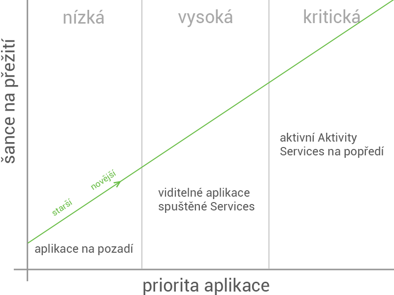

## Service
Service je služba, která běží na pozadí (ale na hlavním vláknu), nemá GUI a není přímo vázaná na životní cyklus nějaké Aktivity. Slouží ke zpracování dlouhotrvajících operací - stahování, přehrávání hudby na pozadí, zpracování dat...

**Service, ikdyž nemá GUI, běží v hlavním vláknu aplikace. Dlouhotrvající operace je třeba dělat ve 2. vlákně.**

Service je potřeba deklarovat v Manifestu. Je potřeba zde uvést minimálně její jméno. Další elementy.

```xml
<service
    android:name=".MyService"
    android:enabled="true" 
    android:exported="true" >
</service>
```

```java
public class MyService extends Service {
    
    @Override
    public int onStartCommand(Intent intent, int flags, int startId) {
        // TODO: udelat, co je potreba
        return START_NOT_STICKY;
    }
 
    @Override
    public IBinder onBind(Intent intent) {
        // TODO: Return the communication channel to the service.
        throw new UnsupportedOperationException("Not yet implemented");
    }
}
```

### Start Service - jednosměrná komunikace přes Intenty
```java
Intent i = new Intent(context, MyService.class);
// potentially add data to the intent
i.putExtra("KEY", "Value");
context.startService(i);
```

Opětovné volání *startService()* vytvoří právě 1 instanci Service, která poběží (*onCreate()* se zavolá 1x). Při dalších voláních *startService()* je spuštěno jen *onStartCommand()*. Proto s tím počítejte a nedělejte tam např. inicializaci, která by měla patřit do *onCreate()*.

#### Flagy pro restart

Na základě konstanty, kterou vracíme v onStartCommand() je nakládáno s restartem Service. [Konstanty](http://developer.android.com/reference/android/app/Service.html#constants):

* START_STICKY - po zabití je Service restartována. Startovací Intent je null. Hodí se pokud intent nepoužíváme.
* START_NOT_STICKY - po zabití nedojde k restartu. Jen pokud by v IntentQueue byly nezpracované intenty.
* START_REDELIVER_INTENT - stejně jako START_STICKY, jen je znovudoručen startovací Intent.

#### Stop
Service můžeme zastavit voláním *stopService()*. Tento krok vede k jejímu skončení. Service je možno skončit i zevnitř voláním *stopSelf()*, typicky po skončení prováděné práce.
 
```java
public class MyService extends Service {
 
    private static final String ACTION_PLAY = "com.example.action.PLAY";
    private static final String ACTION_PAUSE = "com.example.action.PAUSE";
    private static final String ACTION_STOP = "com.example.action.STOP";
 
    public static final String MY_SERVICE_INTENT = "com.example.service.intent";
    public static final String MY_SERVICE_MESSAGE = "com.example.service.MESSAGE";
 
    public int onStartCommand(Intent intent, int flags, int startId) {
        ...
        String action = intent.getAction();
        if (action.equals(ACTION_PLAY)) {
            //zacnu hrat
        } else if (action.equals(ACTION_PAUSE)) {
            //pauznu
        } else if (action.equals(ACTION_STOP)) {
            //prestanu hrat
        }
        ...
    }
 
    private void communicateBackToActivity(int message) {
        Intent intent = new Intent(MY_SERVICE_INTENT);
        intent.putExtra(MY_SERVICE_MESSAGE, message);
        sendBroadcast(intent);  // musim mit v aplikaci registrovany BroadcastReceiver, ktery dany intent zachyti
    }
 
    ...
```
}

### Bind Service - přímá komunikace
Service je možné spustit voláním *bindService()*. Tento způsob slouží pro přímé volání metod této Service. Komunikace probíhá přes objekt IBinder, který Service vrací metodou *onBind()*.

```java
public class MyService extends Service {
 
    private final IBinder mBinder = new MyBinder();
    
    private int result;
 
    ... //jak skoncime praci, tak nasetujeme result
 
    public int getResult() {
        return result;
    }
 
    @Override
    public IBinder onBind(Intent intent) {
        return mBinder;
    }
 
    public class MyBinder extends Binder {
        
        MyService getService() {
            return MyService.this;
        }
    }
}
```

```java
public class MainActivity extends Activity {
 
    private MyService mService;
 
    private ServiceConnection mConnection = new ServiceConnection() {
 
        public void onServiceConnected(ComponentName className, IBinder binder) {
            MyService.MyBinder binder = (MyService.MyBinder) binder;
            mService = binder.getService();
        }
 
        public void onServiceDisconnected(ComponentName className) {
            mService = null; //at neleakujeme pamet
        }
    };
 
    @Override
    protected void onStart() {
        super.onStart();
        Intent intent= new Intent(this, MyService.class);
        bindService(intent, mConnection, Context.BIND_AUTO_CREATE);
    }
 
    @Override
    protected void onStop() {
        super.onStop();
        unbindService(mConnection);
    }
 
    private void processServiceResult() {
        if (mService != null) {
            int result = mService.getResult();
            ...
        }
    }
}
```

### Event Bus - zjednodušená komunikace
Komunikace se Service a zpět je komplikovaná, proto je jednodušší využít event bus.
* [Otto](http://square.github.io/otto/)
* [RxBus](https://github.com/kaushikgopal/RxJava-Android-Samples/tree/master/app/src/main/java/com/morihacky/android/rxjava/rxbus)

### Service ve vlastním procesu
Service je možné spustit ve vlastním procesu pomocí deklarace
```
android:process=":nazev"
```
v Manifestu. Dvojtečka před názvem je volitelná a udává, zda je tento proces privátní pro naši aplikaci, nebo veřejně dostupný ze systému. Deklarace vlastního procesu pro Service je nezbytné, pokud má být přístupná z jiných aplikací. Vytvoření vlastního procesu vede také k alokaci separátního paměťového prostoru.

#### AIDL
Pro komunikace se Service ve vlastním procesu je třeba definovat vlastní [AIDL rozhraní](http://developer.android.com/guide/components/aidl.html).

### Intent Service
[IntentService](http://developer.android.com/reference/android/app/IntentService.html) běží ve vlastním vlákně. Je určena pro zpracování jednorázových operací. Požadavky na zpracování jsou Service zasílány formou Intentů. Tyto Intenty jsou řazeny do IntentQueue a postupně zpracovávány v *onHandleIntent()*. Po dokončení metody *onHandleIntent()* a prázdné IntentQueue, život této Service automaticky končí.

### Životnost
Service jsou spouštěny s větší prioritou, než Aktivity, protože by ze své podstaty měly dělat důležité operace. Proto je menší šance, že budou ze strany sytému zabity. I to se ovšem může stát, proto se dá service spustit s flagem, indikující, že po zabití má dojít k jejímu restartu (START_STICKY). Jsou ovšem druhy Service, které vyžadují, aby nebyly zabity vůbec - přehrávání hudby, GPS navigace. Je možné tedy Service spustit napopředí pomocí *startForeground()*. V takovém případě je po celý život Service zobrazena notifikace.

<div style="text-align: center;">
    
</div>

## Notifikace
Notifikace se získávají jako systémová služba – [NotificationManager](http://developer.android.com/reference/android/app/NotificationManager.html). Umožňuje publikování notifikací. Pro aplikaci můžete mít zobrazenu notifikaci, která obsahuje následující:

* Ikona – měla by být bílá s rozměry 24x24 dp
* Sekundární ikona
* Časová známka
* Titulek
* Text
* Progres – škála, nebo nekonečně se pohybující pruh
* Akce – Intent do aplikace (tzv. pending intent)

Notifikace tedy mají standardizovaný vzhled – jsou vlastně součástí systému. Tvoří se za pomocí Builderu. Ten definuje patřičné settery.

```java
Intent intent = new Intent(this, NotificationReceiver.class);
PendingIntent pIntent = PendingIntent.getActivity(this, 0, intent, 0);
 
Notification n  = new Notification.Builder(this)
       .setContentTitle("Moje notifikace")
       .setContentText("Je moc hezká, že")
       .setSmallIcon(R.drawable.icon)
       .setContentIntent(pIntent) //přesměruje nás do aplikace
       .setAutoCancel(true)
       .addAction(R.drawable.icon, "Akce 1", pIntent)
       .addAction(R.drawable.icon, " Akce 2", pIntent)
       .addAction(R.drawable.icon, " Akce 3", pIntent).build();
      
NotificationManager notificationManager =  (NotificationManager) getSystemService(NOTIFICATION_SERVICE);
notificationManager.notify(0, n); //0 udává číslo notifikace. Na některých zařízeních nefunguje jinačí int než 0.
```

Opětovným voláním *notify()* se přepíše aktuální notifikace. To se může hodit, pokud např. tvoříte notifikaci signalizující proces stahování. Pravidelně tak můžete aktualizovat stav. Notifikace je též možné zrušit pomocí *cancel()* nebo *cancelAll()*. Od API 21 je možné tvořit notifikace zobrazující se na lockscreenu. Více v oficiální [dokumentaci](http://developer.android.com/guide/topics/ui/notifiers/notifications.html).

### Rozšířené notifikace pro Wear
Stačí použít Notifikace ze Support library:

```java
// Pouzijeme WearableExtender pro pridani funkcionality specificke pro Wearables
NotificationCompat.WearableExtender wearableExtender =
       new NotificationCompat.WearableExtender()
       .setHintHideIcon(true);
 
// Pozor, musime pouzit NotificationCompat.Builder pro vytvoreni notifikace
// pripojime WearableExtender
Notification notif = new NotificationCompat.Builder(mContext)
       .setContentTitle("New mail from " + sender)
       .setContentText(subject)
       .setSmallIcon(R.drawable.new_mail);
       .extend(wearableExtender).build();
 
// Notifikace na Wereables mohou mit nekolik stran (obrazovek), mezi kterymi se da pohybovat
Notification twoPageNotification =
       new WearableExtender()
               .addPage(secondPageNotification)
               .extend(notificationBuilder)
               .build();
 
// Aktivovat notifikaci
notificationManager =  NotificationManagerCompat.from(this); //POZOR - NotificationManager se neziskava, jako systemova sluzba
notificationManager.notify(notificationId, twoPageNotification)
```

## BroadcastReceiver

V rámci celého systému můžeme globálně (i lokálně) zasílat broadcasty pomocí *sendBroadcast(Intent i)*. Přijímání broadcastu se děje na základě filtru jména, které je specifikováno v Intentu. Takto se dá např. komunikovat s cizími aplikacemi.

### Globální
Je aktivován, ikdyž není aplikace spuštěna. Spustí se nadefinovaný [BroadcastReceiver](http://developer.android.com/reference/android/content/BroadcastReceiver.html), který má broadcast obsloužit.

```xml
//AndroidManifest.xml
<receiver android:name=".NetworkChangeReceiver" >
           <intent-filter>
               <action android:name="android.net.conn.CONNECTIVITY_CHANGE" />
               <action android:name="android.net.wifi.WIFI_STATE_CHANGED" />
           </intent-filter>
</receiver>
```

### Lokální
Jen v rámci běžící zobrazené Aktivity. Je vhodný jen pro broadcasty, které dávají smysl jen za běhu aplikace. Např. když vypadne internet a naše aplikace neběží, tak je nám to jedno.

```java
public class BroadcastActivity extends AppCompatActivity {
 
    BroadcastReceiver mReceiver = new BroadcastReceiver() {
        @Override
        public void onReceive(Context context, Intent intent) {
            if (isNetworkConnected(context)) {
                //doSomething();
            } else {
                //doSomethingElse();
            }
        }
    };
 
    @Override
    protected void onStart() {
        super.onStart();
 
        IntentFilter intentFilter = new IntentFilter(ConnectivityManager.CONNECTIVITY_ACTION);
        intentFilter.addAction(WifiManager.WIFI_STATE_CHANGED_ACTION);
        registerReceiver(mReceiver, intentFilter);
    }
 
    @Override
    protected void onStop() {
        super.onStop();
 
        unregisterReceiver(mReceiver);
    }
    
    private boolean isNetworkConnected(Context context) {
        ConnectivityManager cm = (ConnectivityManager) context.getSystemService(Context.CONNECTIVITY_SERVICE);
 
        NetworkInfo activeNetwork = cm.getActiveNetworkInfo();
        return activeNetwork != null && activeNetwork.isConnectedOrConnecting();
    }
}
```

### V rámci 1 aplikace
Broadcasty můžeme vytvářet jen s omezenou působností - pouze na naši aplikaci. Je to bezpečnější - neinformujeme zároveň ostatní aplikace.

```java
LocalBroadcastManager.getInstance(this).registerReceiver(receiver,intentFilter);
```

### S WakeLockem
Někdy potřebujeme provést po probuzení aplikace akci, kterou nechceme mít přerušenou. Na to se dá použít [WakefulBroadcastReceiver](https://developer.android.com/reference/android/support/v4/content/WakefulBroadcastReceiver.html).

```java
LocalBroadcastManager.getInstance(this).registerReceiver(receiver,intentFilter);
```