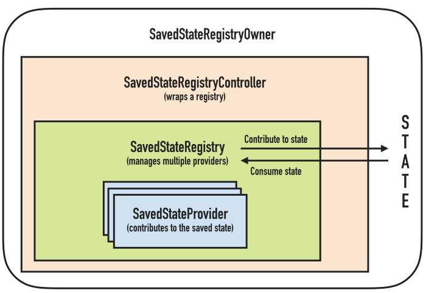
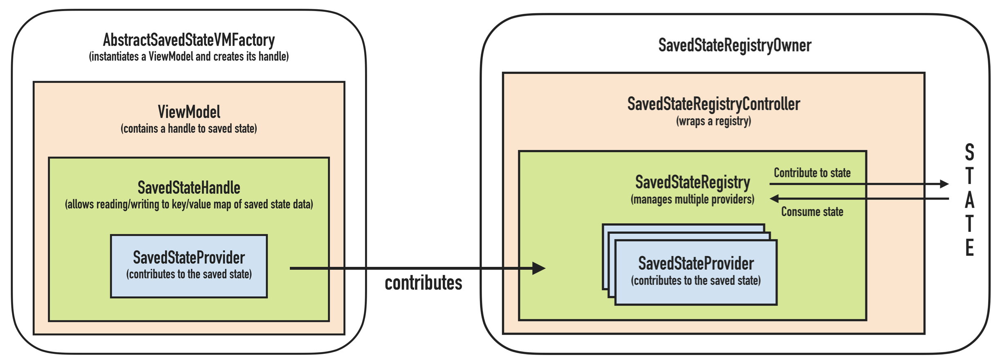

# Lifecycle Aware Components

## Lifecycle Components

Lifecycle components provide better organisation of code and action implementation over components which are influenced by a lifecycle and need to communicate with components having a lifecycle \(Activities/Fragments\).

### LifecycleObserver

`LifecycleObserver` is an interface which doesn't provide any methods, but annotations, which you can use on your methods to mark a lifecycle state event they respond to.

```kotlin
class MyObserver : LifecycleObserver {

    @OnLifecycleEvent(Lifecycle.Event.ON_RESUME)
    fun connectListener() {
        // ...
    }

    @OnLifecycleEvent(Lifecycle.Event.ON_PAUSE)
    fun disconnectListener() {
        // ...
    }
}

myLifecycleOwner.getLifecycle().addObserver(MyObserver())
```

In this way, you don't have to implement custom logic of notifying your classes of lifecycle state change. And from the other perspective, when communicating back to a lifecycle component - like Activity, you may want to perform certain actions only when in the right state - for instance UI operations are only permitted in the visible lifecycle.

```kotlin
if (lifecycle.currentState.isAtLeast(Lifecycle.State.STARTED)) {
    // perform a UI operation
}
```

### LifecycleOwner

`LifecycleOwner` can be thought of as an abstraction over `Activity`/`Fragment`. It has an [`Lifecycle`](https://developer.android.com/reference/androidx/lifecycle/Lifecycle), which `LifecycleObservers` can be notified of.

**More info:**

* [Handling Lifecycles with Lifecycle-Aware Components](https://developer.android.com/topic/libraries/architecture/lifecycle)

## ViewModel

`ViewModel` is a reaction from Google \(year 2017!\) to absence of a framework or official methodology on how to handle `Activity` state during lifecycle or configuration changes. `ViewModel` can handle state of an`Activity` or a `Fragment`.


`ViewModel` is a class that is responsible for preparing and managing the data for an `Activity` or a `Fragment`. It also handles the communication of the `Activity` / `Fragment` with the rest of the application \(e.g. calling the business logic classes\).

A `ViewModel` is always created in association with a scope \(a fragment or an activity\) and will be retained as long as the scope is alive. E.g. if it is an `Activity`, until it is finished.

In other words, this means that a `ViewModel` will not be destroyed if its owner is destroyed for a configuration change \(e.g. rotation\). The new owner instance just re-connects to the existing model.

The purpose of the `ViewModel` is to acquire and keep the information that is necessary for an `Activity` or a `Fragment`. The `Activity` or the `Fragment` should be able to observe changes in the `ViewModel`. `ViewModels` usually expose this information via [`LiveData`](https://developer.android.com/reference/androidx/lifecycle/LiveData) or Android Data Binding. You can also use any observability construct from you favorite framework.

`ViewModel's` only responsibility is to manage the data for the UI. It **should never** access your view hierarchy or hold a reference back to the `Activity` or the `Fragment`.

**More info:**

* [Android Jetpack: ViewModel](https://www.youtube.com/watch?v=5qlIPTDE274&ab_channel=AndroidDevelopers)

## SavedState components

SavedState components are a new addition of lifecycle aware components, that deal with saving state and most importantly,  they help you restore it, when `Activity` or `Fragment` are recreated.



#### SavedStateProvider

`SavedStateProvider` is an interface whose `saveState()` method must be implemented to save your state.

#### SavedStateRegistry

`SavedStateRegistry` manages multiple `SavedStateProviders`, each identified by a unique key. The registry is bound to Activity/Fragment's \(SavedStateRegistryOwner's\) lifecycle. All registries are saved before their Activity/Fragment is destroyed. The final bundle which is going to be saved will end up in `onSaveInstanceState()`.

You may ask, is this any different from saving the state in `onSaveInstanceState`? No, but the concept of save registries is important. It gives us possibility to easily provide a saving mechanism to components which don't have direct access to `onSaveInstanceState`, like `ViewModel`, for instance. In fact `ViewModel's` `SavedState` handle is just a wrapper around SavedStateRegistryOwner's `SavedStateProvider`.

#### SavedStateRegistryController

`SavedStateRegistryController` is a convenience class, handling save and restore operations over a registry.

### Saving ViewModel's state

As seen in the [figure](surviving-inside-a-lifecycle.md#viewmodel) above, using a `ViewModel` itself can solve trouble with configuration changes, like screen rotation, however `ViewModel` doesn't survive system initiated process death. This is the case where you need to use `onSaveInstanceState`, as mentioned in the preceding sections. Thankfully, you don't have to implement communication with `Activity's`/`Fragment's` `onSaveInstanceState` method yourself. There's [`SavedStateHandle`](https://developer.android.com/reference/androidx/lifecycle/SavedStateHandle), which can be passed in `ViewModel's` constructor. `SavedStateHandle` provides map like interface to save your state data.



```kotlin
class SavedStateViewModel(private val state: SavedStateHandle) : ViewModel() { ... }
```

Since using constructor with SavedStateHandle is recognised by ViewModels, you can obtain an instance of the ViewModel the usual way:

```kotlin
class MainFragment : Fragment() {
    val vm: SavedStateViewModel by viewModels()

    // ...
}
```

**More info:**

* [ViewModels: A simple example](https://medium.com/google-developers/viewmodels-a-simple-example-ed5ac416317e)
* [Android ViewModels: State persistence — SavedState](https://proandroiddev.com/viewmodels-state-persistence-savedstate-54d015acad82)

## LiveData

[`LiveData`](https://developer.android.com/reference/androidx/lifecycle/LiveData) is an observable data holder class. Unlike a regular observable, LiveData is lifecycle-aware, meaning it respects the lifecycle of other app components, such as activities, fragments, or services. This awareness ensures LiveData only updates app component observers that are in an active lifecycle state.

LiveData considers an observer, which is represented by the [`Observer`](https://developer.android.com/reference/androidx/lifecycle/Observer) class, to be in an active state if its lifecycle is in the [`STARTED`](https://developer.android.com/reference/androidx/lifecycle/Lifecycle.State#STARTED) or [`RESUMED`](https://developer.android.com/reference/androidx/lifecycle/Lifecycle.State#RESUMED) state. LiveData only notifies active observers about updates. Inactive observers registered to watch [`LiveData`](https://developer.android.com/reference/androidx/lifecycle/LiveData) objects aren't notified about changes.

You can register an observer paired with an object that implements the [`LifecycleOwner`](https://developer.android.com/reference/androidx/lifecycle/LifecycleOwner) interface. This relationship allows the observer to be removed when the state of the corresponding [`Lifecycle`](https://developer.android.com/reference/androidx/lifecycle/Lifecycle) object changes to [`DESTROYED`](https://developer.android.com/reference/androidx/lifecycle/Lifecycle.State#DESTROYED). This is especially useful for activities and fragments because they can safely observe [`LiveData`](https://developer.android.com/reference/androidx/lifecycle/LiveData) objects and not worry about leaks—activities and fragments are instantly unsubscribed when their lifecycles are destroyed.

```kotlin
// 1)
val liveData: MutableLiveData<String>()

// 2)
liveData.observe(this, { 
  // Update UI  
})

// 3)
liveData.value = "Hello World"
```

1. Create `LiveData` object. `MutableLiveData` allow for modification of their state
2. Subscribe to changes in liveData's values \(= observe it\)
3. Publish changes to liveData

Note that the liveData object is usually placed inside a `ViewModel`, while observation of its state happens in Fragment/Activity.

### SingleLiveEvent

When using `LiveData`, you encounter the fact that events submitted ase live data can be emitted multiple times, for instance, ofter resubscribing after `Activity` recreation. [`SingleLiveEvent`](https://github.com/android/architecture-samples/blob/dev-todo-mvvm-live/todoapp/app/src/main/java/com/example/android/architecture/blueprints/todoapp/SingleLiveEvent.java) is a `MutableLiveData` which ensures, the event is fired only once. This is especially handy when used as a trigger for a Toast message, SnackBar etc. This solution has a drawback - only one observer will be notified of changes, which is OK, if you intend to observe this `LiveData` only on one place.


You can implement similar functionality by wrapping your `LiveData` values into a class which provides a flag about observed state and you ensure that reading wrapped data modifies this flag, so that another observer receiving it will know it's been already read.


**More info:**

* [LiveData Overview](https://developer.android.com/topic/libraries/architecture/livedata)

