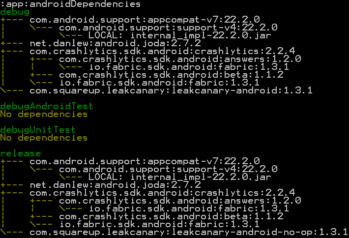

# Gradle

Android Studio leverages [Gradle](https://docs.gradle.org/current/release-notes.html) as a build system. Gradle is built using [Groovy](http://www.groovy-lang.org/) programming language. Groovy, same as Kotlin is a language compiled to Java bytecode. Gradle structures a build script using **D**omain-**S**pecific **L**anguage, which resembles JSON document. For Android specific features and builds, Gradle uses [Android plugin for Gradle](https://developer.android.com/studio/build).

### Gradle VS Gradle Wrapper

Standalone Gradle installation is probably something you won't use with Android projects, they use Gradle Wrapper, which main advantage is that it can be versioned and shipped along with the app. This way you avoid situations, where different members of the same team would be building the same app code with different Gradle versions, and potentially ending up with different results.

Minimal Gradle wrapper installation consist of the following:

* gradle-wrapper.jar
* gradle-wrapper.properties
* sh/bat scripts \(gradlew\)

First interaction with gradlew checks its version, if it's not install yet, it performs installation. Further build then uses local installation.

#### Project structure

Default Android Studio project is structure to be multi-modular \(even though it defines just single app module from start\). `build.gradle` file on the root level defines common configurations for all submodules. Every module defines its own `build.gradle` file defining its specific configurations. Another settings.gradle declares submodules. Without this definition, a module won't be detected and will be interpreted as a plain directory.


```groovy
include ':app', ':library-app'
```


#### Dependencies

Dependencies, or libraries are obtained from repositories. Google uses their own repository for Android libraries. Other library creators use either Maven Central or jCenter \(no longer maintained\), or custom, not so popular repositories.

Dependency is identified by following pattern: `GROUP_ID:ARTIFACT_ID:VERSION`

```groovy
implementation 'com.example:application:1.0.0'
```

Library can be located by composing an URL: `repository/GROUP_ID/ARTIFACT_ID/VERSION` Gradle, takes one by one list of defined repositories, assembles an URL and fires a request, if it fails, the next repository is used until it's successful or there are no other repositories left.

#### Don't use dynamic dependency versioning

Gradle allows to define + sign instead of version number. This way the latest discovered revision is used. This is potentially dangerous, since it leads to indeterministic build outputs \(= 2 succeeding builds result in different output\). New library versions may introduce:

1. breaking changes
2. new errors


#### Know your dependencies

Sometimes, you may encounter a situation when you introduce multiple dependencies which link to the same library, but in a different version. This is resolved by Gradle, but since only 1 library version can be used, you might end up in a non-compatible state. To investigate your dependency tree, run:

```bash
./gradlew androidDependencies
```



### Default config - versions

#### compileSdkVersion

Version of Android SDK which is going to be used for code compilation. Using the latest version is strongly recommended. Newer versions contain latest SDK, thus new classes, methods, deprecation warnings, lint annotations... Major version should match version of build tools

#### minSdkVersion

This parameter sets lower bound for SDK level your app is going to use. Using features from higher SDK version results in static code analysis warnings and cannot be used without runtime checks.

#### targetSdkVersion

This version marks the SDK level which is used as the higher bound \(even though you may compile against higher version\). This parameter helps to maintain compatibility of old applications running on newer system versions.

For instance, Android 6 \(API 23\) added runtime permissions, which would break application compiled before this release. Therefore, enforcing runtime permissions was applied for apps with targetSdkVersion &gt;= 23.

This is the ideal scenario: 

```text
minSdkVersion (lowest possible) <= targetSdkVersion == compileSdkVersion (latest SDK)
```


