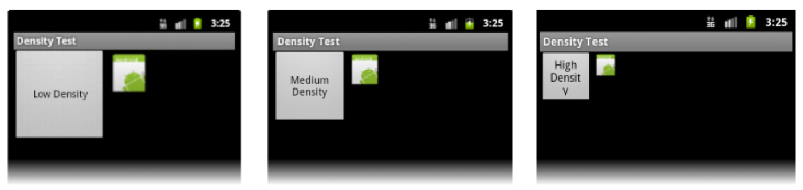
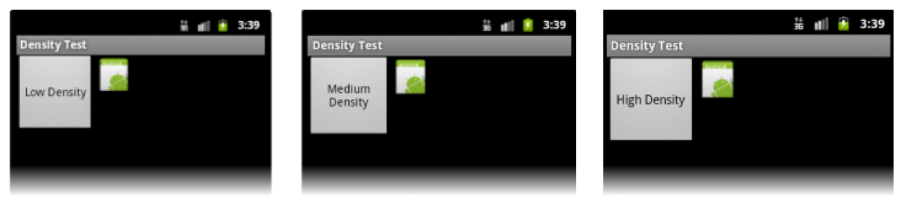

# Layout and Views

## Pixel Density

Pixel density means how many physical pixels can you fit into a 2D space with given dimensions. Display density is usually measured in dot per inch \(DPI\), where the dot can be considered a pixel.

   

### Density-independent Pixels \(DP\) 

When taking physical screen dimensions into account, you usually intend for the same layout, no matter the resolutions. To achieve this, you need a unit which translates to physical pixels differently, based on your screen density. _Dips_ or _DPs_ were introduced to avoid positioning and scaling based on pixels. 





### Scalable Pixels \(SP\)

The _sp_ unit is the same size as _dp_, by default, but it resizes based on the user's preferred text size. That can be done on the system level, and is not used exclusively by visually impaired.


Always use this unit for text, never for layouts.


#### Read More:

* [Support different pixel densities](https://developer.android.com/training/multiscreen/screendensities)

## Drawables

Drawables can have a form of a PNG file or it can be a XML definition of a vector image.

### Shape Drawables

Drawable definition in XML is great for its smaller size, and on-device rendering. The final output is compiled out of graphical primitives, colors and gradients.

Blue rectangle with round edges:

```markup
<shape android:shape="rectangle">
    <solid android:color="@android:color/blue_dark" />
    <corners android:bottomLeftRadius="8dp"
        android:bottomRightRadius="8dp" />
</shape>
```

Drawables can have multiple layers, constructing complex shapes:

```markup
<layer-list>
    <item>
        <shape>
            <solid android:color="@color/gray" />
            <corners android:bottomRightRadius="4dp"
                android:bottomLeftRadius="4dp"
                android:topRightRadius="4dp"
                android:topLeftRadius="4dp" />
        </shape>
    </item>
    <item android:bottom="4dp">
        <shape>
            <solid android:color="@color/black" />
            <corners android:bottomRightRadius="4dp"
                android:bottomLeftRadius="4dp"
                android:topRightRadius="4dp"
                android:topLeftRadius="4dp" />
        </shape>
    </item>
</layer-list>
```

### 9-patch

Modified PNG image \([.9.png](http://developer.android.com/guide/topics/graphics/2d-graphics.html#nine-patch)\), where pixels at its edges describe the way it can be stretched. It got its name based on 9 sectors dividing it into patches:


* **1, 3, 7, 9** - corners are static and don't stretch
* **2, 8** - top and bottom sectors can be stretched horizontally
* **4, 6** - left and right sides can be stretched vertically
* **5** - the center can be stretched in both directions

  

Green parts are stretched in one direction. Pink parts can be stretched to both directions. There can be more than 9 stretchable areas.

#### Optical bounds

Optical bounds were introduced in Androidu 4.3. They mark part of the image which isn't considered as part of the image dimensions. This is used for casting shadow from the image.


#### Draw 9-patch Editor

[Editor](https://developer.android.com/tools/help/draw9patch.html) is part of the Android SDK. You can use it to convert PNG files into .9.png.

### Selectors

Selector is a special kind of Drawable. It can change its visual state based on conditions defined inside it. Basically, it's a list of other Drawables or colors with assigned display conditions. Conditions are evaluated from top to bottom. Item without any conditions is considered to be a fallback variant.

```markup
<selector xmlns:android="http://schemas.android.com/apk/res/android">
   <item android:state_pressed="true" android:color="@color/light_blue"/>
   <item android:state_focused="true" android:color="@color/dark_blue"/>
   <item android:state_selected="true" android:state_activated="true" android:color="@color/light_blue_A400"/>
   <item android:state_selected="true" android:state_activated="false" android:color="@color/gray"/>
   <item android:color="@color/black"/>
</selector>
```

## View Types

### View

View is a single UI component which represents the basic building block for user interface components. Its behavior and look is defined programatically by extending a [View](https://developer.android.com/reference/android/view/View) class.

#### Widget

Widget is a special type of a View, which main purpose is not only to display information, but also to provide additional functionality. Typical widget is a [VideoView](https://developer.android.com/reference/android/widget/VideoView).

### ViewGroup

ViewGroup is a subclass, that is the base class for _layouts_, which are invisible containers that hold other Views \(or other ViewGroups\) and define their layout properties. Views inside a ViewGroup are called child views.

## Layout Types

### RelativeLayout

[`RelativeLayout`](https://developer.android.com/guide/topics/ui/layout/relative) is a view group that displays child views in relative positions. The position of each view can be specified as relative to sibling elements \(such as to the left-of or below another view\) or in positions relative to the parent [`RelativeLayout`](https://developer.android.com/reference/android/widget/RelativeLayout) area \(such as aligned to the bottom, left or center\).



```markup
<RelativeLayout
    android:layout_width="match_parent"
    android:layout_height="match_parent"
    android:padding="16dp">

    <EditText
        android:id="@+id/title"
        android:layout_width="match_parent"
        android:layout_height="wrap_content"
        android:hint="Title"/>

    <Button
        android:id="@+id/button"
        android:layout_width="wrap_content"
        android:layout_height="wrap_content"
        android:layout_below="@id/title"
        android:layout_alignParentRight="true"
        android:text="Button" />

</RelativeLayout>
```







### LinearLayout

[`LinearLayout`](https://developer.android.com/guide/topics/ui/layout/linear) is a view group that aligns all children in a single direction, vertically or horizontally. You can specify the layout direction with the [`android:orientation`](https://developer.android.com/reference/android/widget/LinearLayout#attr_android:orientation) attribute.



```markup
<LinearLayout
    android:layout_width="match_parent"
    android:layout_height="match_parent"
    android:orientation="vertical">

    <Button
        android:layout_width="wrap_content"
        android:layout_height="wrap_content"
        android:text="Button 1" />

    <Button
        android:layout_width="wrap_content"
        android:layout_height="wrap_content"
        android:text="Button 2" />

    <Button
        android:layout_width="wrap_content"
        android:layout_height="wrap_content"
        android:text="Button 3" />

</LinearLayout>
```







### FrameLayout

[`FrameLayout`](https://developer.android.com/reference/android/widget/FrameLayout) is designed to block out an area on the screen to display a single item. Generally, `FrameLayout` should be used to hold a single child view, because it can be difficult to organize child views in a way that's scalable to different screen sizes without the children overlapping each other. You can, however, add multiple children to a `FrameLayout` and control their position within the `FrameLayout` by assigning gravity to each child, using the [`android:layout_gravity`](https://developer.android.com/reference/android/widget/FrameLayout.LayoutParams#attr_android:layout_gravity) attribute.

Child views are drawn in a stack, with the most recently added child on top.



```markup
<FrameLayout
    android:layout_width="match_parent"
    android:layout_height="match_parent">

    <TextView
        android:layout_width="wrap_content"
        android:layout_height="wrap_content"
        android:layout_gravity="center"
        android:text="Hello World!" />

</FrameLayout>
```







### ConstraintLayout

Available since Android Studio v 2.2. It allows creation of flat view hierarchy, which can improve view rendering latencies. It was created to replace RelativeLayout or LinearLayout using wight attributes. These both group layouts have computationally expensive onMeasure phase, which can be simplified by mathematical expressions in ConstraintLayout. This way the dimensions can be computed with constant complexity. It's being shipped as independent support library, so it can be used regardless the version on OS.




```markup
<androidx.constraintlayout.widget.ConstraintLayout
    android:layout_width="match_parent"
    android:layout_height="match_parent">

    <TextView
        android:id="@+id/button"
        android:layout_width="wrap_content"
        android:layout_height="wrap_content"
        android:text="Hello World!"
        app:layout_constraintBottom_toBottomOf="parent"
        app:layout_constraintEnd_toEndOf="parent"
        app:layout_constraintStart_toStartOf="parent"
        app:layout_constraintTop_toTopOf="parent" />

</androidx.constraintlayout.widget.ConstraintLayout>
```







### CoordinatorLayout

Enhanced FrameLayout. It allows for creation of UI with animations. CoordinatorLayout's child views can be animated together based on defined behaviors from state A to state B. It's one of the fundamental parts of the Material Design language.


## Gotchas

### Don't use RelativeLayout as a parent view of a complex view structure

RelativeLayout is suitable for simple view hierarchy only. Complex structure leads to slow rendering and can introduce a jank.

RelativeLayout uses 2 passes in its onMeasure phase. First phase computes size of its child views, the second pass sets its own dimensions.

### Efficient Layout Inflation

Using the following layout:

```markup
<ViewGroup android:id="@+id/root">
    <View android:id="@+id/leaf" />
    <ViewGroup android:id="@+id/inner_group">
        <View android:id="@+id/inner_leaf" />
    </ViewGroup>
</ViewGroup>
```

**What's the difference between** _**A**_ **and** _**B**_**?**

A\)

```kotlin
val vg = findViewById<View>(R.id.inner_group) as ViewGroup
val v: View = findViewById(R.id.inner_leaf)
```

B\)

```kotlin
val vg = findViewById<View>(R.id.inner_group) as ViewGroup
val v = vg.findViewById<View>(R.id.inner_leaf)
```

Calling `findViewById()` on the root view results in subsequent calls of this function on all of its children, or until the ID is found. Example A finds the ID following these steps:

1. root-&gt;leaf  
2. root-&gt;inner\_group  
3. inner\_group-&gt;inner\_leaf

Example B has just one step:

1. inner\_group-&gt;inner\_leaf

### Minimising Overdraw

Placing views on top of each other \(usually when using FrameLayout\) introduces overdraw. The UI is rendered in layers, and if you have views overlapping each other, some pixels might be overdrawn multiple times, before the whole layout is finally rendered.

See the the image below. The background o window is rendered first, then the background of a ToolBar, then the wide image and finally the poster image on top of it. Pixels in the top poster area were overdrawn as much as 4 times!


Overdrawing existing pixels is a redundant operation and slows down the whole process of rendering, because we compute an information which is then discarded.


You can activate overdraw visualisation in Developer options.



Overdraw can be introduced just by applying a redundant background color:

  

