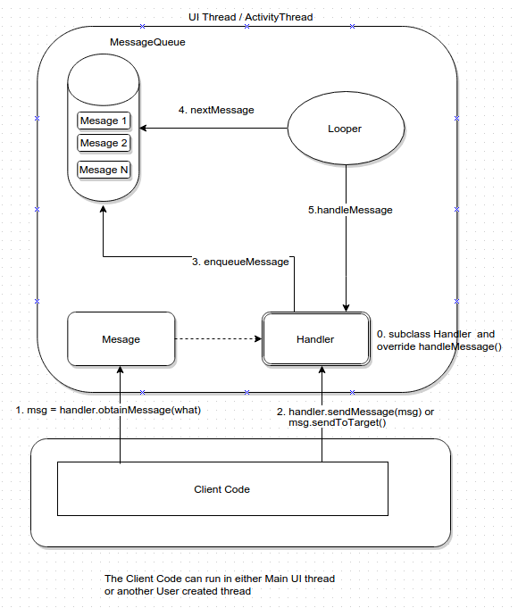

# Networking, Threads

## Networking

### Manifest Permissions

Network connection requires Internet permission, which is declared in the AndroidManifest:

```markup
<uses-permission android:name="android.permission.INTERNET" />
```

Permissions are used to inform users about about potentially dangerous or harmful requirements of the app. You can't access wanted resource without defining a permission and user accepting it \(either before installation or runtime\). Defining a permission doesn't only warn before risky behavior of your app, it influences set of usable devices too \(not applicable devices are excluded from downloading such app on the Play store\). I.e. defining a camera permission implies your device has one. 

#### StrictMode

Starting from API 11 \(3.0 Honeycomb\), Android enables StrictMode to watch for network activity on the Main Thread - none is allowed. If you violate this rule, your app crashes with `NetworkOnMainThreadException`. This happens because the purpose of the Main Thread is to handle UI operations and GUI itself. If you block it with non related requests, Main Thread can not handle UI rendering and you start experiencing a jank, or worse, your app can be killed by the system with ANR dialogue \(Application Not Responding\).

### HTTP Clients

Up to API 23, Android SDK contained 2 HTTP client implementations - standard `java.net.HttpURLConnection` and Apache's HTTP Client in form of `AndroidHttpClient`. Apache's client was eventually made obsolete, with `HttpURLConnection` superseding it.

#### OkHttp

```groovy
implementation 'com.squareup.okhttp3:okhttp:4.9.0'
```

[OkHttp](http://square.github.io/okhttp/) is a popular library by Square. It can handle synchronous and asynchronous calls. It defines 3 basic types: `Request`, `Response`, and `Call`. `Request` is a synchronous request, followed by `Response`. `Call` serves the same purpose as `Request`, but it's asynchronous.

OkHttp is wide spread library, it's used across Square's library ecosystem and Android [as of Android 4.4](https://twitter.com/JakeWharton/status/482563299511250944) is using OkHttp for its internal `HttpUrlConnection` implementation. Nevertheless, using the library as external dependency means you will get up to date implementation even on older Android versions.

```kotlin
private val client = OkHttpClient()

fun run() {
    val request = Request.Builder()
        .url("https://publicobject.com/helloworld.txt")
        .build()

    client.newCall(request).execute().use { response ->
      if (!response.isSuccessful) throw IOException("Unexpected code $response")

      for ((name, value) in response.headers) {
        println("$name: $value")
      }

      println(response.body!!.string())
    }
}
```

While calling a synchronous `Request`, the executing thread is waiting for `Response`. It is necessary to run this off of the Main Thread, where the asynchronous variant might be useful:

```kotlin
private val client = OkHttpClient()

fun run() {
    val request = Request.Builder()
        .url("http://publicobject.com/helloworld.txt")
        .build()

    client.newCall(request).enqueue(object : Callback {
      override fun onFailure(call: Call, e: IOException) {
        e.printStackTrace()
      }

      override fun onResponse(call: Call, response: Response) {
        response.use {
          if (!response.isSuccessful) throw IOException("Unexpected code $response")

          for ((name, value) in response.headers) {
            println("$name: $value")
          }

          println(response.body!!.string())
        }
      }
    })
}
```

Async variant with the callback is executed on a networking thread, but be warned, callback functions are still being run on the networking thread. This has several implications:

1. if you decide to update your GUI, you will fail, since all UI related operations must run on the Main Thread
2. OkHttp uses thread pooling, so next network calls might be blocked


Handle HTTP clients as singletons, they are heavy object, and they can reuse cache, cookies, connections...


#### **Retrofit**

[Retrofit](https://square.github.io/retrofit/) is a API client made easy. It's one many excellent Square libraries, making your life in Android easier. It uses annotations to describe the HTTP request:

* URL parameter replacement and query parameter support
* Object conversion to request body \(e.g., JSON, protocol buffers\)
* Multipart request body and file upload

```kotlin
interface ApiService {

    @GET("jokes/random")
    suspend fun getRandomJoke(): Joke

    companion object {

        private const val API_ENDPOINT = "https://api.chucknorris.io/"

        val apiService by lazy { create() }

        private fun create(): ApiService = Retrofit.Builder()
            .baseUrl(API_ENDPOINT)
            .addConverterFactory(MoshiConverterFactory.create())
            .client(OkHttpClient())
            .build()
            .create(ApiService::class.java)
    }
}
```

## Working off the Main Thread

### Thread, Runnable

Threads and Runnables are the main constructs to handle threads in Java. They are beyond scope of this course, and are taught in [PV168](http://kore.fi.muni.cz/wiki/index.php/PV168/Vl%C3%A1kna).

```kotlin
// Thread definition
class MyThread : Thread() {
    override fun run() {
        // TODO do some work on a new thread
    }
}

// execute a thread
MyThread().start()
```

```kotlin
// Runnable
class MyRunnable : Runnable {
    override fun run() {
        // TODO do some work on a new thread
    }
}

// execute a thread
Thread(MyRunnable()).start()
```

### Handler

`Handler` is used extensively by Android framework to achieve concurrent behavior. A typical use case is to allow a worker thread to post an action to be run in the UI thread.

Every thread has 0 or 1 `Looper`. Classical `Thread` doesn't have any `Looper`. If you need one, it must be invoked by calling `Looper.prepare()` followed by `Looper.loop()`, or using a `HandlerThread` directly. The Main Thread has always a `Looper`. It is accessible by `Looper.getMainLooper()`.

Every `Looper` iterates over 1 `MessageQueue`. `Looper's` loop\(\) loops over the `MessageQueue` and handles its messages \(if there are any available\).

`Handler` is a `Message` producer. Each `Handler` is initialised and connected to a `Looper` \(either explicitly by passing the `Looper`, or it's associated with the `Looper` of a `Thread` it's created in\). When sending a `Message` via `Handler's` `sendMessage()`, the `Message` will be send to a `MessageQueue` of the associated `Looper`. `Handler` can handle messages of a type `Message` or `Runnable`.




Note - `sendMessage()` can be called from any `Thread`, while handling of the `Message` in `handleMessage()` will always happen in the associated `Looper's` `Thread`.


One Looper can be shared by multiple Handlers.

Each Message must have a Handler capable of its handling.

Example of autocomplete, when every request is send with a delay \(to minimise server's load\):

```kotlin
private var lastChange: Long = 0
    private val handler: Handler = Handler(Looper.getMainLooper()) // Creates Handler associated with the Main Thread

    private val autoCompleteRunnable = Runnable {
        if (noChangeInTextInTheLastFewSeconds()) {
            searchAndPopulateListView(chars.toString())
        }
    }

    fun onTextChanged(chars: CharSequence?,
                      start: Int, before: Int, count: Int) {
        handler.removeCallbacks(autoCompleteRunnable) // cancel any possible scheduled runnables that were't run
        handler.postDelayed( // 1st argument - message to be run on the Main Thread
                autoCompleteRunnable,  // 2nd argument - ms to wait with performing the action
                300)
                300)
        lastChange = System.currentTimeMillis()
    }

    private fun noChangeInTextInTheLastFewSeconds(): Boolean {
        return System.currentTimeMillis() - lastChange >= 300
    }
```

#### Want More?

* [Looper](http://pierrchen.blogspot.cz/2015/08/android-concurrent-programming-looper.html)
* [Handlers](http://nerds.weddingpartyapp.com/tech/2014/06/20/primer-threading-handlers-android/)

### Coroutines

Coroutines are a great Kotlin's addition for handling concurrency. They provide a way of writing **asynchronously ran code in a sequential manner**. Moreover, coroutines are backed by a thread pool, where one Thread can run multiple coroutines, making them very efficient.

#### Suspending Functions

Suspending functions are special kind of functions that can suspend their execution and then resume at the same point. Let's take a look again at the example from OkHttp:

```kotlin
fun run() {
    // ...

    client.newCall(request).enqueue(object : Callback {
      override fun onFailure(call: Call, e: IOException) {
        // do something
      }

      override fun onResponse(call: Call, response: Response) {
        response.use {
          // do something else
        }
      }
    })
}
```

From this example, it might seem, that onFailure or onResponse are executed immediately, or in the same context. But that's not true.

What you can do with coroutines, is to take the synchronous implementation of the call, and rather turn the function to be suspend function:

```kotlin
suspend fun run() {
  // ...
  // fetchResponse is going to be suspended
  // until its result becomes available, without blocking the main thread
  val result = fetchResponse()
  // continues executing once the result becomes available
  // ...
}

suspend fun fetchResponse(): Response {
    // ...

    client.newCall(request).execute().use { response ->
      // ...
      return response
    }
}
```

Both examples handle the same thing correctly, the main difference is, that the second one reads and also executes in a sequential order, even though it's processing an async operation.


Suspend functions can be run only within a coroutine or another suspend function.


#### Scope

Coroutine scope is a context where the coroutine is run. It defines where and how is the coroutine is going to be invoked.

**Coroutine Dispatchers**

Dispatchers define a thread on which the coroutine will run:

1. Main - on the Main Thread
2. Default - on a thread pool dedicated to CPU intensive operations
3. IO - on a thread pool dedicated Input/Output operations, like API calls or DB queries

**Coroutine Builders**

Builders define, how the coroutine will run:

1. runBlocking - will run synchronously \(useful for testing purposes\)
2. launch - launches the coroutine on a thread specified by its dispatcher
3. async - special case of launch, which returns `Deffered`, a `Job`, that can be wait upon or cancelled

**Async - Await**

```kotlin
val one = async { doSomethingUsefulOne() }
val two = async { doSomethingUsefulTwo() }
println("The answer is ${one.await() + two.await()}")
```

#### Changing context of the Scope

It may occur to you, that you run a coroutine inside one context and need to switch temporarily to a new one - You are operating within `Main`, but need to perform a CPU intensive computation, thus switching to `Default` dispatcher. Changing of context happens using `withContext()` function.

```kotlin
CoroutineScope(Dispatchers.Main).launch {
     val result =  withContext(Dispatchers.Default) {
      // do expensive calculation
     }
}
```

#### Jobs

Launching a coroutine returns a Job object. Jobs are useful for handling an already launched coroutine, mainly for the purpose of its cancelation.

```kotlin
private fun doSomething() {
   job = CoroutineScope(Dispatchers.Main).launch {
     // do something
   }
}

override fun onDestroy() {
   super.onDestroy()
   // cancel the job later, where it's no longer needed
   job.cancel()
}
```

When cancelling a `Job` of a scope, all coroutines inside that scope get cancelled as well.

#### Android-specific Scopes

To avoid memory leaks and unnecessary calculations, when your Activity/Fragment reaches end of their lifecycle, it's important to cancel all running coroutines as well.

1. **lifecycleScope** - to be used in `LifecycleOwners`
2. **viewModelScope** - to be used in `ViewModels`

