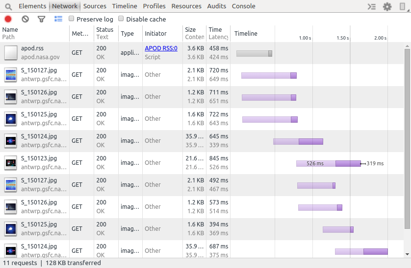

# Niceties

### Logging

Using logs is simple, just include [Timber](https://github.com/JakeWharton/timber) into your project. Timber solves 2 most painful points about logging:

1. Removes the need of specifying a tag for every log message
2. Allows conditional usage of logs

The most obvious way to name your tag is to use class name of a current class, and that's exactly what Timber does. Furthermore, you don't have to worry about what happens, if you refactor your class name, Timber reads the current value.

As for the second point, production builds shouldn't contain logs. Logs slow execution - it's not obvious on the first sight, but writing into a log means performing an I/O operation. Logs may contain sensitive data useful for debugging, but again, not for production. Logs don't bring any additional value to your users -&gt; Logging should be dedicated solely for debug builds. One exception might be remote logging \(= not on device\) for analytical purposes.

```kotlin
class MyApplication : Application() {
    override fun onCreate() {
        super.onCreate()

        if (BuildConfig.DEBUG) {
            Timber.plant(Timber.DebugTree())
        }
    }
}
```

### Inside View

#### Stetho

If you've ever developed web applications, you encountered developer console. Android teams are gradually improving Android Studio to bring useful tools to developers, but one important thing is still missing - network request inspection. [Stetho](http://facebook.github.io/stetho/) brings integration with Chrome DevTools to provide access to what you might be missing from web developing experience:



```kotlin
Retrofit.Builder()
    .baseUrl(API_ENDPOINT)
    .addConverterFactory(MoshiConverterFactory.create())
    .client(
        OkHttpClient.Builder()
            .addNetworkInterceptor(StethoInterceptor())
            .build()
    )
    .build()
```

#### Firebase Analytics

Getting familiar with your audience is a key in making great apps. Easy integration with Firebase Analytics brings you basic insights into usage of your app. You can see which parts of your app they visit, the time they spend there... Furthermore, you can measure goals and objectives - in terms of how your users use your app, and if they use it in a way you expected they will.

#### Firebase Crashlytics

Build robust code, but fail fast - so you know, where your failure originated from. But how to get crash data if it happens on the other side of the globe? Crashlytics help you gather your app crashes the same way, you would observe them in a LogCat. Identical crashes are grouped together, and also provide additional information about the device they originated from. You can get alerted if you app suddenly experiences wave of crashes, co you can react promptly and make your users happy again.

### Avoiding Memory Leaks

Leak Canary


