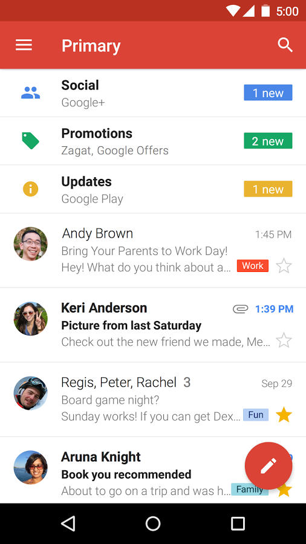
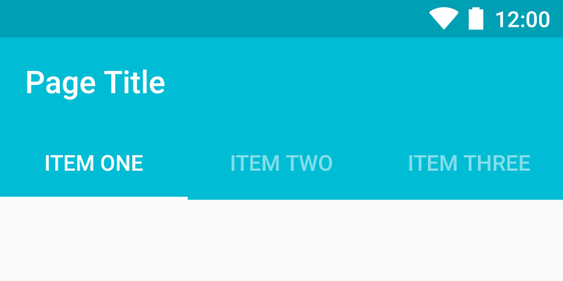
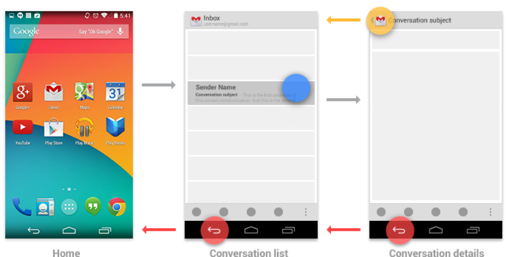
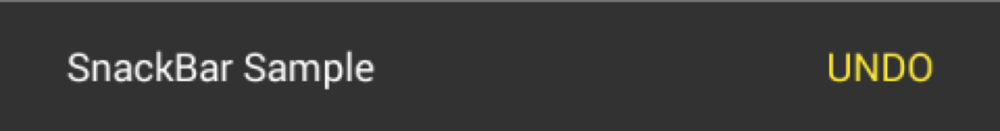
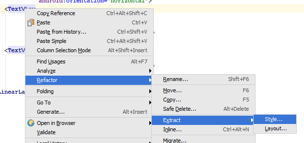
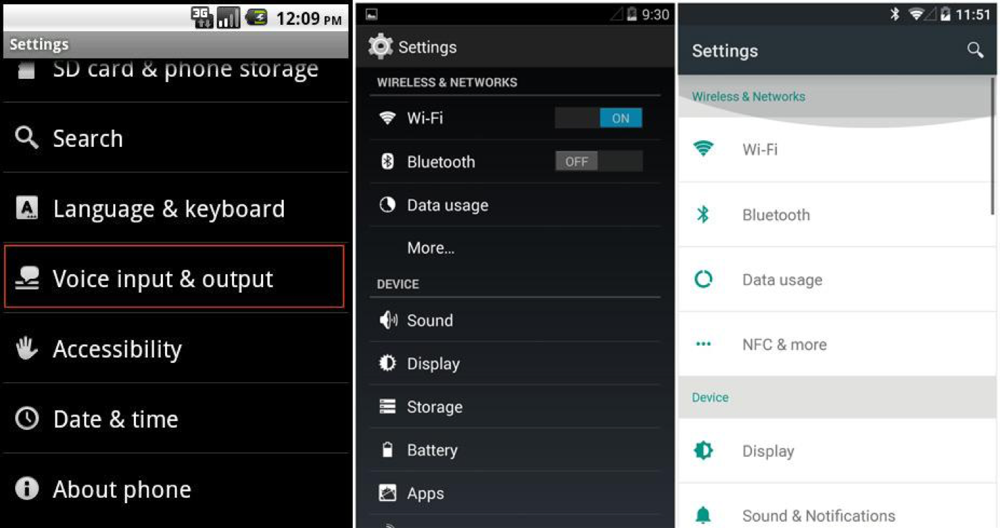
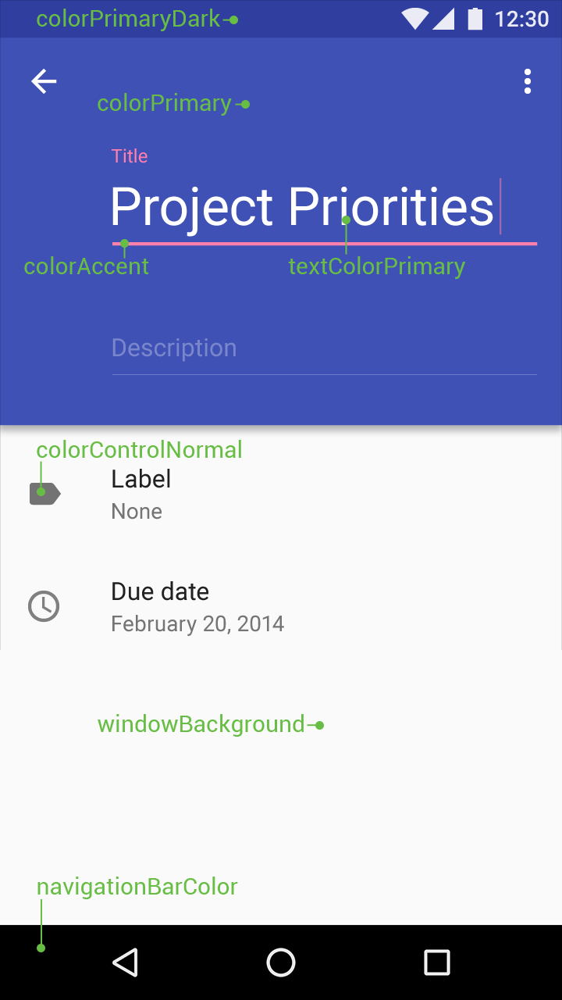

# UI, Styles

## Fundamental Design Elements

### ActionBar, Toolbar

* Main branding
* Quick access to actions for the screen

&#x20;  

### Contextual ActionBar

* Selections, bulk operations


### Floating Action Button (FAB)




### Tabs

* Division into sections
* Optimal number of tabs: 3
* Text / icon / text + icon



### Up vs. Back&#x20;

#### Up

* the Go to a parent section
* Displayed at ActionBar (top left corner)

#### Back

* Back to the previous screen (back in the history stack)
* Either as a physical button or on the NavigationBar (bottom left corner)

&#x20; 

### Toast

* Quick splash message
* Nonblocking


### SnackBar

* Shows information in a similar fashion to Toast
* Can be used along with an action (usually an undo/revert type of action)



### NavigationView / NavigationDrawer

* App categorization
* Content subcategories
* Use wisely, you can adopt different means of navigation in your app, based on its complexity


## Styles and Themes

The purpose of styles is to separate design definitions from the code, in a similar fashion as CSS is used on the web. GUI elements can be styled directly in the layout files, but produced outcome can be hard to read and use duplicate styling definitions (imagine your layout consist of several buttons, and you define the same style for each one of them multiple times).

The best practice is to keep definitions inside 2 files - `theme.xml` for grouping individual element definitions, and `styles.xml`, for defining these individual element styles. If you don't need extensive styling, you can probably use just `theme.xml` and redefine basic app colors.

theme.xml

```markup
<style name="Theme" parent="android:Theme.Holo.Light">
   <item name="android:buttonStyle">@style/ButtonStyle</item>
   <item name="android:seekBarStyle">@style/SeekBarStyle</item>
</style>
```

styles.xml

```markup
<style name="ButtonStyle" parent="android:Widget.Holo.Light.Button">
   <item name="android:background">@drawable/theme_btn_default_holo_light</item>
   <item name="android:textColor">@color/white</item>
   <item name="android:textSize">@dimen/button_text</item>
 </style>

 <style name="ButtonStyle.Big">
   <item name="android:textSize">@dimen/button_text_big</item>
 </style>

 <style name="SeekBarStyle" parent="android:Widget.Holo.Light.SeekBar">
   <item name="android:progressDrawable">@drawable/theme_scrubber_progress_horizontal_holo_light</item>
   <item name="android:indeterminateDrawable">@drawable/theme_scrubber_progress_horizontal_holo_light</item>
   <item name="android:thumb">@drawable/theme_scrubber_control_selector_holo_light</item>
 </style>
```

### Theme Inheritance

You can save time redefining a style, by inheriting properties of one. For instance, you can imagine a button style with 10 attributes, and you want a new one with just 1 different attribute, so you derive your new style from the first one and change just the parameter you need.

You can inherit your style using a `.` notation in the style's name or using a parent attribute.

Original style definition:

```markup
<style name="Parent"/>
```

*   Explicit inheritance

    ```markup
    <style name="Child" parent="Parent"/>
    ```
*   Implicit inheritance

    ```markup
    <style name="Parent.Child"/>
    ```

System styles can be inherited using parent attribute only. Inheriting a custom-defined style can be done using `.` notation.

#### Using Both Types of Inheritance at Once

```markup
<style name="Implicit"/>
<style name="Explicit"/>
<style name="Implicit.Child" parent="Explicit"/>
```


**Can **_**Implicit.Child**_** inherit attributes from both Implicit and Explicit Styles?**\
****No, using both inheritance types results in the child inheriting attributes of the explicit parent only. Therefore prefer using 1 type of inheritance only.


### Usage of Styles

Styles can be applied to individual GUI elements as well as to Activities or globally - for the whole App.



```markup
<Button style="@style/ButtonStyle.Big" />
```



```markup
<activity android:theme="@style/Theme">
```



```markup
<application android:theme="@style/Theme">
```



#### Is it possible to apply multiple styles to 1 View at the same time?

No, View can have only one style definition applied to it, except a TextView. TextView can be styled with the additional `textAppearance` attribute.

```markup
<TextView
        android:textAppearance="@style/TextViewAppearance"
        style="@style/TextView"/>
```

When defining a textAppearance style, inherit your attributes from appropriate TextAppearance style:

```markup
<style name="MyText" parent="TextAppearance.AppCompat">
    <item name="android:textColor">#fff</item>
</style>
```

TextAppearance attributes:

* textColor
* textColorHighlight
* textColorHint
* textColorLink
* textSize
* textStyle
* fontFamily
* typeface
* textAllCaps
* shadowColor
* shadowDx
* shadowDy
* shadowRadius
* elegantTextHeight
* letterSpacing
* fontFeatureSettings


Quick tip: Extract style definition from a View




## Design Languages

### Theme

The original visual style of Android. Its significant feature was, that it had no style at all.



### Holo

The first attempt at a unified design language. It brought huge improvement to app looks in Android 3.0.

Styles or themes used to be generated through specialized tools, like Holo Colors, or [ActionBar style generator](http://jgilfelt.github.io/android-actionbarstylegenerator/). It's deprecated now, mainly due to the design change, and also improvements in the system. Originally it wasn't possible to recolor the app just by defining its elementary colors. All visual components had to be provided in form of drawables at the time.

### Material Design

Originally introduced in Android 5.0, but with continual development still a valid design language for Android.

```markup
<style name="Theme.MyTheme" parent="Theme.AppCompat.Light">
    <item name="colorPrimary">@color/material_blue_500</item>
    <item name="colorPrimaryDark">@color/material_blue_700</item>
    <item name="colorAccent">@color/material_green_A200</item>
</style>
```



#### Idea of Depth

The UI isn't just flat. Individual design elements are laid out or grouped in layers. Layers provide the illusion of depth.


* [LayerVisualizer](https://github.com/romannurik/LayerVisualizer)

#### Using the Right Views

The recommended way of working with Material design is to use the [Material Components](https://github.com/material-components/material-components-android/blob/master/docs/getting-started.md) library. This way you stay up to date with their definitions, regardless of the OS version.

#### How to Use Material Design Correctly

* [Using the Material Theme](http://developer.android.com/training/material/theme.html)
* [Material Palette](http://www.materialpalette.com) - Color generation based on primary and accent color.
* [Color Tool](https://material.io/color)

## Additional Materials

* [Android Design Principles](https://developer.android.com/design/get-started/principles.html)
* Official Google guidelines
* mDevCamp 2013 [Optimizing UI](https://www.youtube.com/watch?v=X\_TJOSNzNug\&ab\_channel=mDevCamp)
* [Using styles and themes without going crazy](https://speakerdeck.com/dlew/using-styles-and-themes-without-going-crazy-1)
* [ConstraintLayout codelab](https://codelabs.developers.google.com/codelabs/constraint-layout/index.html)
