# UI, layout, styles

## Fundamental Design Elements

### ActionBar, Toolbar

* Main branding
* Quick access to actions for the screen

 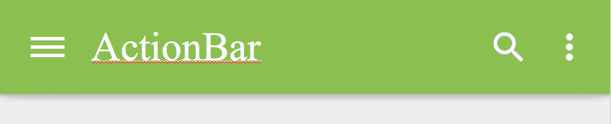 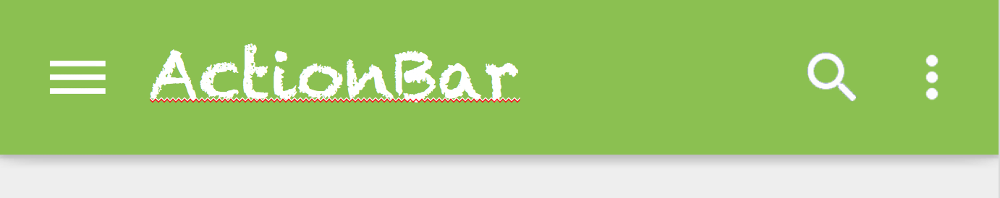 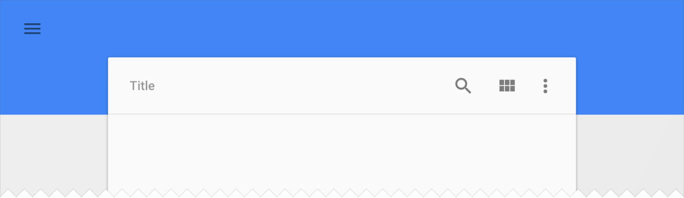

### Contextual ActionBar

* Selections, bulk operations

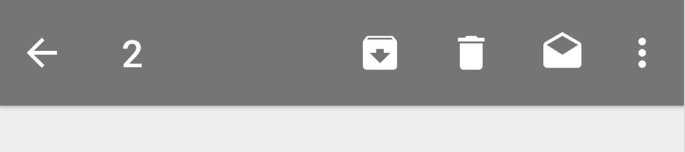

### Floating Action Button \(FAB\)

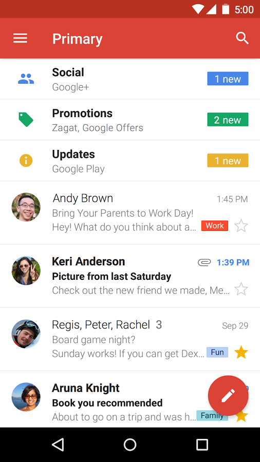

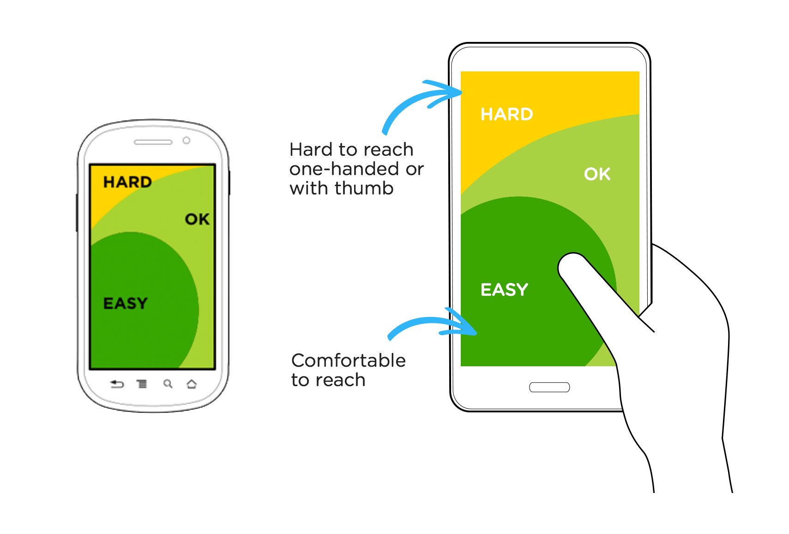

### Tabs

* Division into sections
* Optimal number of tabs: 3
* Text / icon / text + icon

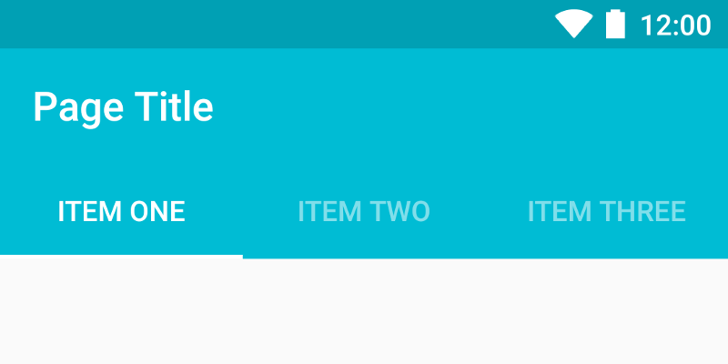

### Up vs. Back 

#### Up

* Go to parent section
* Displayed at ActionBar \(top left corner\)

#### Back

* Back to the previous screen \(back in history stack\)
* Either as a physical button, or on the NavigationBar \(bottom left corner\)

 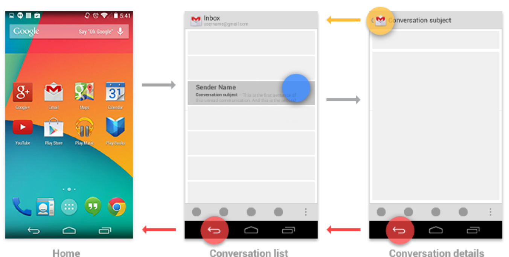 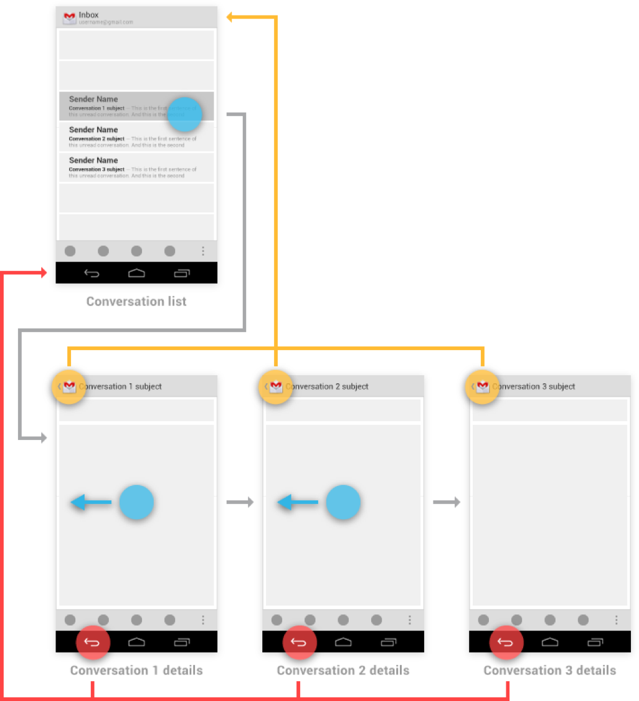

### Toast

* Quick splash message
* Non blocking


### SnackBar

* Shows information in a similar fashion to Toast
* Can be used along with an action \(usually an undo/revert type of action\)

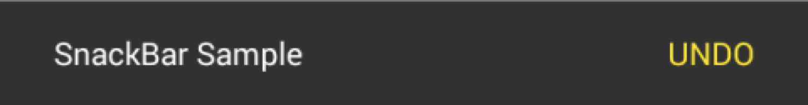

### NavigationView / NavigationDrawer

* App categorisation
* Content subcategories
* Use wisely, you can adopt different means of navigation in your app, based on its complexity

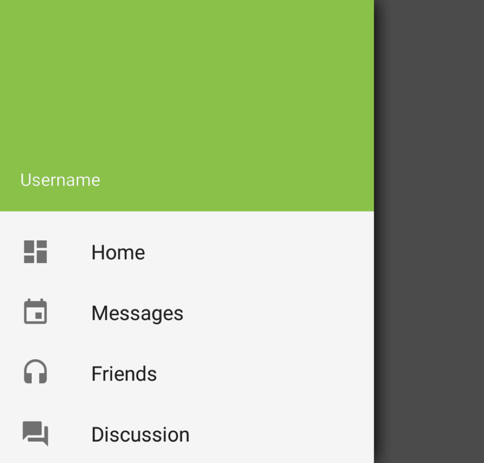

## Pixel Density

Pixel density means how many physical pixels can you fit into a 2D space with given dimensions. Display density is usually measured in dot per inch \(DPI\), where the dot can be considered a pixel.

   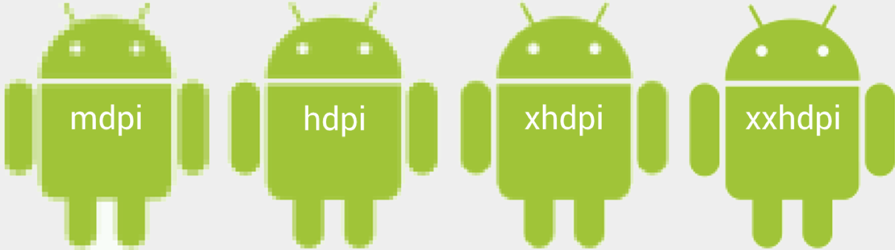

### Density-independent Pixels \(DP\) 

When taking physical screen dimensions into account, you usually intend for the same layout, no matter the resolutions. To achieve this, you need a unit which translates to physical pixels differently, based on your screen density. _Dips_ or _DPs_ were introduced to avoid positioning and scaling based on pixels. 

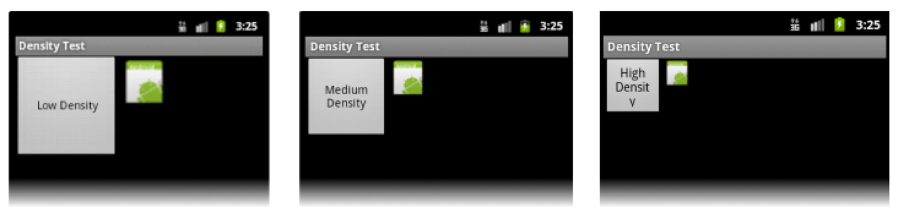

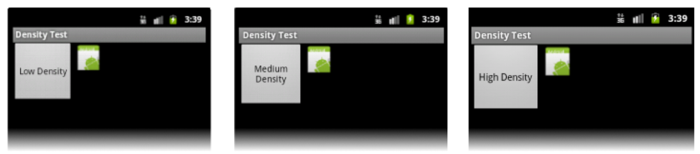

### Scalable Pixels \(SP\)

The _sp_ unit is the same size as _dp_, by default, but it resizes based on the user's preferred text size. That can be done on the system level, and is not used exclusively by visually impaired.


Always use this unit for text, never for layouts.


#### Read More:

* [Support different pixel densities](https://developer.android.com/training/multiscreen/screendensities)

## Drawables

Drawables can have a form of a PNG file or it can be a XML definition of a vector image.

### Shape Drawables

Drawable definition in XML is great for its smaller size, and on-device rendering. The final output is compiled out of graphical primitives, colors and gradients.

Blue rectangle with round edges:

```markup
<shape android:shape="rectangle">
    <solid android:color="@android:color/blue_dark" />
    <corners android:bottomLeftRadius="8dp"
        android:bottomRightRadius="8dp" />
</shape>
```

Drawables can have multiple layers, constructing complex shapes:

```markup
<layer-list>
    <item>
        <shape>
            <solid android:color="@color/gray" />
            <corners android:bottomRightRadius="4dp"
                android:bottomLeftRadius="4dp"
                android:topRightRadius="4dp"
                android:topLeftRadius="4dp" />
        </shape>
    </item>
    <item android:bottom="4dp">
        <shape>
            <solid android:color="@color/black" />
            <corners android:bottomRightRadius="4dp"
                android:bottomLeftRadius="4dp"
                android:topRightRadius="4dp"
                android:topLeftRadius="4dp" />
        </shape>
    </item>
</layer-list>
```

### 9-patch

Modified PNG image \([.9.png](http://developer.android.com/guide/topics/graphics/2d-graphics.html#nine-patch)\), where pixels at its edges describe the way it can be stretched. It got its name based on 9 sectors dividing it into patches:

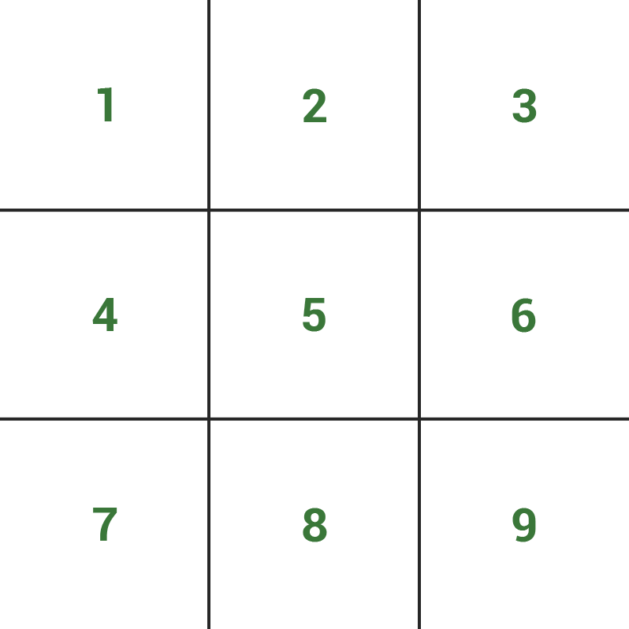

* **1, 3, 7, 9** - corners are static and don't stretch
* **2, 8** - top and bottom sectors can be stretched horizontally
* **4, 6** - left and right sides can be stretched vertically
* **5** - the center can be stretched in both directions

 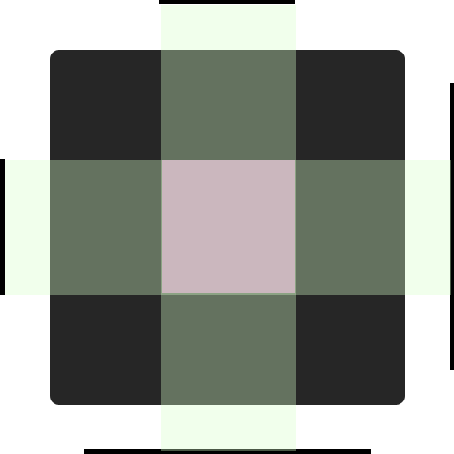 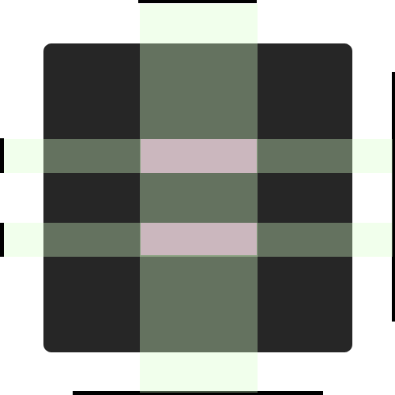

Green parts are stretched in one direction. Pink parts can be stretched to both directions. There can be more than 9 stretchable areas.

#### Optical bounds

Optical bounds were introduced in Androidu 4.3. They mark part of the image which isn't considered as part of the image dimensions. This is used for casting shadow from the image.

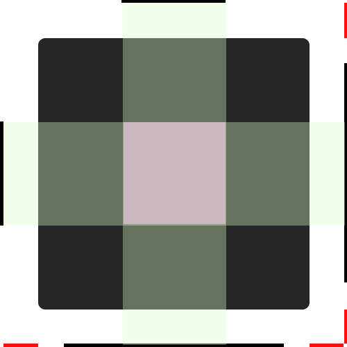

#### Draw 9-patch Editor

[Editor](https://developer.android.com/tools/help/draw9patch.html) is part of the Android SDK. You can use it to convert PNG files into .9.png.

### Selectors

Selector is a special kind of Drawable. It can change its visual state based on conditions defined inside it. Basically, it's a list of other Drawables or colors with assigned display conditions. Conditions are evaluated from top to bottom. Item without any conditions is considered to be a fallback variant.

```markup
<selector xmlns:android="http://schemas.android.com/apk/res/android">
   <item android:state_pressed="true" android:color="@color/light_blue"/>
   <item android:state_focused="true" android:color="@color/dark_blue"/>
   <item android:state_selected="true" android:state_activated="true" android:color="@color/light_blue_A400"/>
   <item android:state_selected="true" android:state_activated="false" android:color="@color/gray"/>
   <item android:color="@color/black"/>
</selector>
```

## Styles and Themes

The purpose of styles is to separate design definitions from the code, in a similar fashion as CSS is used on the web. GUI elements can be styled directly in the layout files, but produced outcome can be hard to read and use duplicit styling definitions \(imagine your layout consist of several buttons, and you define the same style for each one of them multiple times\).

Best practice is to keep definitions inside 2 files - `theme.xml` for grouping individual element definitions, and `styles.xml`, for defining these individual element styles. If you don't need extensive styling, you can probably use just `theme.xml` and redefine basic app colors.

theme.xml

```markup
<style name="Theme" parent="android:Theme.Holo.Light">
   <item name="android:buttonStyle">@style/ButtonStyle</item>
   <item name="android:seekBarStyle">@style/SeekBarStyle</item>
</style>
```

styles.xml

```markup
<style name="ButtonStyle" parent="android:Widget.Holo.Light.Button">
   <item name="android:background">@drawable/theme_btn_default_holo_light</item>
   <item name="android:textColor">@color/white</item>
   <item name="android:textSize">@dimen/button_text</item>
 </style>

 <style name="ButtonStyle.Big">
   <item name="android:textSize">@dimen/button_text_big</item>
 </style>

 <style name="SeekBarStyle" parent="android:Widget.Holo.Light.SeekBar">
   <item name="android:progressDrawable">@drawable/theme_scrubber_progress_horizontal_holo_light</item>
   <item name="android:indeterminateDrawable">@drawable/theme_scrubber_progress_horizontal_holo_light</item>
   <item name="android:thumb">@drawable/theme_scrubber_control_selector_holo_light</item>
 </style>
```

### Theme Inheritance

You can save time redefining a style, by inheriting properties of one. For instance, you can imagine a button style with 10 attributes, and you want a new one with just 1 different attribute, so you derive your new style from the first one and change just the parameter you need

Práci se styly si můžeme zjednodušit dědičností. Např. máme definovaný kompletní styl pro tlačítko \(např. 10 atributů\) a chceme vyrobit nový styl, který se liší pouze v 1 atributu. Nemusíme definovat celý nový styl ale určíme si ten původní jako rodič a definujeme jen lišící se atribut.

You can inherit your style using a `.` notation in style's name or using a parent attribute.

Original style definition:

```markup
<style name="Parent"/>
```

* Explicit inheritance

  ```markup
  <style name="Child" parent="Parent"/>
  ```

* Implicit inheritance

  ```markup
  <style name="Parent.Child"/>
  ```

System styles can be inherited using parent attribute only. Inheriting a custom defined style can be done using `.` notation.

#### Using Both Types of Inheritance at Once

```markup
<style name="Implicit"/>
<style name="Explicit"/>
<style name="Implicit.Child" parent="Explicit"/>
```


**Can** _**Implicit.Child**_ **inherit attributes from both Implicit and Explicit Styles?**  
No, using both inheritance types results in the child inheriting attributes of the explicit parent only. Therefore prefer using 1 type of inheritance only.


### Usage of Styles

Styles can be applied to individual GUI elements as well as to Activities or globally - for the whole App.



```markup
<Button style="@style/ButtonStyle.Big" />
```



```markup
<activity android:theme="@style/Theme">
```



```markup
<application android:theme="@style/Theme">
```



#### Is it possible to apply multiple styles to 1 View at the same time?

No, View can have only one style definition applied to it, with the exception of a TextView. TextView can be styled with the additional `textAppearance` attribute.

```markup
<TextView
        android:textAppearance="@style/TextViewAppearance"
        style="@style/TextView"/>
```

When defining a textAppearance style, inherit your attributes from appropriate TextAppearance style:

```markup
<style name="MyText" parent="TextAppearance.AppCompat">
    <item name="android:textColor">#fff</item>
</style>
```

TextAppearance atributes:

* textColor
* textColorHighlight
* textColorHint
* textColorLink
* textSize
* textStyle
* fontFamily
* typeface
* textAllCaps
* shadowColor
* shadowDx
* shadowDy
* shadowRadius
* elegantTextHeight
* letterSpacing
* fontFeatureSettings


Quick tip: Extract style definition from a View

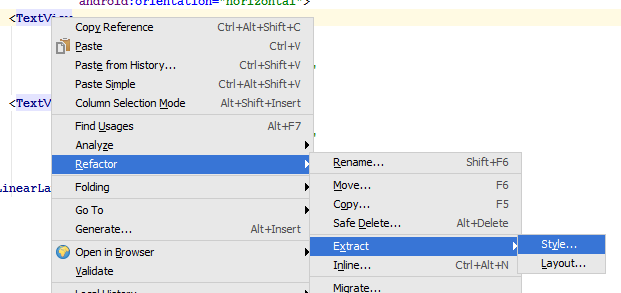


## Design Languages

### Theme

Original visual style of Android. It's significant feature was, that it had no style at all.

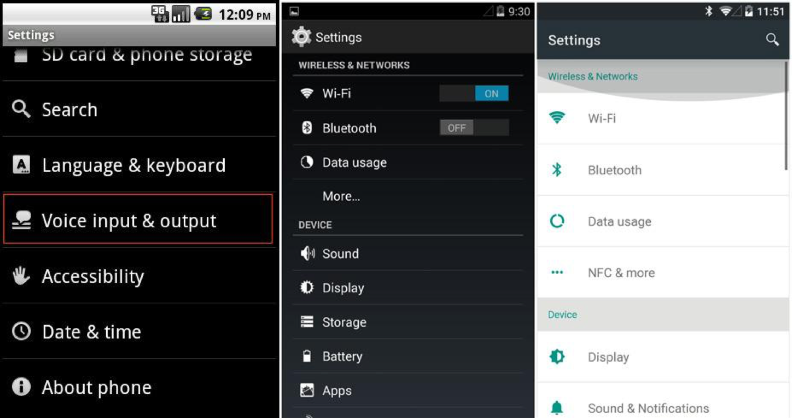

### Holo

The first attempt for unified design language. It brought huge improvement to app looks in Android 3.0.

Styles or themes used to be generated through specialised tools, like Holo Colors, or [ActionBar style generator](http://jgilfelt.github.io/android-actionbarstylegenerator/). It's deprecated now, mainly due to the design change, and also improvements in the system. Originally it wasn't possible to recolor the app just by defining its elementary colors. All visual components  had to be provided in form of drawables at the time.

### Material Design

Originally introduced in Android 5.0, but with continual development still valid design language for Android.

```markup
<style name="Theme.MyTheme" parent="Theme.AppCompat.Light">
    <item name="colorPrimary">@color/material_blue_500</item>
    <item name="colorPrimaryDark">@color/material_blue_700</item>
    <item name="colorAccent">@color/material_green_A200</item>
</style>
```

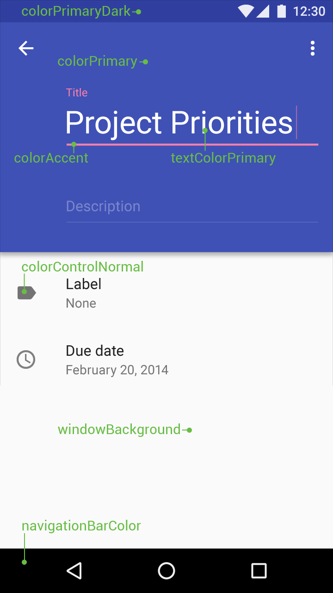

#### Idea of Depth

The UI isn't just flat. Individual design elements are laid out or grouped in layers. Layers provide the illusion of depth.


* [LayerVisualizer](https://github.com/romannurik/LayerVisualizer)

#### Using the Right Views

The recommended way of working with Material design is to use [Material Components](https://github.com/material-components/material-components-android/blob/master/docs/getting-started.md) library. This way you stay up to date with their definitions, regardless the OS version.

#### How to Use Material Design Correctly

* [Using the Material Theme](http://developer.android.com/training/material/theme.html)
* [Material Palette](http://www.materialpalette.com/) - Color generation based on primary and accent color.
* [Color Tool](https://material.io/color)

## Additional Materials

* [Android Design Principles](https://developer.android.com/design/get-started/principles.html)
* Official Google guidelines
* mDevCamp 2013 [Optimizing UI](https://www.youtube.com/watch?v=X_TJOSNzNug&ab_channel=mDevCamp)
* [Using styles and themes without going crazy](https://speakerdeck.com/dlew/using-styles-and-themes-without-going-crazy-1)
* [ConstraintLayout codelab](https://codelabs.developers.google.com/codelabs/constraint-layout/index.html)

