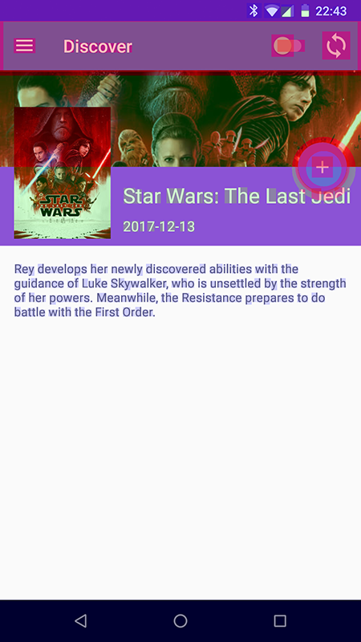

# Layout And Views

### View Types

View

ViewGroup

### Gotchas

#### Don't use RelativeLayout as a parent view of a complex view structure

RelativeLayout is suitable for simple view hierarchy only. Complex structure leads to slow rendering and can introduce a jank.

RelativeLayout uses 2 passes in its onMeasure phase. First phase computes size of its child views, the second pass sets its own dimensions.

#### Efficient Layout Inflation

Using the following layout:

```markup
<ViewGroup android:id="@+id/root">
    <View android:id="@+id/leaf" />
    <ViewGroup android:id="@+id/inner_group">
        <View android:id="@+id/inner_leaf" />
    </ViewGroup>
</ViewGroup>
```

**What's the difference between** _**A**_ **and** _**B**_**?**

A\)

```kotlin
val vg = findViewById<View>(R.id.inner_group) as ViewGroup
val v: View = findViewById(R.id.inner_leaf)
```

B\)

```kotlin
val vg = findViewById<View>(R.id.inner_group) as ViewGroup
val v = vg.findViewById<View>(R.id.inner_leaf)
```

Calling `findViewById()` on the root view results in subsequent calls of this function on all of its children, or until the ID is found. Example A finds the ID following these steps:

1. root-&gt;leaf  
2. root-&gt;inner\_group  
3. inner\_group-&gt;inner\_leaf

Example B has just one step:

1. inner\_group-&gt;inner\_leaf

#### Minimise Overdraw

Placing views on top of each other \(usually when using FrameLayout\) introduces overdraw. The UI is rendered in layers, and if you have views overlapping each other, some pixels might be overdrawn multiple times, before the whole layout is finally rendered.

See the the image below. The background o window is rendered first, then the background of a ToolBar, then the wide image and finally the poster image on top of it. Pixels in the top poster area were overdrawn as much as 4 times!



Overdrawing existing pixels is a redundant operation and slows down the whole process of rendering, because we compute an information which is then discarded.


You can activate overdraw visualisation in Developer options.



Overdraw can be introduced just by applying a redundant background color:

  

