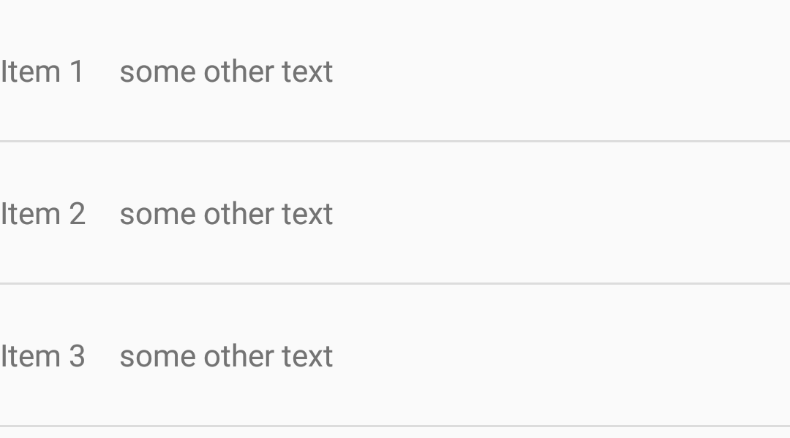

# View Binding, Lists

## View Binding

View Binding is the official way to deal with `findViewById`. Historically, this was handled by a popular library [Butter knife](https://github.com/JakeWharton/butterknife), or later by Kotlin synthetics as part of Kotlin Android Extensions. These are all deprecated in favor of Jetpack view binding.

The main advantage of view binding is that all the magic happens during compile time, so you can reveal errors instantly and not later during runtime.

View binding feature must be enabled in `build.gradle` on a per-module basis.

```groovy
android {
    // ...
    buildFeatures {
        viewBinding true
    }
}
```

### View Binding in Activities

View binding inside `Activities` is a straightforward process. See the following example.

1. We want to use `TextView` with the id `title`, inside `MainActivity`.
2. Every layout file has autogenerated Binding class, which helps us with the binding process. For layout `activity_main.xml,` this class is `ActivityMainBinding`. We use it inside the Main activity. to handle layout inflation, during which it initializes references to inflated views.
3. The inflated layout must be passed to `setContentView` to initialize the Activity itself.
4. You can start using binding to get access to views from the layout.


```markup
<LinearLayout ... >
    <TextView android:id="@+id/title" />
</LinearLayout>
```



```kotlin
private lateinit var binding: ActivityMainBinding

override fun onCreate(savedInstanceState: Bundle?) {
    super.onCreate(savedInstanceState)
    binding = ActivityMainBinding.inflate(layoutInflater)
    setContentView(binding.root)
}
```


```kotlin
binding.title.text = "Hello World!"
```

### View Binding in Fragments

The process is analogical to the one in `Activities`, with the exception that `Fragments` are short lived, so there's extra maintenance with dereferencing the binding.

```kotlin
private var _binding: FragmentMainBinding? = null
// This property is only valid between onCreateView and
// onDestroyView and provides access without null checks.
private val binding get() = _binding!!

override fun onCreateView(
    inflater: LayoutInflater,
    container: ViewGroup?,
    savedInstanceState: Bundle?
): View? {
    _binding = FragmentMainBinding.inflate(inflater, container, false)
    return binding.root
}

override fun onDestroyView() {
    super.onDestroyView()
    _binding = null
}
```


Note that view binding must be dereferenced in `onDestroyView`, because `Fragments` outlive their views.


## Lists

Originally, dynamic list creation was handled by [`ListView`](https://developer.android.com/reference/android/widget/ListView), but it's now obsolete in favor of `RecyclerView`. `ListView` wasn't fundamentally bad in design, but required knowledge how to use it right, because it didn't enforce patterns for view recycling.

### RecyclerView

RecyclerView is designed to handle and display large sets of data. Programmer defines layout for each list item and provides logic for view binding and `RecyclerView` handles the rest. The main added value lies in view recycling.

Views are heavy objects, so creation of a view is time expensive operation. Moreover, it's "impossible" to generate a layout for say collection of 1000 items. Therefore, `RecyclerView` works in a way, that it creates just the needed amount of items to fit the screen + a couple of extra ones. Then, when scrolling, the items which become invisible are reused to display newly appeared ones. This way it appears, the `RecyclerView` can fit almost an infinite number of items and scrolling is smooth, because the heavy objects are created just once and then are always reused.

#### LayoutManager

`LayoutManager` is a supplemental class, which handles layout rendering for `RecyclerView's` items.

* `LinearLayoutManager` arranges the items in a one-dimensional list - vertically or horizontally.
* `GridLayoutManager` arranges all items in a two-dimensional grid.

#### Adapter and ViewHolder

These two classes work together to handle views. ViewHolder holds references to item's views (to avoid layout inflation and repeated calls to `findViewById`), while `Adapter` handles a logic of supplying views with data to a `RecyclerView`. For successful implementation of an Adapter, you need to override 3 methods: `onCreateViewHolder`, `onBindViewHolder` , and `getItemCount`.

```kotlin
class MainAdapter(private var items: List<ListItem>, private val onClick: (ListItem) -> Unit) :
    RecyclerView.Adapter<MainAdapter.ViewHolder>() {

    / ...

    class ViewHolder(itemBinding: ListItemBinding, val onClick: (ListItem) -> Unit) :
        RecyclerView.ViewHolder(itemBinding.root) {

        private val textView = itemBinding.textView

        fun bind(item: ListItem) {
            textView.text = item.description
            itemView.setOnClickListener { onClick(item) }
        }
    }

    // Create new views
    override fun onCreateViewHolder(parent: ViewGroup, viewType: Int): ViewHolder {
        // Create a new view, which defines the UI of the list item
        val itemBinding =
            ListItemBinding.inflate(LayoutInflater.from(parent.context), parent, false)
        return ViewHolder(itemBinding, onClick)
    }

    // Replace the contents of a view
    override fun onBindViewHolder(holder: ViewHolder, position: Int) {
        holder.bind(data[position])
    }

    // Return the size of your dataset
    override fun getItemCount() = data.size
}
```

#### Putting it all together

In your `Activity`/`Fragment`, get an instance of a `RecyclerView` and associate it with the appropriate `Adapter`. You can include additional features, like item decorations.

```markup
<FrameLayout ... >

    <androidx.recyclerview.widget.RecyclerView
        android:id="@+id/recycler_view"
        android:layout_width="match_parent"
        android:layout_height="match_parent"
        app:layoutManager="LinearLayoutManager" />

</FrameLayout>
```

```kotlin
// ...
    adapter = MainAdapter(items) { item -> adapterOnClick(item) }
    binding.recyclerView.apply {
        val itemDecoration = DividerItemDecoration(context, LinearLayoutManager.VERTICAL)
        addItemDecoration(itemDecoration)
        adapter = this@MainFragment.adapter
    }
// ...

private fun adapterOnClick(item: ListItem) {
    // Perform action on item
}
```

### Best Practices

#### Keep fixed height for items if possible

Remeasuring views takes time, moreover, having items with different heights can lead to your list "jumping", while scrolling. Use `?android:attr/listPreferredItemHeight` on the root view of an item or a fixed height if possible.

#### Inflate layout correctly

In `onCreateViewHolder`, there's a reference to a parent view, for a reason. If you inflate a layout without specifying a parent view, the system cannot set the view's attributes correctly. Always choose the option for inflation when specifying the parent, like so (the same applies to `Fragments` as well):

```kotlin
LayoutInflater.from(parent.context).inflate(R.layout.list_item, parent, false)
```




#### Minimize Overdraw

Drawing the same pixels on top of each other is a wasteful operation. If your items use the same background as the background of the `RecyclerView`, you can omit it.

You can find more info [here](layout-and-views.md#minimising-overdraw).
