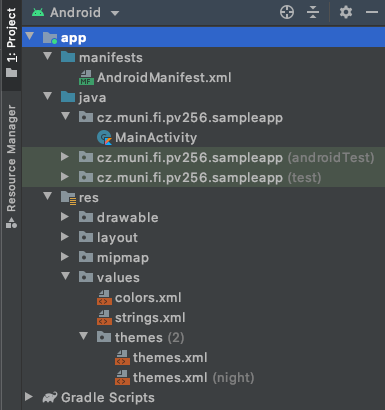
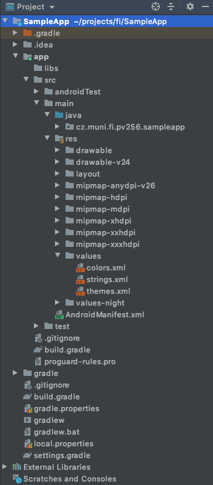

# Android Studio

Android Studio is the official integrated development environment for Google's Android operating system, built on JetBrains' IntelliJ IDEA software and designed specifically for Android development. The original tooling was built on Eclipse and lacked the necessary responsivity and mainly its build system wasn't suitable for Android development.

Get Android Studio from the [official website](https://developer.android.com/studio) and follow its install instructions. If you intend to use bundled tooling from your command line, don't forget to export necessary ENV variables, plus make sure your default Java binaries are the one's from Android Studio \(that's the easiest way\).

### Getting Started

#### Project Views

Studio allows to show multiple view over the project. The default one is _Android View_, and it groups related files into common groups, like themes for instance, so it doesn't keep the actual folder structure as seen on the disk. The one reflecting real folder structure is the _Project View_.











#### Project Structure

Main project is divided into _modules_. The main one is usually called app and it's defined in _settings.gradle_ file. The whole [Gradle framework](https://book.droidboy.cz/build-system) will be described more later.

**build.gradle**

You can think of it as a place for defining dependencies and build properties for now.

**AndroidManifest.xml**

Key file, describing all application entry points and permissions. It's being loaded by the Android OS, so it can orchestrate your app or trigger events related to it.

**Source Codes**

Usually kept in `/module/src/main/java/package`, since we are going to use Kotlin in our project, the project skeletons have redefined this structure to `/module/src/main/kotlin/package`.

**Module Resources**

The `res` folder is a place for all resources other than code. Images, XML image definitions, string resources, dimensions, colors, styling and [more](https://developer.android.com/guide/topics/resources/providing-resources). Android has been a fragmented platform in terms of device types and their specs, since the very beginning of its existence, therefore it was designed in a way that allows defining property specific resources. For instance, you can provide different set of imagery based on screen resolution, or easily change app's locale, or even a layout on the screen.

