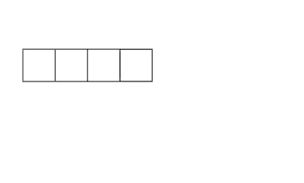

# Restricted Environment

Android runs on devices with limited resources. As opposed to PCs, there's less CPU power, significantly less RAM, and more importantly, power supply is constrained by battery capacity. Therefore, you need to adjust your development habits to reflect the lack of resources and provide the best user experience possible.

Following tips mostly apply to coding in Java. Nevertheless, Android SDK and various supplemental libraries are still mainly written in Java, therefore it's still valid to understand the Java way too.

### Know Your Collections

Standard Java collections are not optimised for usage on mobile devices. Think twice before selecting the most suitable collection for the job:

* in Java, when dealing with constant count of items, prefer Arrays over Lists
* when storing lower hundreds of items, prefer Android collections over Java collections
* in Java, when dealing with primitive data types, use `SparseArray`

#### Maps

Maps rely on the use of generics `Map<K, V>`, meaning that natively, they work with Objects. In Java primitive data types are interchangeable with their object counterpart. This process is called [autoboxing](https://docs.oracle.com/javase/tutorial/java/data/autoboxing.html) or autounboxing and provides seamless type conversions. Nevertheless, they still happen. Imagine following example:

```java
Map<Integer, Object> integerObjectMap = new HashMap<>(100);

int integer = 10;
Object object = new Object();
integerObjectMap.put(integer, object);
integerObjectMap.remove(integer);

for (Map.Entry<Integer, Object> entry : integerObjectMap.entrySet()) {
    int key = entry.getKey();
    Object value = entry.getValue();
}
```

This can be easily avoided by using a `SparseArray`, or more complex `SimpleArrayMap` or a `ArrayMap`. The underlying implementation is optimised in terms of allocated memory and in case of using lower count of containing items, it's optimised in performance speed as well.

```java
SparseArray<Object> sparseArray = new SparseArray<>(100);

int integer = 10;
Object object = new Object();
sparseArray.put(integer, object);
sparseArray.remove(integer);

for (int index = 0, size = sparseArray.size(); index < size; index++) {
    int key = sparseArray.keyAt(index);
    Object value = sparseArray.valueAt(index)
}
```

**Why want to Eliminate Auto\(un\)boxing?**

One obvious reason is unnecessary memory allocations and garbage collection. See [object memory usage](http://www.javamex.com/tutorials/memory/object_memory_usage.shtml) for more info.

#### ArrayLists

`ArrayList` is great for storing variable number of items. `ArrayList` is backed by an `Array`. Arrays however require fixed capacity, when reached triggers creation of a new bigger Array, into which are the original items moved. This doesn't happen instantly, therefore if we know the count of items we want to store, we can avoid unnecessary reallocations by specifying this value in the constructor: `ArrayList(int initialCapacity)`.



#### Iterating over ArrayList

Using a for-each loop can yield performance and memory penalty. It's not visible on the first sight \(better readable in Java\):

```kotlin
for (Object o : collection) {}
```

Iteration over a collection requires an `Iterator` object, which iterates over it:

```java
for (Iterator<Object> iter = collection.iterator(); iter.hasNext(); ) {
   Object o = iter.next();
}
```

This can be avoided \(this applies to `ArrayList` only\):



```java
for (int i = 0, collectionSize = collection.size(); i < collectionSize; i++) {
   Object o = collection.get(i);
}
```



```kotlin
for (i in array.indices) { 
    val value = array[i]
}
```



#### Enums in Java

In the early days of Android, Google recommended to use constants, rather than enums. You can notice that being all over the place in the platform code.

```java
public enum WeekDay {
   MONDAY, TUESDAY, WEDNESDAY, THURSDAY, FRIDAY, SATURDAY, SUNDAY
}
```

```java
@IntDef({MONDAY, TUESDAY, WEDNESDAY, THURSDAY, FRIDAY, SATURDAY, SUNDAY})
@Retention(RetentionPolicy.SOURCE) // use in the IDE only
public @interface WeekDay {}

public static final int MONDAY = 0;
public static final int TUESDAY = 1;
public static final int WEDNESDAY = 2;
public static final int THURSDAY = 3;
public static final int FRIDAY = 4;
public static final int SATURDAY = 5;
public static final int SUNDAY = 6;

@WeekDay
public abstract int getWeekDay();

public abstract void setWeekDay(@WeekDay int weekDay);
```

The main difference is in the amount of RAM used. Enum values are represented as instances of enum's class they are defined in. Furthermore all values are stored in an array, to express their ordering.


Note the use of annotations, which help defining enum's type over standard integer.


#### Enums in Kotlin

Enums in Kotlin have a hidden cost when used in _when_ statements \(Kotlin's equivalent of _switch_ statement\)

```kotlin
enum class Color {
    BLUE,
    RED,
    YELLOW,
    GREEN
}

class Colors {
    fun isPrimitive(color: Color): Boolean = when(color){
        Color.BLUE -> true
        Color.RED -> true
        Color.YELLOW -> true
        Color.GREEN -> false
    }
}
```

And this is what the compiled code in Java looks like:

```kotlin
public static final int[] $EnumSwitchMapping$0 = new int[Colour.values().length];static {
     $EnumSwitchMapping$0[Colour.BLUE.ordinal()] = 1;
     $EnumSwitchMapping$0[Colour.RED.ordinal()] = 2;
     $EnumSwitchMapping$0[Colour.YELLOW.ordinal()] = 3;
     $EnumSwitchMapping$0[Colour.GREEN.ordinal()] = 4;
}
```

As you can see, an array is created just for this _when_ statement. When multiple _when_ statements are used, the compiler doesn't reuse the created array but just creates more.

Thankfully, this overhead can be avoided when enabling R8.

**More Info**

* [D8, R8 and enums - Kotlin Vocabulary](https://www.youtube.com/watch?v=lTo03M2HzFY&ab_channel=AndroidDevelopers)

### Final Note


Don't try to optimise code for the sake of optimisation. It's not worth it, if it leads to worsen readability.


